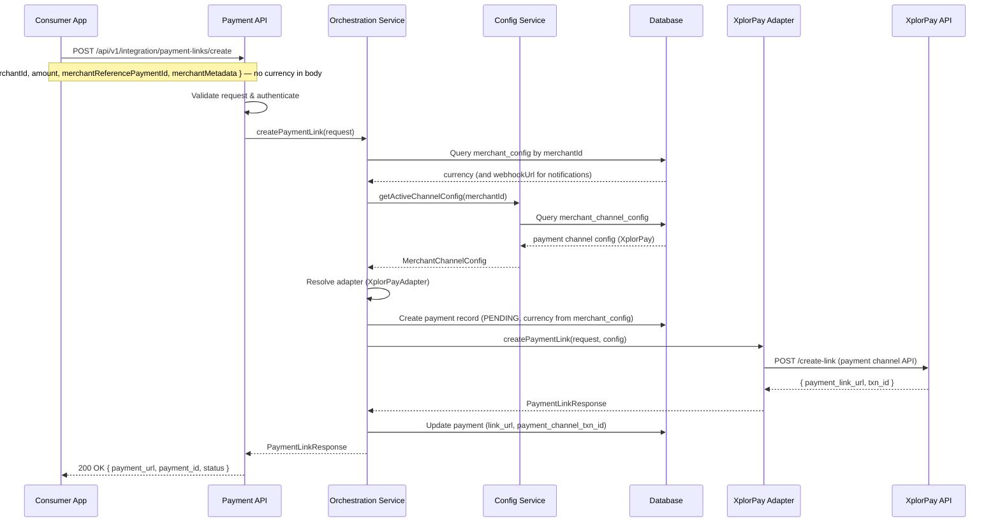
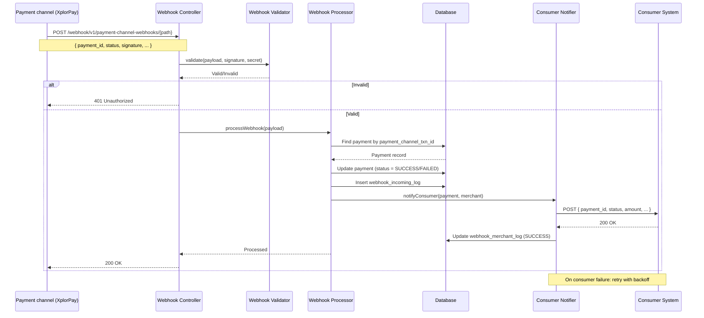

# Digi Payment Gateway — Architecture Documentation

## Overview

The **Digi Payment Gateway** is a Common Payment Gateway Application that acts as an intermediary between consumer applications (e-commerce platforms, booking systems, ERP/POS systems) and multiple payment channels. It provides a unified API layer so consumers integrate once and can use any supported payment channel.

---

## 1. High-Level Architecture

```
┌───────────────────────────────────────────────────────────────────────────────────────────────────┐
│                              CONSUMER APPLICATIONS                                                │
│  (E-commerce, Booking Systems, ERP/POS, etc.)                                                     │
└───────────────────────────────────────────────────────────────────────────────────────────────────┘
                                           │
                                           │ REST API (Unified)
                                           ▼
┌───────────────────────────────────────────────────────────────────────────────────────────────────┐
│                        DIGI PAYMENT GATEWAY (Spring Boot)                                         │
│  ┌─────────────────────────────────────────────────────────────────────────────────────────────┐  │
│  │                    Consumer API Layer (REST Controllers)                                    │  │
│  │  /api/v1/integration/payment-links  │  /api/v1/integration/terminal-payments  │  /api/v1/ui │  │
│  │  /webhook/v1/payment-channel-webhooks  (payment channel → gateway)                         │  │
│  └─────────────────────────────────────────────────────────────────────────────────────────────┘  │
│                                           │                                                       │
│  ┌─────────────────────────────────────────────────────────────────────────────────────────────┐  │
│  │                    Payment Orchestration Service                                            │  │
│  │  • Channel Selection  • Request Routing  • Response Mapping  • Retry Logic                  │  │
│  └─────────────────────────────────────────────────────────────────────────────────────────────┘  │
│                                           │                                                       │
│  ┌─────────────────────────────────────────────────────────────────────────────────────────────┐  │
│  │                    Payment Channel Adapters (Strategy Pattern)                              │  │
│  │  ┌─────────────┐  ┌─────────────┐  ┌─────────────┐  ┌─────────────┐  ┌─────────────────┐    │  │
│  │  │ XplorPay    │  │ Paymob      │  │ Stripe      │  │ Razorpay    │  │ Future channels │    │  │
│  │  │ Adapter     │  │ Adapter     │  │ Adapter     │  │ Adapter     │  │                 │    │  │
│  │  └─────────────┘  └─────────────┘  └─────────────┘  └─────────────┘  └─────────────────┘    │  │
│  └─────────────────────────────────────────────────────────────────────────────────────────────┘  │
│                                           │                                                       │
│  ┌─────────────────────────────────────────────────────────────────────────────────────────────┐  │
│  │                    Webhook Processing Layer                                                 │  │
│  │  • Payment channel webhook receivers  • Validation  • Status Update  • Consumer Forwarding  │  │
│  └─────────────────────────────────────────────────────────────────────────────────────────────┘  │
│                                           │                                                       │
│  ┌─────────────────────────────────────────────────────────────────────────────────────────────┐  │
│  │                    Configuration & Persistence                                              │  │
│  │  • Merchant/Channel Config  • Payment Records  • Transaction Logs  • Retry Queue            │  │
│  └─────────────────────────────────────────────────────────────────────────────────────────────┘  │
└───────────────────────────────────────────────────────────────────────────────────────────────────┘
                                           │
     ┌────────────────────┬────────────────┼────────────────┬────────────────┬────────────────────┐
     ▼                    ▼                ▼                ▼                ▼
┌──────────┐  ┌──────────────┐  ┌──────────────┐  ┌──────────────┐  ┌──────────────┐
│PostgreSQL│  │ XplorPay API │  │  Paymob API  │  │  Stripe API  │  │ Razorpay API │
│(Database)│  │    (1st)     │  │    (2nd)     │  │    (3rd)     │  │    (4th)     │
└──────────┘  └──────────────┘  └──────────────┘  └──────────────┘  └──────────────┘
```

---

## 2. Component Breakdown

### 2.1 Consumer API Layer


| Component                             | Responsibility                         | Endpoints                                                                 |
| ------------------------------------- | -------------------------------------- | ------------------------------------------------------------------------- |
| **PaymentLinkIntegrationController**  | Payment links (server-to-server)       | `POST /api/v1/integration/payment-links/create`, `GET /api/v1/integration/payment-links/{id}` |
| **TerminalPaymentIntegrationController** | Terminal payments (stub)          | `GET /api/v1/integration/terminal-payments/test`                          |
| **PaymentChannelWebhookController**   | Inbound webhooks from payment channels | `POST /webhook/v1/payment-channel-webhooks/test` (TEST channel stub)     |
| **UiController**                      | Management UI API (stub)               | `GET /api/v1/ui/test`                                                     |
| **Actuator**                          | Health & readiness                     | `GET /actuator/health`                                                    |


**Key Features:**

- Single API contract for all consumers
- Request validation and error mapping
- Consistent response format (JSON)

**Authentication:**

- **Target model:** **API key (`Merchant.apiKey`)** for server-to-server integration calls (e.g. header `X-API-Key`) on payment-link and related integration APIs; **JWT** for login and UI/configuration. These are not wired to endpoint rules yet.
- **Current application:** `SecurityConfig` uses `authorizeHttpRequests(anyRequest().permitAll())` with HTTP Basic available on the filter chain — suitable for local development only. Harden before production.

---

### 2.2 Payment Orchestration Service


| Responsibility                 | Description                                                           |
| ------------------------------ | --------------------------------------------------------------------- |
| **Merchant config resolution** | Loads **`merchant_config`** (1:1) for **currency** on payment-link creation and **webhookUrl** when notifying the consumer |
| **Payment channel resolution** | Resolves which payment channel to use based on **`merchant_channel_config`** |
| **Request Routing**            | Delegates to the appropriate adapter implementation                   |
| **Response Mapping**           | Normalizes payment channel-specific responses to a common format      |
| **Retry Logic**                | Idempotent retries with exponential backoff for transient failures    |
| **Logging**                    | Structured logging for audit and debugging                            |


---

### 2.3 Payment Channel Adapters (Strategy Pattern)

```java
// Actual interface (package adapter)
public interface PaymentChannelAdapter {
    PaymentChannelEntity getChannel();

    AdapterPaymentLinkResponse createPaymentLink(
            PaymentEntity payment,
            MerchantConfigEntity merchantConfig,
            MerchantChannelConfigEntity channelConfig);

    // Record: status, paymentId, paymentChannelTxnId, merchantReferencePaymentId
    AdaptorWebhookResponse validateAndParseWebhook(String payload, String signature, String secret);
}
```


| Adapter                    | Implementation Order | Payment channel API                        |
| -------------------------- | -------------------- | ------------------------------------------ |
| **TestPaymentChannelAdapter** | Implemented (dev) | In-process TEST channel (no external API)  |
| **XplorPayAdapter**        | 1st (planned)        | XplorPay REST API                          |
| **PaymobAdapter**          | 2nd (planned)        | Paymob REST API                            |
| **StripeAdapter**          | 3rd (planned)        | Stripe REST API                            |
| **RazorpayAdapter**        | 4th (planned)        | Razorpay REST API                          |
| **Future adapters**        | Extensible           | New `@Component` implementing the interface |


#### Outbound HTTP Standard (Direct RestTemplate)

- `RestTemplate` is the standard outbound HTTP client for all payment channel API calls.
- Adapters and outbound services inject `RestTemplate` directly and call `exchange(...)` for GET/POST/PUT operations.
- No dedicated outbound HTTP wrapper/facade service should be introduced.
- A shared Spring bean configuration provides timeout defaults, interceptor chain, and centralized `ResponseErrorHandler`.
- Adapter code remains responsible for provider-specific request/response mapping and converting transport errors to domain exceptions.
- Outbound request/response details are persisted to `payment_channel_api_log` with secrets masked or omitted.


**Adding a new payment channel:**

1. Create `XxxChannelAdapter` implementing `PaymentChannelAdapter`
2. Register as Spring bean with `@Component`
3. Add payment channel configuration in `merchant_channel_config` table
4. Inject `RestTemplate` directly and implement outbound calls via `exchange(...)`
5. Ensure outbound API logs are persisted to `payment_channel_api_log`
6. No changes to consumer API or orchestration layer

---

### 2.4 Webhook Processing Layer


| Component                               | Responsibility                                                                                |
| --------------------------------------- | --------------------------------------------------------------------------------------------- |
| **Payment channel webhook controllers** | Receive webhooks under `/webhook/v1/payment-channel-webhooks/...` (e.g. `/test` for TEST); add per-provider paths as adapters ship |
| **Webhook Validator**                   | Verify signature/secret per payment channel                                                   |
| **Webhook Processor**                   | Parse payload, update payment record, trigger consumer notification                           |
| **Consumer Notification Service**       | Forward payment result to the consumer webhook URL from `merchant_config` with retry          |


---

### 2.5 Configuration & Persistence


| Component                          | Responsibility                                                  |
| ---------------------------------- | --------------------------------------------------------------- |
| **MerchantConfigService**          | Manage merchant and payment channel configurations              |
| **PaymentRepository**              | Store payment records and transaction data                      |
| **WebhookIncomingLogRepository**   | Log incoming payment channel webhooks for audit and debugging   |
| **PaymentChannelApiLogRepository** | Log outbound request/response for each payment channel API call |


---

## 3. Webhook Flow

```
┌──────────────┐     ┌─────────────────────┐     ┌─────────────────────┐     ┌─────────────┐
│   Payment    │     │  Digi Payment       │     │  Digi Payment       │     │   Consumer  │
│   Channel    │     │  Gateway            │     │  Gateway            │     │   System    │
│  (XplorPay)  │     │  (Webhook Receiver) │     │  (Processor)        │     │             │
└──────┬───────┘     └──────────┬──────────┘     └──────────┬──────────┘     └─────┬───────┘
       │                        │                           │                      │
       │ 1. POST /webhook/v1/   │                           │                      │
       │    payment-channel-    │                           │                      │
       │    webhooks/…          │                           │                      │
       │  (payment status)      │                           │                      │
       │───────────────────────>│                           │                      │
       │                        │                           │                      │
       │                        │ 2. Validate signature     │                      │
       │                        │    (HMAC/secret)          │                      │
       │                        │                           │                      │
       │                        │ 3. Parse & store          │                      │
       │                        │──────────────────────────>│                      │
       │                        │                           │                      │
       │                        │                           │ 4. Update payment    │
       │                        │                           │    record in DB      │
       │                        │                           │                      │
       │                        │                           │ 5. Forward to        │
       │                        │                           │    consumer webhook  │
       │                        │                           │─────────────────────>│
       │                        │                           │                      │
       │                        │                           │ 6. 200 OK            │
       │                        │                           │<─────────────────────│
       │                        │                           │                      │
       │ 7. 200 OK              │                           │                      │
       │<───────────────────────│                           │                      │
       │                        │                           │                      │
       │                        │  (If consumer fails: retry with backoff)         │
       │                        │                           │                      │
```

### Webhook Steps

1. **Receive** — Payment channel sends HTTP POST to `POST /webhook/v1/payment-channel-webhooks/...` (today: `/test` for the TEST adapter; future providers get dedicated subpaths).
2. **Validate** — Verify signature/secret using payment channel-specific validation (HMAC, API key, etc.).
3. **Parse** — Extract payment ID, status, amount, payment channel transaction ID.
4. **Store** — Update `payment` record and optionally `webhook_incoming_log`.
5. **Forward** — Call the consumer webhook URL stored on **`merchant_config.webhookUrl`** (one row per merchant) with a normalized payload.
6. **Retry** — If consumer webhook fails, retry with exponential backoff (configurable).

---

## 4. Data Model (Java Entities)

Primary keys are **Long**, **unique**, and identity-generated (1, 2, 3, …). Types below are Java entity field types. The model includes **UserEntity**, **MerchantEntity**, **MerchantConfigEntity**, **PaymentChannelEntity**, **MerchantChannelConfigEntity**, **PaymentEntity**, **WebhookIncomingLogEntity**, **WebhookMerchantLogEntity**, and **PaymentChannelApiLogEntity**, plus the join table **user_merchant** (UserEntity ↔ MerchantEntity, no separate entity). Java class names use the `Entity` suffix; database table names are unchanged (e.g. `users`, `merchant`, `merchant_config`, `payment_channel`, `merchant_channel_config`, `payment`, `webhook_incoming_log`, `webhook_merchant_log`, `payment_channel_api_log`).

### 4.1 Entity Relationship Diagram

The entity definitions in **§4.2** follow this diagram.

```
┌─────────────────────┐       ┌─────────────────────────────┐
│ UserEntity          │       │ user_merchant (join table)  │       │ MerchantEntity      │
│ table: users        │       │ user_id, merchant_id        │       │ table: merchant     │
├─────────────────────┤       ├─────────────────────────────┤       ├─────────────────────┤
│ id (Long PK)        │───┐   │ user_id (FK)                │   ┌───│ id (Long PK)        │
│ email               │   └──>│ merchant_id (FK)            │<──┘   │ name                │
│ passwordHash        │       └─────────────────────────────┘       │ apiKey (UUID)       │
│ name                │                                             │ isActive            │
│ isActive            │                                             │ createdAt           │
│ isVerified          │                                             │ updatedAt           │
│ createdAt           │                                             └──────────┬──────────┘
│ updatedAt           │                                                        │ 1:1
└─────────────────────┘                                                        ▼
                                                                        ┌─────────────────────┐
                                                                        │ MerchantConfigEntity │
                                                                        │ merchant_config      │
                                                                        ├─────────────────────┤
                                                                        │ merchantId (FK, UQ) │
                                                                        │ webhookUrl          │
                                                                        │ currency (ISO 4217) │
                                                                        └─────────────────────┘

        Many-to-many: one user can manage many merchants; one merchant can have many users.

┌─────────────────────┐       ┌────────────────────────────────┐       ┌─────────────────────────┐
│ MerchantEntity      │       │ MerchantChannelConfigEntity    │       │ PaymentChannelEntity    │
│ table: merchant     │       │ table: merchant_channel_config │       │ table: payment_channel  │
├─────────────────────┤       ├────────────────────────────────┤       ├─────────────────────────┤
│ id (Long PK)        │───┐   │ id (Long PK)                   │   ┌───│ id (Long PK)            │
│ name                │   │   │ merchantId (FK)                │   │   │ name (PaymentChannelNameEnum) │
│ apiKey (UUID)       │   └──>│ paymentChannelId (FK)          │<──┘   │ isActive                │
│ isActive            │       │ isActive                       │       │ createdAt               │
│ createdAt           │       │ configJson                     │       │ updatedAt               │
│ updatedAt           │       │ createdAt                      │       └─────────────────────────┘
                       │       │ updatedAt                      │
└─────────────────────┘       └────────────────────────────────┘
                                          │
                                          │
                              ┌───────────┴───────────┐
                              ▼                       ▼
┌─────────────────────┐       ┌─────────────────────────────┐       ┌────────────────────────────┐
│ PaymentEntity       │       │ WebhookIncomingLogEntity    │       │ WebhookMerchantLogEntity   │
│ table: payment      │       │ table: webhook_incoming_log │       │ table: webhook_merchant_log│
├─────────────────────┤       ├─────────────────────────────┤       ├────────────────────────────┤
│ id (Long PK)        │       │ id (Long PK)                │◄──────│ webhookIncomingLogId (FK)  │
│ merchantId (FK)     │       │ paymentId (FK)              │       │ paymentId (FK)             │
│ channelConfigId(FK) │       │ paymentChannelId (FK)       │       │ paymentChannelId (FK)      │
│ paymentChannelId(FK)│       │ rawPayload                  │       │ webhookUrl                 │
│ amount              │       │ status                      │       │ payload                    │
│ currency            │       │ createdAt                   │       │ status                     │
│ status              │       └─────────────────────────────┘       │ retryCount                 │
│ paymentChannelTxnId │                                             │ lastAttemptAt              │
│ paymentLinkUrl      │                                             │ createdAt                  │
│ merchantReferencePaymentId   │                                    └────────────────────────────┘
│ merchantMetadataJson│                                             
│ createdAt           │
│ updatedAt           │
└─────────────────────┘
                              │
                              │ (outbound API calls)
                              ▼
                    ┌─────────────────────────────┐
                    │ PaymentChannelApiLogEntity  │
                    │ table: payment_channel_api_log
                    ├─────────────────────────────┤
                    │ id (Long PK)                │
                    │ paymentId (FK)              │
                    │ paymentChannelId (FK)       │
                    │ operation                   │
                    │ request*                    │
                    │ response*                   │
                    │ createdAt                   │
                    └─────────────────────────────┘
```

### 4.2 Entity Definitions

All entities use **Long id** as primary key (unique; identity/sequence: 1, 2, 3, …). Types are Java field types. Enum types use the `**Enum`** suffix (e.g. `PaymentChannelNameEnum`, `PaymentStatusEnum`).

#### UserEntity (table: `users`)

For application login and managing merchants. One user can manage multiple merchants; one merchant can have multiple users (many-to-many via join table user_merchant).


| Field        | Type    | Description                      |
| ------------ | ------- | -------------------------------- |
| id           | Long    | PK (1, 2, 3, …)                  |
| email        | String  | Unique login email               |
| passwordHash | String  | Hashed password (e.g. BCrypt)    |
| name         | String  | User display name                |
| isActive     | Boolean | Whether account is active        |
| isVerified   | Boolean | Whether user is verified         |
| createdAt    | Instant | Creation time                    |
| updatedAt    | Instant | Last update time                 |


#### Join table `user_merchant` (UserEntity ↔ MerchantEntity, many-to-many)

Join table for **UserEntity ↔ MerchantEntity** many-to-many. Which users can manage which merchants. No separate entity class when using `@ManyToMany`; the table has only the two FKs.

**JPA mapping:** Use `@ManyToMany`. **UserEntity**: `@ManyToMany` with `@JoinTable(name = "user_merchant", joinColumns = @JoinColumn(name = "user_id"), inverseJoinColumns = @JoinColumn(name = "merchant_id"))`, e.g. `List<MerchantEntity> merchants`. **MerchantEntity**: `@ManyToMany(mappedBy = "merchants")`, e.g. `List<UserEntity> users`. The join table `user_merchant` has columns `user_id`, `merchant_id`.


| Column      | Type | Description         |
| ----------- | ---- | ------------------- |
| user_id     | Long | FK → UserEntity     |
| merchant_id | Long | FK → MerchantEntity |


Unique constraint on (user_id, merchant_id). One user can be linked to the same merchant only once.

#### MerchantEntity (table: `merchant`)


| Field     | Type              | Description                                                 |
| --------- | ----------------- | ----------------------------------------------------------- |
| id        | Long              | PK (1, 2, 3, …)                                             |
| name      | String            | Merchant display name                                       |
| apiKey    | String            | Plain UUID; used only for server-to-server payment API auth |
| config    | MerchantConfigEntity | **One-to-one** inverse mapping (`mappedBy = "merchant"`); optional until a `merchant_config` row exists |
| isActive  | Boolean           | Whether merchant is active                                  |
| createdAt | Instant           | Creation time                                               |
| updatedAt | Instant           | Last update time                                            |

Consumer webhook URL and default **currency** for payment operations live on **`MerchantConfigEntity`** (`merchant_config`), not on this table.


#### MerchantConfigEntity (table: `merchant_config`)

Exactly **one** row per merchant (enforced by unique `merchant_id`). Holds integration settings used by orchestration and consumer notification.


| Field      | Type    | Description                                                                 |
| ---------- | ------- | --------------------------------------------------------------------------- |
| id         | Long    | PK (1, 2, 3, …)                                                             |
| merchantId | Long    | FK → `merchant.id`, **unique** (1:1 with merchant)                          |
| webhookUrl | String  | Consumer callback URL for payment status notifications (optional if not set) |
| currency   | String  | ISO 4217 alphabetic code (e.g. USD); used when creating payment links         |
| createdAt  | Instant | Creation time                                                               |
| updatedAt  | Instant | Last update time                                                            |

**JPA:** Owning side is **`MerchantConfigEntity`**: `@OneToOne` + `@JoinColumn(name = "merchant_id", nullable = false, unique = true)`. **`MerchantEntity`** uses `@OneToOne(mappedBy = "merchant", fetch = LAZY)`.

**Payment link API:** The consumer request body does **not** include `currency`; orchestration loads `merchant_config` for the merchant and copies **`currency`** onto the **`payment`** row (and adapters use that resolved value).


#### PaymentChannelEntity (table: `payment_channel`)

Extends **`AuditableEntity`** (`createdDateTime`, `updatedDateTime` in JPA; physical column names depend on naming strategy — often `created_date_time` / `updated_date_time`).

Channel is identified by **`name`** (`PaymentChannelNameEnum`, stored as string). Values include **XPLORPAY**, **PAYMOB**, **STRIPE**, **RAZORPAY**, **TEST**. No separate provider code column.


| Field    | Type                   | Description                            |
| -------- | ---------------------- | -------------------------------------- |
| id       | Long                   | PK (1, 2, 3, …)                        |
| name     | PaymentChannelNameEnum | Unique channel key (enum, see above)   |
| isActive | Boolean                | Whether this payment channel is active |
| createdAt | Instant               | From `AuditableEntity` (see note above) |
| updatedAt | Instant               | From `AuditableEntity` (see note above) |


#### MerchantChannelConfigEntity (table: `merchant_channel_config`)


| Field            | Type    | Description                                      |
| ---------------- | ------- | ------------------------------------------------ |
| id               | Long    | PK (1, 2, 3, …)                                  |
| merchantId       | Long    | FK → MerchantEntity                              |
| paymentChannelId | Long    | FK → PaymentChannelEntity                        |
| isActive         | Boolean | Whether this config is active                    |
| configJson       | String  | Payment channel-specific config (API keys, etc.) |
| createdAt        | Instant | Creation time                                    |
| updatedAt        | Instant | Last update time                                 |


#### PaymentEntity (table: `payment`)


| Field                      | Type              | Description                                  |
| -------------------------- | ----------------- | -------------------------------------------- |
| id                         | Long              | PK (1, 2, 3, …)                              |
| merchantId                 | Long              | FK → MerchantEntity                          |
| channelConfigId            | Long              | FK → MerchantChannelConfigEntity             |
| paymentChannelId           | Long              | FK → PaymentChannelEntity                    |
| merchantReferencePaymentId | String            | Merchant's payment/order reference ID        |
| paymentChannelTxnId        | String            | Payment channel's transaction ID             |
| amount                     | BigDecimal        | Amount                                       |
| currency                   | String            | ISO 4217 currency code (set from `merchant_config.currency` at link creation, not from consumer payload) |
| status                     | PaymentStatusEnum | PENDING, SUCCESS, FAILED, CANCELLED, EXPIRED |
| paymentLinkUrl             | String            | Generated payment link                       |
| merchantMetadataJson       | String            | Merchant-provided metadata (JSON)            |
| createdAt                  | Instant           | Creation time                                |
| updatedAt                  | Instant           | Last update time                             |


#### WebhookIncomingLogEntity (table: `webhook_incoming_log`)


| Field            | Type    | Description                 |
| ---------------- | ------- | --------------------------- |
| id               | Long    | PK (1, 2, 3, …)             |
| paymentId        | Long    | FK → PaymentEntity          |
| paymentChannelId | Long    | FK → PaymentChannelEntity   |
| rawPayload       | String  | Raw webhook body            |
| status           | String  | RECEIVED, PROCESSED, FAILED |
| createdAt        | Instant | Creation time               |


#### WebhookMerchantLogEntity (table: `webhook_merchant_log`)


| Field                | Type    | Description                              |
| -------------------- | ------- | ---------------------------------------- |
| id                   | Long    | PK (1, 2, 3, …)                          |
| webhookIncomingLogId | Long    | FK → WebhookIncomingLogEntity (nullable) |
| paymentId            | Long    | FK → PaymentEntity                       |
| paymentChannelId     | Long    | FK → PaymentChannelEntity                |
| webhookUrl           | String  | Consumer URL called                      |
| payload              | String  | Payload sent (JSON)                      |
| status               | String  | PENDING, SUCCESS, FAILED                 |
| retryCount           | Integer | Number of retries                        |
| lastAttemptAt        | Instant | Last attempt time                        |
| createdAt            | Instant | Creation time                            |


#### PaymentChannelApiLogEntity (table: `payment_channel_api_log`)

Request/response log for each outbound call to a payment channel (e.g. create payment link, get status). Used for audit and debugging.


| Field              | Type    | Description                                 |
| ------------------ | ------- | ------------------------------------------- |
| id                 | Long    | PK (1, 2, 3, …)                             |
| paymentId          | Long    | FK → PaymentEntity (nullable)               |
| paymentChannelId   | Long    | FK → PaymentChannelEntity (nullable)        |
| channelConfigId    | Long    | FK → MerchantChannelConfigEntity (nullable) |
| operation          | String  | e.g. CREATE_PAYMENT_LINK, GET_STATUS        |
| requestMethod      | String  | GET, POST, PUT                              |
| requestUrl         | String  | Payment channel endpoint called             |
| requestHeaders     | String  | Request headers (mask secrets; JSON)        |
| requestBody        | String  | Request body (JSON)                         |
| responseStatusCode | Integer | HTTP status from payment channel            |
| responseHeaders    | String  | Response headers (JSON, optional)           |
| responseBody       | String  | Response body (JSON)                        |
| durationMs         | Integer | Call duration in milliseconds               |
| createdAt          | Instant | When the log row was created               |
| updatedAt          | Instant | Last update time (from `AuditableEntity`)   |


---

## 5. Sequence Diagrams

### 5.1 Payment Link Generation




### 5.2 Webhook Processing




---

## 6. System Requirements Summary


| Requirement                           | Implementation                                                               |
| ------------------------------------- | ---------------------------------------------------------------------------- |
| **Clean design for payment channels** | Strategy pattern with `PaymentChannelAdapter` interface                      |
| **Scalability & HA**                  | Stateless services, horizontal scaling, PostgreSQL                           |
| **Secure webhook verification**       | Payment channel-specific HMAC/signature validation                           |
| **Logging**                           | Structured logging (SLF4J + JSON), correlation IDs                           |
| **Retry mechanisms**                  | Retry for payment channel API calls and consumer notifications               |
| **Outbound HTTP standard**            | Direct `RestTemplate.exchange(...)` in adapters with shared bean configuration |
| **Merchant / payment channel config** | `merchant`, **`merchant_config` (1:1 merchant)**, `merchant_channel_config`, `payment_channel` tables |
| **User & merchant access**            | `users`, `user_merchant` (many-to-many); login and manage merchants           |
| **Auth: API key vs JWT**              | API key = server-to-server payment API; JWT = login and UI app configuration |


---

## 7. Technology Stack


| Layer           | Technology                                                                 |
| --------------- | -------------------------------------------------------------------------- |
| **Backend**     | Java 21, Spring Boot 4.0.3                                                 |
| **API**         | REST (Spring Web MVC)                                                      |
| **Outbound HTTP** | Spring `RestTemplate` (direct adapter usage with shared bean config)     |
| **Database**    | PostgreSQL                                                                 |
| **Security**    | Spring Security: API key (payment API, server-to-server), JWT (login & UI) |
| **Persistence** | Spring Data JPA                                                            |
| **Monitoring**  | Spring Boot Actuator                                                       |


---

## 8. Document History


| Version | Date       | Changes                                                                 |
| ------- | ---------- | ----------------------------------------------------------------------- |
| 1.0     | 2025-03-17 | Initial architecture documentation                                      |
| 1.1     | 2025-03-23 | `merchant_config` (1:1): `webhookUrl` + `currency`; payment link currency from DB, not request body |
| 1.2     | 2025-03-23 | `PaymentChannelEntity` extends `AuditableEntity`; ER diagram and field table include audit timestamps and **TEST** enum |
| 1.3     | 2026-03-25 | Integration base paths (`/api/v1/integration/...`), webhook base (`/webhook/v1/payment-channel-webhooks`), actual controller names; `PaymentChannelAdapter` + `AdaptorWebhookResponse`; **TestPaymentChannelAdapter**; security note (permit-all dev); ER diagram duplicate row fix |


