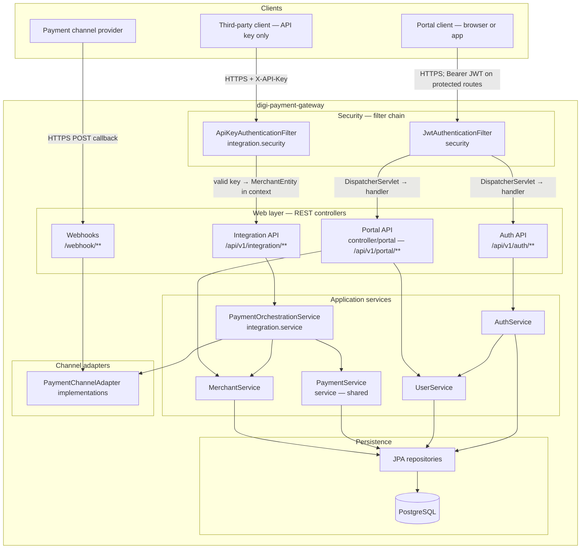

# Digi Payment Gateway — Architecture Documentation

This document describes the **digi-payment-gateway** service as implemented in the repository: responsibilities, layering, APIs, security, data model, and extension points. It reflects the current code (Spring Boot 4, Java 21, PostgreSQL).

---

## 1. Purpose and scope

The service is a **backend payment orchestration API** that:

- Exposes **integration APIs** for **third-party merchant systems**: those clients authenticate **only with an API key** (`X-API-Key`); they do not use JWT for integration routes.
- Exposes **portal APIs** consumed by **our UI**: operators sign **in first** (password or OTP flows) to receive a **JWT** (and refresh token), then call protected portal endpoints with `Authorization: Bearer <token>`.
- Provides **authentication** endpoints (login, email/mobile OTP, refresh, logout) and **user registration** as public pre-login steps where applicable.
- Accepts **payment channel webhooks** (currently wired for a **test** adapter) to update payment status.
- Persists merchants, users, payments, and configuration in **PostgreSQL** via **JPA/Hibernate**.

It is **not** a full front-end application. Several UI merchant/user list and detail endpoints return **501 Not Implemented** with TODOs for JWT subject-to-merchant authorization.

---

## 2. Client access model


| Client                                                         | APIs                                                                                                                                      | Authentication                                                                                                                                           |
| -------------------------------------------------------------- | ----------------------------------------------------------------------------------------------------------------------------------------- | -------------------------------------------------------------------------------------------------------------------------------------------------------- |
| **Third-party client** (merchant backend, partner integration) | **Integration only** — `/api/v1/integration/`** (payment links, transactions, terminal test placeholder)                                  | **API key** in header `X-API-Key`. JWT is **not** used on these paths.                                                                                   |
| **UI portal** (first-party admin/merchant portal)              | **Portal resource APIs** — `/api/v1/portal/`** (merchants, users, etc.). **Auth APIs** — `/api/v1/auth/`** (login, OTP, refresh, logout). | **JWT** after login: obtain access token from auth endpoints, then send `Authorization: Bearer <access_token>`. Refresh via `POST /api/v1/auth/refresh`. |


**Flow in practice**

1. **Third-party system:** Configure the merchant’s API key (issued at onboarding). Call integration endpoints server-to-server with that key only.
2. **Portal user:** Open the UI → register or use existing account → **login** (password or OTP) → store access/refresh tokens → attach Bearer token to every subsequent portal API request until expiry, then refresh or log in again.

**Public (unauthenticated) paths** are limited to what Spring Security and `JwtAuthenticationFilter` allow without a JWT: for example user signup (`POST /api/v1/portal/users`), auth login/OTP/refresh/logout under `/api/v1/auth/`**, and `OPTIONS`. Other `/api/**` routes typically require a valid JWT.

**Webhooks** (`/webhook/`**) are a separate inbound channel from payment providers; they are not called by the third-party client or the portal user browser for normal API access.

---

## 3. Technology stack


| Area        | Choice                                                                                     |
| ----------- | ------------------------------------------------------------------------------------------ |
| Runtime     | Java 21                                                                                    |
| Framework   | Spring Boot 4.0.x (`spring-boot-starter-webmvc`, validation, security, data-jpa, actuator) |
| Persistence | Spring Data JPA, Hibernate (`ddl-auto`: `update` in dev, `validate` in prod)               |
| Database    | PostgreSQL                                                                                 |
| Security    | Spring Security; custom **JWT** (HMAC-SHA256); **API key** header for integration routes   |
| Build       | Maven (`pom.xml`)                                                                          |
| Utilities   | Lombok                                                                                     |


---

## 4. High-level architecture




**Request flow summary**

- **Integration** (`/api/v1/integration/`**) — **third-party clients only:** Every request is evaluated by `integration.security.ApiKeyAuthenticationFilter` before it reaches integration controllers; there is **no** direct client-to-controller path. The filter resolves `X-API-Key` to a `MerchantEntity` and sets `ROLE_INTEGRATION`. `JwtAuthenticationFilter` **skips** these paths, so integration APIs are **not** accessible with Bearer JWT in lieu of an API key.
- **Portal** (`/api/v1/portal/`**) and **auth** (`/api/v1/auth/`**) — **portal after login:** `JwtAuthenticationFilter` runs on `/api/`** (except integration); it validates `Authorization: Bearer <jwt>` on protected routes. Public routes include `POST /api/v1/portal/users` (signup), auth login/OTP/refresh/logout under `/api/v1/auth/**`, as mirrored in `SecurityConfig` and `JwtAuthenticationFilter`.
- **Webhooks** (`/webhook/`**): Permitted without authentication (verify signatures at the edge or in adapters before production use).

---

## 5. Package and layer structure

Root Java package is the single base namespace under `src/main/java` (aligned with the Maven `groupId` and artifact in `pom.xml`).

`**integration` package (aggregate):** Holds everything specific to the **third-party integration surface**: REST controllers under `integration/controller/`, inbound `integration/webhooks/`, `integration/security.ApiKeyAuthenticationFilter`, orchestration and principal extraction in `integration/service/`, request/response types in `integration/dto/` (plus `integration/dto/adaptor/` for adapter payloads), and `integration/adapter/` for payment-channel implementations. Shared domain operations that integration also needs (e.g. `MerchantService`, `PaymentService`, `PaymentChannelService`) stay in top-level `service/`.


| Layer / concern      | Location                                                            | Role                                                                                                                                                             |
| -------------------- | ------------------------------------------------------------------- | ---------------------------------------------------------------------------------------------------------------------------------------------------------------- |
| Bootstrap            | `DigiPaymentGatewayApplication`                                     | `@SpringBootApplication`, `@EnableJpaAuditing`, `@EnableScheduling`                                                                                              |
| Config               | `config/SecurityConfig`                                             | `SecurityFilterChain`, CORS, `PasswordEncoder`                                                                                                                   |
| Web — integration    | `integration/controller/`, `integration/webhooks/`                  | Payment links, transactions, terminal placeholder, payment channel webhooks                                                                                      |
| Web — portal         | `controller/portal/`                                                | Users, merchants (`UserController`, `MerchantController`)                                                                                                        |
| Web — auth           | `auth/controller/`                                                  | Login, OTP, refresh, logout                                                                                                                                      |
| Security             | `security/`, `integration/security/`                                | JWT creation/validation; `integration/security` — API key filter for integration routes                                                                          |
| Domain services      | `service/`                                                          | `MerchantService`, `PaymentChannelService`, `UserService`, `PaymentService` (payment load/save/list-by-merchant; used by integration orchestration and adapters) |
| Integration services | `integration/service/`                                              | `PaymentOrchestrationService`, `IntegrationAuthenticationService` (resolve `MerchantEntity` from API-key security context)                                       |
| Auth domain          | `auth/service/`, `auth/entity/`, `auth/repository/`                 | Refresh tokens, OTP sessions (in-memory)                                                                                                                         |
| Adapters             | `integration/adapter/`                                              | `PaymentChannelAdapter` + `TestPaymentChannelAdapter`                                                                                                            |
| Persistence          | `entity/`, `repository/`                                            | JPA entities and Spring Data repositories                                                                                                                        |
| API contracts        | `dto/`, `auth/dto/`, `integration/dto/`, `integration/dto/adaptor/` | Portal DTOs; integration request/response and adapter DTOs                                                                                                       |
| Cross-cutting        | `exception/GlobalExceptionHandler`                                  | JSON error envelopes                                                                                                                                             |
| Enums                | `enums/`                                                            | Payment status, channel names                                                                                                                                    |


---

## 6. API surface

### 6.1 Integration API (third-party clients — API key only)

Base path: `/api/v1/integration` (prefix configurable via `security.integration.path-prefix`, default `/api/v1/integration/`).


| Method | Path                     | Auth        | Behavior                                                                                                                                |
| ------ | ------------------------ | ----------- | --------------------------------------------------------------------------------------------------------------------------------------- |
| POST   | `/payment-link/generate` | `X-API-Key` | Creates `PaymentEntity`, selects adapter by merchant’s **active** channel config, calls adapter, returns link + channel txn id + status |
| GET    | `/transactions`          | `X-API-Key` | Lists payments for authenticated merchant (newest first)                                                                                |
| GET    | `/transactions/{id}`     | `X-API-Key` | Payment details if owned by merchant                                                                                                    |
| GET    | `/terminal-payment/test` | `X-API-Key` | Placeholder (`TerminalPaymentIntegrationController`); plain-text smoke response                                                         |


Principal type: `MerchantEntity` (`integration.service.IntegrationAuthenticationService.extractMerchant`).

### 6.2 Portal API (JWT after login)

Base path: `/api/v1/portal`.

These routes are for **our UI portal** (first-party app), not for third-party server integration. The portal must **complete login** (see section 6.3) and send the **Bearer access token** on protected calls; third-party systems should use **section 6.1** with an API key instead.

**Merchants** (`MerchantController`, `/api/v1/portal/merchants`)

- Implemented: POST merchant (generates UUID **apiKey**), POST payment-channel-config, DELETE merchant (deactivate), DELETE payment-channel-config (deactivate).
- Not implemented: list/get/patch merchant and config endpoints (501).

**Users** (`UserController`, `/api/v1/portal/users`)

- Implemented: POST create user, DELETE deactivate user.
- Not implemented: list/get/patch (501).

Controllers carry **TODOs**: enforce that the JWT subject maps to a user allowed to act on the target merchant.

### 6.3 Auth API (portal login — public until token issued)

Base: `/api/v1/auth`.


| Endpoint                                                     | Purpose                                              |
| ------------------------------------------------------------ | ---------------------------------------------------- |
| POST `/login`                                                | Email + password → access + refresh tokens           |
| POST `/login/email/request-otp`, `/login/email/verify-otp`   | Email OTP (OTP logged in dev; no email provider yet) |
| POST `/login/mobile/request-otp`, `/login/mobile/verify-otp` | Mobile OTP (same placeholder behavior)               |
| POST `/refresh`                                              | New tokens from refresh token                        |
| POST `/logout`                                               | Invalidates refresh token                            |


JWT **subject** is the user identifier string produced by `AuthService` (user id as string). Refresh tokens are stored hashed in `auth_refresh_token` (entity `AuthRefreshTokenEntity`).

OTP state lives in **in-memory** `ConcurrentHashMap` in `AuthService` (not clustered); scheduled cleanup uses `security.otp.cleanup-interval-ms`.

### 6.4 Webhooks

- `POST /webhook/v1/payment-channel-webhooks/test` — `integration.webhooks.PaymentChannelWebhookController` delegates to `TestPaymentChannelAdapter.validateAndParseWebhook`, updates payment status by `paymentId` in payload.

---

## 7. Payment orchestration and adapter pattern

### 7.1 Orchestration (`integration.service.PaymentOrchestrationService`)

Uses `**service.MerchantService`** for merchant/channel config and `**service.PaymentService**` for persisting and loading `PaymentEntity` rows (the same `PaymentService` is used by channel adapters, e.g. webhook handling).

For **generate payment link**:

1. Load `MerchantConfigEntity` (currency) and **first active** `MerchantPaymentChannelConfigEntity` for the merchant.
2. Resolve `integration.adapter.PaymentChannelAdapter` where `adapter.getChannel().getName()` equals the config’s channel name.
3. Persist a new `PaymentEntity` (`INITIATED`, amount, merchant reference, metadata JSON).
4. Call `adapter.createPaymentLink(payment)`; persist returned URL, channel txn id, and status.
5. Return `PaymentLinkResponse` (`integration.dto`).

**Implication:** Exactly one “active” channel config is chosen via `findFirstByMerchant_IdAndIsActiveTrue`; ordering is repository-defined unless refined later.

### 7.2 Adapter contract (`integration.adapter.PaymentChannelAdapter`)

```text
getChannel()
createPaymentLink(PaymentEntity)
validateAndParseWebhook(Map<String, Object>)
```

Implementations are Spring **beans**; orchestration injects `List<PaymentChannelAdapter>` and picks by channel name.

**Current implementation:** `integration.adapter.TestPaymentChannelAdapter` — synthetic txn id, local test URL, webhook updates status via `service.PaymentService` from payload keys `paymentId`, `paymentStatus` (enum name).

**Declared channel names** (`PaymentChannelNameEnum`): `XPLORPAY`, `PAYMOB`, `STRIPE`, `RAZORPAY`, `TEST`. Only **TEST** has an adapter class in-tree; **payment_channel** rows must exist in the database for adapters to resolve (`PaymentChannelService.findByName`).

---

## 8. Security model

### 8.1 Spring Security (`SecurityConfig`)

- **CSRF** disabled (stateless API style).
- **CORS** allows all origin patterns, common methods, all headers, credentials false.
- **PermitAll:** `OPTIONS /`**, `/webhook/**`, selected auth and user-registration paths.
- **Authenticated:** `/api/v1/integration/`** and remaining `/api/**`.

Filters (order): `integration.security.ApiKeyAuthenticationFilter` → `security.JwtAuthenticationFilter` → (defaults).

### 8.2 API key integration (third-party → integration APIs only)

- Type: `integration.security.ApiKeyAuthenticationFilter` (Spring `@Component`).
- Header: `**X-API-Key**`.
- Lookup: `MerchantRepository.findByApiKey`; merchant must be **active**.
- Sets `UsernamePasswordAuthenticationToken` with principal = `MerchantEntity`, authority `ROLE_INTEGRATION`.

### 8.3 JWT (portal / UI)

- Custom `JwtService` (HS256, configurable `security.jwt.secret`, `security.jwt.expiration-seconds`).
- Filter applies to `/api/`** except integration paths, webhooks, and explicitly public auth/signup routes.

**Operational note:** `SecurityConfig` permits email OTP endpoints without authentication; ensure `JwtAuthenticationFilter.requiresJwtAuth` stays aligned with those paths so clients are not asked for a Bearer token on OTP steps.

### 8.4 Secrets and profiles


| Property / env                                                               | Use                                                                           |
| ---------------------------------------------------------------------------- | ----------------------------------------------------------------------------- |
| `security.jwt.secret`                                                        | JWT signing (dev default in `application-dev.properties`; prod: `JWT_SECRET`) |
| `spring.datasource.`* / `DB_*`                                               | PostgreSQL                                                                    |
| `security.jwt.expiration-seconds`, `security.jwt.refresh-expiration-seconds` | Token lifetimes                                                               |
| `security.integration.path-prefix`                                           | Integration URL prefix for API key filter                                     |


---

## 9. Data model

All persistent entities extend `AuditableEntity` (`createdDateTime`, `updatedDateTime`) with JPA auditing enabled.

```mermaid
erDiagram
    merchant ||--o| merchant_config : has
    merchant ||--o{ merchant_payment_channel_config : has
    payment_channel ||--o{ merchant_payment_channel_config : referenced_by
    merchant ||--o{ payment : owns
    payment_channel ||--o{ payment : channel
    merchant_payment_channel_config ||--o{ payment : used_by
    users }o--o{ merchant : user_merchant
    users ||--o{ auth_refresh_token : optional_refresh

    merchant {
        bigint id PK
        string name
        string apiKey UK
        boolean isActive
    }
    merchant_config {
        bigint id PK
        bigint merchant_id FK UK
        text webhookUrl
        string currency
    }
    merchant_payment_channel_config {
        bigint id PK
        bigint merchant_id FK
        bigint payment_channel_id FK
        boolean isActive
        text configJson
    }
    payment_channel {
        bigint id PK
        enum name UK
        boolean isActive
    }
    payment {
        bigint id PK
        bigint merchant_id FK
        bigint merchant_payment_channel_config_id FK
        bigint payment_channel_id FK
        string merchantReferencePaymentId
        string paymentChannelTxnId
        decimal amount
        string currency
        enum status
        string paymentLinkUrl
        text merchantMetadataJson
    }
    users {
        bigint id PK
        string email UK
        string mobileNumber UK
        string passwordHash
        string name
        boolean isActive
        boolean isVerified
    }
```


**Payment statuses** (`PaymentStatusEnum`): `INITIATED`, `PAYMENT_LINK_GENERATED`, `SUCCESS`, `FAILED`, `REFUNDED`, `VOIDED`.

**Supporting / logging entities** (present in codebase): `PaymentChannelApiLogEntity`, `WebhookIncomingPaymentChannelLogEntity`, `WebhookOutgoingMerchantLogEntity` — intended for observability and outbound merchant notifications; webhook controller path shown above uses the test adapter directly.

---

## 10. Runtime and operations

- **Actuator** is on the classpath (`spring-boot-starter-actuator`); expose/management settings can be tightened per environment (not detailed in base `application.properties`).
- **Scheduling** enabled for OTP maintenance in `AuthService`.
- **Dev profile** (`application-dev.properties`): local PostgreSQL URL, `ddl-auto=update`, JWT dev secret placeholder.
- **Prod profile** (`application-prod.properties`): `ddl-auto=validate`, datasource and JWT from environment.

---

## 11. Error handling

`GlobalExceptionHandler` returns JSON with `timestamp`, `status`, `error`, `message`, `path` for:

- `IllegalArgumentException` → 400  
- `EntityNotFoundException` → 404  
- Other `Exception` → 500

`ResponseStatusException` (used widely for 401/404/409/429) is **not** mapped explicitly; it is normally handled by Spring MVC’s default handling for that exception type. Prefer consistent handling if you standardize API errors.

---

## 12. Extension guidelines

1. **New payment channel:** Add enum value if needed, ensure DB row in `payment_channel`, implement `integration.adapter.PaymentChannelAdapter` in `integration.adapter` as a `@Component`, store secrets/config in `merchant_payment_channel_config.configJson` (consumption is adapter-specific).
2. **Merchant webhooks:** `merchant_config.webhookUrl` is available for future outbound notifications when payments change (wire in orchestration or a domain event handler).
3. **Multi-channel selection:** Replace or augment `findFirstByMerchant_IdAndIsActiveTrue` with explicit channel selection in the API if merchants support multiple active channels.
4. **UI authorization:** Implement JWT subject → `UserEntity` → allowed `MerchantEntity` checks on merchant/user mutating endpoints.

---

## 13. Current limitations (as of this codebase)

- No `data.sql`/migration in repo for seeding `payment_channel`; TEST channel must exist for `TestPaymentChannelAdapter` to start.
- Webhook endpoint is **unauthenticated**; production should validate provider signatures and map routes per channel.
- OTP delivery is **log-only**; no SMS/email integration.
- OTP sessions are **single-node** in-memory.
- Several UI read/update endpoints are **stubs** (501).
- Integration API trusts **API key only**; consider IP allowlists, rotating keys, and audit logging for high-risk deployments.

---

## 14. Related files (quick reference)


| Topic                        | Primary types                                                                                                          |
| ---------------------------- | ---------------------------------------------------------------------------------------------------------------------- |
| Security chain               | `config/SecurityConfig.java`                                                                                           |
| Integration auth             | `integration/security/ApiKeyAuthenticationFilter.java`, `integration/service/IntegrationAuthenticationService.java`    |
| JWT                          | `security/JwtService.java`, `security/JwtAuthenticationFilter.java`                                                    |
| Payment link flow            | `integration/service/PaymentOrchestrationService.java`, `integration/controller/PaymentLinkIntegrationController.java` |
| Payment persistence (shared) | `service/PaymentService.java`, `repository/PaymentRepository.java`                                                     |
| Test channel                 | `integration/adapter/TestPaymentChannelAdapter.java`, `integration/webhooks/PaymentChannelWebhookController.java`      |
| Auth                         | `auth/service/AuthService.java`, `auth/controller/AuthController.java`                                                 |


This document should be updated when new adapters, security rules, or API versions are added.