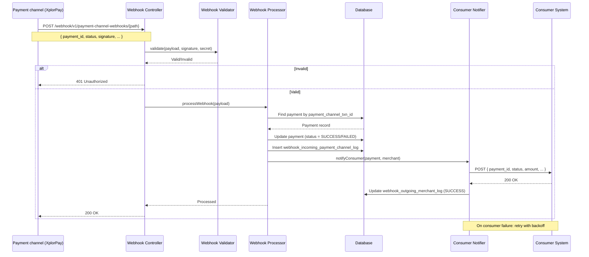

# Digi Payment Gateway — Architecture Documentation

## Overview

The **Digi Payment Gateway** is a Common Payment Gateway Application that acts as an intermediary between consumer applications (e-commerce platforms, booking systems, ERP/POS systems) and multiple payment channels. It provides a unified API layer so consumers integrate once and can use any supported payment channel.

---

## 1. High-Level Architecture

```
┌───────────────────────────────────────────────────────────────────────────────────────────────────┐
│                              CONSUMER APPLICATIONS                                                │
│  (E-commerce, Booking Systems, ERP/POS, etc.)                                                     │
└───────────────────────────────────────────────────────────────────────────────────────────────────┘
                                           │
                                           │ REST API (Unified)
                                           ▼
┌───────────────────────────────────────────────────────────────────────────────────────────────────┐
│                        DIGI PAYMENT GATEWAY (Spring Boot)                                         │
│  ┌─────────────────────────────────────────────────────────────────────────────────────────────┐  │
│  │                    Consumer API Layer (REST Controllers)                                    │  │
│  │  /api/v1/integration/payment-link  │  /api/v1/integration/transactions  │  /api/v1/integration/terminal-payment  │  /api/v1/ui/... │  │
│  │  /webhook/v1/payment-channel-webhooks  (payment channel → gateway)                         │  │
│  └─────────────────────────────────────────────────────────────────────────────────────────────┘  │
│                                           │                                                       │
│  ┌─────────────────────────────────────────────────────────────────────────────────────────────┐  │
│  │                    Payment Orchestration Service                                            │  │
│  │  • Channel selection  • Adapter routing (by channel name)  • Response mapping              │  │
│  └─────────────────────────────────────────────────────────────────────────────────────────────┘  │
│                                           │                                                       │
│  ┌─────────────────────────────────────────────────────────────────────────────────────────────┐  │
│  │                    Payment Channel Adapters (Strategy Pattern)                              │  │
│  │  ┌─────────────┐  ┌─────────────┐  ┌─────────────┐  ┌─────────────┐  ┌─────────────────┐    │  │
│  │  │ XplorPay    │  │ Paymob      │  │ Stripe      │  │ Razorpay    │  │ Future channels │    │  │
│  │  │ Adapter     │  │ Adapter     │  │ Adapter     │  │ Adapter     │  │                 │    │  │
│  │  └─────────────┘  └─────────────┘  └─────────────┘  └─────────────┘  └─────────────────┘    │  │
│  └─────────────────────────────────────────────────────────────────────────────────────────────┘  │
│                                           │                                                       │
│  ┌─────────────────────────────────────────────────────────────────────────────────────────────┐  │
│  │                    Webhook Processing Layer                                                 │  │
│  │  • Payment channel webhook receivers  • Validation  • Status Update  • Consumer Forwarding  │  │
│  └─────────────────────────────────────────────────────────────────────────────────────────────┘  │
│                                           │                                                       │
│  ┌─────────────────────────────────────────────────────────────────────────────────────────────┐  │
│  │                    Configuration & Persistence                                              │  │
│  │  • Merchant/Channel Config  • Payment Records  • Transaction Logs  • Retry Queue            │  │
│  └─────────────────────────────────────────────────────────────────────────────────────────────┘  │
└───────────────────────────────────────────────────────────────────────────────────────────────────┘
                                           │
     ┌────────────────────┬────────────────┼────────────────┬────────────────┬────────────────────┐
     ▼                    ▼                ▼                ▼                ▼
┌──────────┐  ┌──────────────┐  ┌──────────────┐  ┌──────────────┐  ┌──────────────┐
│PostgreSQL│  │ XplorPay API │  │  Paymob API  │  │  Stripe API  │  │ Razorpay API │
│(Database)│  │    (1st)     │  │    (2nd)     │  │    (3rd)     │  │    (4th)     │
└──────────┘  └──────────────┘  └──────────────┘  └──────────────┘  └──────────────┘
```

---

## 2. Component Breakdown

### 2.1 API Layer Segmentation


**Consumer / Third-party integration APIs**

| Component                                | Responsibility                   | Endpoints                                                                 |
| ---------------------------------------- | -------------------------------- | ------------------------------------------------------------------------- |
| **PaymentLinkIntegrationController**     | Payment link operations          | `POST /api/v1/integration/payment-link/generate` (201 Created) |
| **TransactionIntegrationController**     | Transaction read operations      | `GET /api/v1/integration/transactions`<br>`GET /api/v1/integration/transactions/{id}` |
| **TerminalPaymentIntegrationController** | Terminal integration (future)      | `GET /api/v1/integration/terminal-payment/test`                          |

**Internal / panel APIs**

| Component                           | Responsibility                            | Endpoints                                                                 |
| ----------------------------------- | ----------------------------------------- | ------------------------------------------------------------------------- |
| **MerchantController**              | UI panel merchant onboarding/config       | **Implemented:** `POST /api/v1/ui/merchants` (201), `POST /api/v1/ui/merchants/{merchantId}/payment-channel-configs` (201), `DELETE /api/v1/ui/merchants/{merchantId}` (204), `DELETE /api/v1/ui/merchants/{merchantId}/payment-channel-configs/{configId}` (204). **Stubs (501 + plain text):** `GET /api/v1/ui/merchants`, `GET /api/v1/ui/merchants/{merchantId}`, `PATCH /api/v1/ui/merchants/{merchantId}`, list/get/patch under `.../payment-channel-configs`. |
| **UserController**                  | UI user lifecycle                         | **Implemented:** `POST /api/v1/ui/users` (201), `DELETE /api/v1/ui/users/{userId}` (204). **Stubs (501):** `GET` list, `GET /{userId}`, `PATCH /{userId}`. |
| **AuthController**                  | UI authentication (login/session lifecycle) | `POST /api/v1/ui/auth/login`<br>`POST /api/v1/ui/auth/login/mobile/request-otp`<br>`POST /api/v1/ui/auth/login/mobile/verify-otp`<br>`POST /api/v1/ui/auth/refresh`<br>`POST /api/v1/ui/auth/logout` |
| **UiController**                    | UI panel placeholder APIs                 | `GET /api/v1/ui/test`                                                     |
| **Actuator**                        | Health/readiness (ops/internal)           | `GET /actuator/health`                                                    |

**Payment channel callback APIs**

| Component                           | Responsibility                          | Endpoints                                                                 |
| ----------------------------------- | --------------------------------------- | ------------------------------------------------------------------------- |
| **PaymentChannelWebhookController** | Inbound callbacks from payment channels | `POST /webhook/v1/payment-channel-webhooks/test` (JSON body as `Map`; `TestPaymentChannelAdapter.validateAndParseWebhook(...)`) |


**Key Features:**

- Clear boundary between consumer integration APIs and internal/channel-facing APIs
- Request validation and error mapping
- Consistent response format (JSON)
- Controllers return **`ResponseEntity<T>`** with explicit HTTP status where implemented (e.g. **201 Created** for payment-link generate and merchant create endpoints, **200 OK** for reads and webhooks)

**Authentication:**

- **Integration APIs** (`SecurityConfig`: `/api/v1/integration/**` authenticated): **`ApiKeyAuthenticationFilter`** runs first and handles only requests whose URI starts with **`security.integration.path-prefix`** (default **`/api/v1/integration/`** from `ApiKeyAuthenticationFilter`). Valid header **`X-API-Key`** must match **`merchant.apiKey`** for an **active** merchant. The security principal is **`MerchantEntity`**; controllers use **`IntegrationAuthenticationService.extractMerchant(Authentication)`**.
- **UI APIs** (other `/api/**` routes): **`JwtAuthenticationFilter`** requires **`Authorization: Bearer <access_token>`** except for paths it skips: integration prefix, `/webhook/**`, **`POST /api/v1/ui/users`**, and the **`/api/v1/ui/auth/...`** login/OTP/refresh/logout routes (logout does not require a Bearer token in the JWT filter). Filter order: API key filter, then JWT filter, then username/password.
- **Webhooks:** `/webhook/**` is **permitAll** (no API key or JWT).

---

### 2.2 Payment Orchestration Service

Implemented by **`PaymentOrchestrationService`**:

| Method | Role |
| ------ | ---- |
| **`generatePaymentLink(MerchantEntity merchant, PaymentLinkRequest request)`** | Resolves active channel config and `merchant_config`, persists a new **`PaymentEntity`**, calls **`createPaymentLink(payment)`** on the adapter whose **`getChannel().getName()`** equals **`merchantPaymentChannelConfig.getPaymentChannel().getName()`**, then updates the payment row from **`AdapterPaymentLinkResponse`**. Returns **`PaymentLinkResponse`**. |
| **`getPaymentDetails(Long paymentId, Long merchantId)`** | **`PaymentDetailsResponse`** for that merchant’s payment (`findByIdAndMerchant_Id`). |
| **`listPaymentDetails(Long merchantId)`** | All payments for the merchant, newest first (`findAllByMerchant_IdOrderByCreatedDateTimeDesc`). |


| Responsibility                 | Description                                                           |
| ------------------------------ | --------------------------------------------------------------------- |
| **Merchant config resolution** | Loads **`merchant_config`** (1:1) for **currency** on payment-link creation; **webhookUrl** is for future consumer notification |
| **Payment channel resolution** | **`findFirstByMerchant_IdAndIsActiveTrue`** on **`merchant_payment_channel_config`**; adapter chosen by **payment channel enum name** equality (not by optional DTO `paymentChannelName`) |
| **Request routing**            | Delegates **`createPaymentLink(PaymentEntity)`** to the resolved adapter |
| **Response mapping**           | Maps adapter **`AdapterPaymentLinkResponse`** onto persisted **`PaymentEntity`** and **`PaymentLinkResponse`** |
| **Retry logic**                | Target design for channel HTTP and consumer webhooks; not implemented in this service today |
| **Logging**                    | Adapter/channel code may use structured logging; no central correlation ID yet |


---

### 2.3 Payment Channel Adapters (Strategy Pattern)

```java
// Actual interface (package adapter)
import java.util.Map;

public interface PaymentChannelAdapter {
    PaymentChannelEntity getChannel();

    // Record: paymentLinkUrl, paymentChannelTxnId, status (from adapter after link creation)
    AdapterPaymentLinkResponse createPaymentLink(PaymentEntity payment);

    // Parsed JSON body from the payment channel (per-channel shape)
    AdaptorWebhookResponse validateAndParseWebhook(Map<String, Object> webhookPayload);
}
```


| Adapter                    | Implementation Order | Payment channel API                        |
| -------------------------- | -------------------- | ------------------------------------------ |
| **TestPaymentChannelAdapter** | Implemented (dev) | In-process TEST channel (no external API)  |
| **XplorPayAdapter**        | 1st (planned)        | XplorPay REST API                          |
| **PaymobAdapter**          | 2nd (planned)        | Paymob REST API                            |
| **StripeAdapter**          | 3rd (planned)        | Stripe REST API                            |
| **RazorpayAdapter**        | 4th (planned)        | Razorpay REST API                          |
| **Future adapters**        | Extensible           | New `@Component` implementing the interface |


#### Outbound HTTP Standard (Direct RestTemplate)

- `RestTemplate` is the standard outbound HTTP client for all payment channel API calls.
- Adapters and outbound services inject `RestTemplate` directly and call `exchange(...)` for GET/POST/PUT operations.
- No dedicated outbound HTTP wrapper/facade service should be introduced.
- A shared Spring bean configuration provides timeout defaults, interceptor chain, and centralized `ResponseErrorHandler`.
- Adapter code remains responsible for provider-specific request/response mapping and converting transport errors to domain exceptions.
- Outbound request/response details are persisted to `payment_channel_api_log` with secrets masked or omitted.


**Adding a new payment channel:**

1. Create `XxxChannelAdapter` implementing `PaymentChannelAdapter`
2. Register as Spring bean with `@Component`
3. Add payment channel configuration in `merchant_payment_channel_config` table
4. Inject `RestTemplate` directly and implement outbound calls via `exchange(...)`
5. Ensure outbound API logs are persisted to `payment_channel_api_log`
6. No changes to consumer API or orchestration layer

---

### 2.4 Webhook Processing Layer


| Component                               | Responsibility                                                                                |
| --------------------------------------- | --------------------------------------------------------------------------------------------- |
| **Payment channel webhook controllers** | Receive webhooks under `/webhook/v1/payment-channel-webhooks/...`; current `/test` endpoint injects and calls `TestPaymentChannelAdapter` directly |
| **Webhook Validator**                   | Verify signature/secret per payment channel                                                   |
| **Webhook Processor**                   | Parse payload, update payment record, trigger consumer notification                           |
| **Consumer Notification Service**       | Forward payment result to the consumer webhook URL from `merchant_config` with retry          |


---

### 2.5 Configuration & Persistence


| Component                          | Responsibility                                                  |
| ---------------------------------- | --------------------------------------------------------------- |
| **MerchantService**                | Merchant registration and `merchant_payment_channel_config` creation (UI APIs) |
| **PaymentOrchestrationService**    | Payment link generation and payment details (integration API)   |
| **PaymentRepository**              | Store payment records and transaction data                      |
| **WebhookIncomingPaymentChannelLogRepository** | Persist incoming payment-channel webhook payloads (`webhook_incoming_payment_channel_log`) when the pipeline is wired |
| **WebhookOutgoingMerchantLogRepository** | Outbound calls to merchant webhooks (`webhook_outgoing_merchant_log`) when the pipeline is wired |
| **PaymentChannelApiLogRepository** | Log outbound request/response for each payment channel API call |


---

## 3. Webhook Flow

```
┌──────────────┐     ┌─────────────────────┐     ┌─────────────────────┐     ┌─────────────┐
│   Payment    │     │  Digi Payment       │     │  Digi Payment       │     │   Consumer  │
│   Channel    │     │  Gateway            │     │  Gateway            │     │   System    │
│  (XplorPay)  │     │  (Webhook Receiver) │     │  (Processor)        │     │             │
└──────┬───────┘     └──────────┬──────────┘     └──────────┬──────────┘     └─────┬───────┘
       │                        │                           │                      │
       │ 1. POST /webhook/v1/   │                           │                      │
       │    payment-channel-    │                           │                      │
       │    webhooks/…          │                           │                      │
       │  (payment status)      │                           │                      │
       │───────────────────────>│                           │                      │
       │                        │                           │                      │
       │                        │ 2. Validate signature     │                      │
       │                        │    (HMAC/secret)          │                      │
       │                        │                           │                      │
       │                        │ 3. Parse & store          │                      │
       │                        │──────────────────────────>│                      │
       │                        │                           │                      │
       │                        │                           │ 4. Update payment    │
       │                        │                           │    record in DB      │
       │                        │                           │                      │
       │                        │                           │ 5. Forward to        │
       │                        │                           │    consumer webhook  │
       │                        │                           │─────────────────────>│
       │                        │                           │                      │
       │                        │                           │ 6. 200 OK            │
       │                        │                           │<─────────────────────│
       │                        │                           │                      │
       │ 7. 200 OK              │                           │                      │
       │<───────────────────────│                           │                      │
       │                        │                           │                      │
       │                        │  (If consumer fails: retry with backoff)         │
       │                        │                           │                      │
```

### Webhook Steps

1. **Receive** — Payment channel sends HTTP POST to `POST /webhook/v1/payment-channel-webhooks/...` (today: `/test` for the TEST adapter; future providers get dedicated subpaths).
2. **Validate** — Verify signature/secret using payment channel-specific validation (HMAC, API key, etc.). **Current `/test` stub** does not perform real verification; it forwards the JSON body as a **`Map`** into **`TestPaymentChannelAdapter.validateAndParseWebhook`**.
3. **Parse** — Extract payment ID, status, amount, payment channel transaction ID (per adapter).
4. **Store** — Update `payment` record and optionally `webhook_incoming_payment_channel_log` (target flow; not wired for the **`/test`** stub yet).
5. **Forward** — Call the consumer webhook URL stored on **`merchant_config.webhookUrl`** (one row per merchant) with a normalized payload.
6. **Retry** — If consumer webhook fails, retry with exponential backoff (configurable).

**Note:** §3 diagram and §5.2 show the **target** end-to-end pipeline. The live **`/test`** handler today returns **`AdaptorWebhookResponse`** from the adapter without DB updates or consumer notification unless you extend the pipeline.

### Merchant Setup Flow (UI)

1. **Register merchant** — `POST /api/v1/ui/merchants` creates `merchant` + `merchant_config`.
2. **Currency defaulting** — `currency` in registration is optional; when omitted/blank, backend defaults to `USD`.
3. **Create channel config** — `POST /api/v1/ui/merchants/{merchantId}/payment-channel-configs` with body **`MerchantPaymentChannelConfigCreateRequest`**: required **`paymentChannelId`**; optional **`paymentChannelName`** (enum, informational — resolution uses id); optional **`isActive`** (defaults true); optional **`configJson`**.
4. **Conflict guard** — Duplicate `(merchant, paymentChannel)` configs are rejected with HTTP `409`.

---

## 4. Data Model (Java Entities)

Primary keys are **Long**, **unique**, and identity-generated (1, 2, 3, …). Types below are Java entity field types. The model includes **UserEntity**, **MerchantEntity**, **MerchantConfigEntity**, **PaymentChannelEntity**, **MerchantPaymentChannelConfigEntity**, **PaymentEntity**, **WebhookIncomingPaymentChannelLogEntity**, **WebhookOutgoingMerchantLogEntity**, and **PaymentChannelApiLogEntity**, plus the join table **user_merchant** (UserEntity ↔ MerchantEntity, no separate entity). Java class names use the `Entity` suffix; database tables include `webhook_incoming_payment_channel_log` and `webhook_outgoing_merchant_log` (replacing older doc names `webhook_incoming_log` / `webhook_merchant_log`).

### 4.1 Entity Relationship Diagram

The entity definitions in **§4.2** follow this diagram.

```
┌─────────────────────┐       ┌─────────────────────────────┐
│ UserEntity          │       │ user_merchant (join table)  │       │ MerchantEntity      │
│ table: users        │       │ user_id, merchant_id        │       │ table: merchant     │
├─────────────────────┤       ├─────────────────────────────┤       ├─────────────────────┤
│ id (Long PK)        │───┐   │ user_id (FK)                │   ┌───│ id (Long PK)        │
│ email               │   └──>│ merchant_id (FK)            │<──┘   │ name                │
│ passwordHash        │       └─────────────────────────────┘       │ apiKey (UUID)       │
│ name                │                                             │ isActive            │
│ isActive            │                                             │ createdDateTime     │
│ isVerified          │                                             │ updatedDateTime     │
│ createdDateTime     │                                             └──────────┬──────────┘
│ updatedDateTime     │                                                        │ 1:1
└─────────────────────┘                                                        ▼
                                                                        ┌─────────────────────┐
                                                                        │ MerchantConfigEntity │
                                                                        │ merchant_config      │
                                                                        ├─────────────────────┤
                                                                        │ merchantId (FK, UQ) │
                                                                        │ webhookUrl          │
                                                                        │ currency (ISO 4217) │
                                                                        └─────────────────────┘

        Many-to-many: one user can manage many merchants; one merchant can have many users.

┌─────────────────────┐       ┌────────────────────────────────┐       ┌─────────────────────────┐
│ MerchantEntity      │       │ MerchantPaymentChannelConfigEntity │       │ PaymentChannelEntity    │
│ table: merchant     │       │ table: merchant_payment_channel_config │       │ table: payment_channel  │
├─────────────────────┤       ├────────────────────────────────┤       ├─────────────────────────┤
│ id (Long PK)        │───┐   │ id (Long PK)                   │   ┌───│ id (Long PK)            │
│ name                │   │   │ merchantId (FK)                │   │   │ name (PaymentChannelNameEnum) │
│ apiKey (UUID)       │   └──>│ paymentChannelId (FK)          │<──┘   │ isActive                │
│ isActive            │       │ isActive                       │       │ createdDateTime         │
│ createdDateTime     │       │ configJson                     │       │ updatedDateTime         │
│ updatedDateTime     │       │ createdDateTime                │       └─────────────────────────┘
│                     │       │ updatedDateTime                │
│                     │       └────────────────────────────────┘
└─────────────────────┘
                                          │
                                          │
                              ┌───────────┴───────────┐
                              ▼                       ▼
┌─────────────────────┐       ┌──────────────────────────────────────┐       ┌─────────────────────────────────────┐
│ PaymentEntity       │       │ WebhookIncomingPaymentChannelLogEntity │       │ WebhookOutgoingMerchantLogEntity    │
│ table: payment      │       │ webhook_incoming_payment_channel_log  │       │ webhook_outgoing_merchant_log       │
├─────────────────────┤       ├──────────────────────────────────────┤       ├─────────────────────────────────────┤
│ id (Long PK)        │       │ id (Long PK)                         │◄──────│ webhook_incoming_payment_channel_   │
│ merchantId (FK)     │       │ paymentId (FK)                       │       │   log_id (FK, required)           │
│ merchantPaymentChannelConfigId (FK) │ paymentChannelId (FK)       │       │ paymentId (FK)                      │
│ paymentChannelId(FK)│       │ merchantId (FK)                    │       │ paymentChannelId (FK)               │
│ amount              │       │ rawPayload                         │       │ merchantId (FK)                   │
│ currency            │       │ status                             │       │ webhookUrl, payload, status       │
│ status              │       │ createdDateTime / updatedDateTime   │       │ retryCount, lastAttemptAt         │
│ paymentChannelTxnId │       └──────────────────────────────────────┘       │ createdDateTime / updatedDateTime   │
│ paymentLinkUrl      │                                                      └─────────────────────────────────────┘
│ merchantRefPaymentId│
│ merchantMetadataJson│
│ createdDateTime     │
│ updatedDateTime     │
└─────────────────────┘
                              │
                              │ (outbound API calls)
                              ▼
                    ┌─────────────────────────────┐
                    │ PaymentChannelApiLogEntity  │
                    │ payment_channel_api_log     │
                    ├─────────────────────────────┤
                    │ id (Long PK)                │
                    │ paymentId (FK)              │
                    │ paymentChannelId (FK)       │
                    │ merchantId (FK)             │
                    │ merchantPaymentChannelConfigId (FK) │
                    │ operation, request*, response*      │
                    │ createdDateTime / updatedDateTime   │
                    └─────────────────────────────┘
```

### 4.2 Entity Definitions

All entities use **Long id** as primary key (unique; identity/sequence: 1, 2, 3, …). Types are Java field types. Enum types use the `**Enum**` suffix (e.g. `PaymentChannelNameEnum`, `PaymentStatusEnum`).

**Audit timestamps (`AuditableEntity`):** Every subclass inherits **`createdDateTime`** and **`updatedDateTime`** (Java **`LocalDateTime`**; JPA columns **`createdDateTime`** / **`updatedDateTime`** on the mapped superclass). 

#### UserEntity (table: `users`)

For application login and managing merchants. One user can manage multiple merchants; one merchant can have multiple users (many-to-many via join table user_merchant).


| Field        | Type    | Description                      |
| ------------ | ------- | -------------------------------- |
| id           | Long    | PK (1, 2, 3, …)                  |
| email        | String  | Unique login email               |
| passwordHash | String  | Hashed password (e.g. BCrypt)    |
| name         | String  | User display name                |
| isActive     | Boolean | Whether account is active        |
| isVerified   | Boolean | Whether user is verified         |
| createdDateTime | LocalDateTime | From `AuditableEntity` |
| updatedDateTime | LocalDateTime | From `AuditableEntity` |


#### Join table `user_merchant` (UserEntity ↔ MerchantEntity, many-to-many)

Join table for **UserEntity ↔ MerchantEntity** many-to-many. Which users can manage which merchants. No separate entity class when using `@ManyToMany`; the table has only the two FKs.

**JPA mapping:** Use `@ManyToMany`. **UserEntity**: `@ManyToMany` with `@JoinTable(name = "user_merchant", joinColumns = @JoinColumn(name = "user_id"), inverseJoinColumns = @JoinColumn(name = "merchant_id"))`, e.g. `List<MerchantEntity> merchants`. **MerchantEntity**: `@ManyToMany(mappedBy = "merchants")`, e.g. `List<UserEntity> users`. The join table `user_merchant` has columns `user_id`, `merchant_id`.


| Column      | Type | Description         |
| ----------- | ---- | ------------------- |
| user_id     | Long | FK → UserEntity     |
| merchant_id | Long | FK → MerchantEntity |


Unique constraint on (user_id, merchant_id). One user can be linked to the same merchant only once.

#### MerchantEntity (table: `merchant`)


| Field     | Type              | Description                                                 |
| --------- | ----------------- | ----------------------------------------------------------- |
| id        | Long              | PK (1, 2, 3, …)                                             |
| name      | String            | Merchant display name                                       |
| apiKey    | String            | Plain UUID; used only for server-to-server payment API auth |
| config    | MerchantConfigEntity | **One-to-one** inverse mapping (`mappedBy = "merchant"`); optional until a `merchant_config` row exists |
| isActive  | Boolean           | Whether merchant is active                                  |
| createdDateTime | LocalDateTime | From `AuditableEntity` |
| updatedDateTime | LocalDateTime | From `AuditableEntity` |

Consumer webhook URL and default **currency** for payment operations live on **`MerchantConfigEntity`** (`merchant_config`), not on this table.


#### MerchantConfigEntity (table: `merchant_config`)

Exactly **one** row per merchant (enforced by unique `merchant_id`). Holds integration settings used by orchestration and consumer notification.


| Field      | Type    | Description                                                                 |
| ---------- | ------- | --------------------------------------------------------------------------- |
| id         | Long    | PK (1, 2, 3, …)                                                             |
| merchantId | Long    | FK → `merchant.id`, **unique** (1:1 with merchant)                          |
| webhookUrl | String  | Consumer callback URL for payment status notifications (optional if not set) |
| currency   | String  | ISO 4217 alphabetic code (e.g. USD); used when creating payment links         |
| createdDateTime | LocalDateTime | From `AuditableEntity` |
| updatedDateTime | LocalDateTime | From `AuditableEntity` |

**JPA:** Owning side is **`MerchantConfigEntity`**: `@OneToOne` + `@JoinColumn(name = "merchant_id", nullable = false, unique = true)`. **`MerchantEntity`** uses `@OneToOne(mappedBy = "merchant", fetch = LAZY)`.

**Payment link API:** The consumer request body does **not** include `currency`; orchestration loads `merchant_config` for the merchant and copies **`currency`** onto the **`payment`** row (and adapters use that resolved value).


#### PaymentChannelEntity (table: `payment_channel`)

Extends **`AuditableEntity`**: audit fields are mapped as **`createdDateTime`** and **`updatedDateTime`** (`LocalDateTime` in Java; explicit `@Column` names on the mapped superclass).

Channel is identified by **`name`** (`PaymentChannelNameEnum`, stored as string). Values include **XPLORPAY**, **PAYMOB**, **STRIPE**, **RAZORPAY**, **TEST**. No separate provider code column.


| Field    | Type                   | Description                            |
| -------- | ---------------------- | -------------------------------------- |
| id       | Long                   | PK (1, 2, 3, …)                        |
| name     | PaymentChannelNameEnum | Unique channel key (enum, see above)   |
| isActive | Boolean                | Whether this payment channel is active |
| createdDateTime | LocalDateTime | From `AuditableEntity` |
| updatedDateTime | LocalDateTime | From `AuditableEntity` |


#### MerchantPaymentChannelConfigEntity (table: `merchant_payment_channel_config`)


| Field            | Type    | Description                                      |
| ---------------- | ------- | ------------------------------------------------ |
| id               | Long    | PK (1, 2, 3, …)                                  |
| merchantId       | Long    | FK → MerchantEntity                              |
| paymentChannelId | Long    | FK → PaymentChannelEntity                        |
| isActive         | Boolean | Whether this config is active                    |
| configJson       | String  | Payment channel-specific config (API keys, etc.) |
| createdDateTime  | LocalDateTime | From `AuditableEntity` |
| updatedDateTime  | LocalDateTime | From `AuditableEntity` |


#### PaymentEntity (table: `payment`)


| Field                      | Type              | Description                                  |
| -------------------------- | ----------------- | -------------------------------------------- |
| id                         | Long              | PK (1, 2, 3, …)                              |
| merchantId                 | Long              | FK → MerchantEntity                          |
| merchantPaymentChannelConfigId | Long          | FK → MerchantPaymentChannelConfigEntity      |
| paymentChannelId           | Long              | FK → PaymentChannelEntity                    |
| merchantReferencePaymentId | String            | Merchant's payment/order reference ID        |
| paymentChannelTxnId        | String            | Payment channel's transaction ID             |
| amount                     | BigDecimal        | Amount                                       |
| currency                   | String            | ISO 4217 currency code (set from `merchant_config.currency` at link creation, not from consumer payload) |
| status                     | PaymentStatusEnum | Default **INITIATED** on insert; after adapter link step typically **PAYMENT_LINK_GENERATED** (or adapter-returned status). Also **SUCCESS**, **FAILED**, **REFUNDED**, **VOIDED** |
| paymentLinkUrl             | String            | Generated payment link                       |
| merchantMetadataJson       | String            | Merchant-provided metadata (JSON)            |
| createdDateTime    | LocalDateTime     | From `AuditableEntity`                       |
| updatedDateTime    | LocalDateTime     | From `AuditableEntity`                       |


#### WebhookIncomingPaymentChannelLogEntity (table: `webhook_incoming_payment_channel_log`)

Inbound payload from a payment channel (target processing pipeline; repositories exist in code).


| Field            | Type    | Description                 |
| ---------------- | ------- | --------------------------- |
| id               | Long    | PK (1, 2, 3, …)             |
| paymentId        | Long    | FK → PaymentEntity (optional) |
| paymentChannelId | Long    | FK → PaymentChannelEntity (optional) |
| merchantId       | Long    | FK → MerchantEntity (optional) |
| rawPayload       | String  | Raw webhook body (TEXT)     |
| status           | String  | Channel-specific / workflow status |
| createdDateTime  | LocalDateTime | From `AuditableEntity` |
| updatedDateTime  | LocalDateTime | From `AuditableEntity` |


#### WebhookOutgoingMerchantLogEntity (table: `webhook_outgoing_merchant_log`)

Outbound notification toward the consumer’s **`merchant_config.webhookUrl`** (target pipeline).


| Field                | Type    | Description                              |
| -------------------- | ------- | ---------------------------------------- |
| id                   | Long    | PK (1, 2, 3, …)                          |
| webhookIncomingPaymentChannelLog | WebhookIncomingPaymentChannelLogEntity | Required parent; column **`webhook_incoming_payment_channel_log_id`** |
| paymentId            | Long    | FK → PaymentEntity (required)            |
| paymentChannelId     | Long    | FK → PaymentChannelEntity (required)     |
| merchantId           | Long    | FK → MerchantEntity (optional)           |
| webhookUrl           | String  | Consumer URL called                      |
| payload              | String  | Payload sent (TEXT)                      |
| status               | String  | e.g. PENDING, SUCCESS, FAILED            |
| retryCount           | Integer | Number of retries (default 0)            |
| lastAttemptAt        | LocalDateTime | Optional; last outbound attempt   |
| createdDateTime      | LocalDateTime | From `AuditableEntity` |
| updatedDateTime      | LocalDateTime | From `AuditableEntity` |


#### PaymentChannelApiLogEntity (table: `payment_channel_api_log`)

Request/response log for each outbound call to a payment channel (e.g. create payment link, get status). Used for audit and debugging.


| Field              | Type    | Description                                 |
| ------------------ | ------- | ------------------------------------------- |
| id                 | Long    | PK (1, 2, 3, …)                             |
| paymentId          | Long    | FK → PaymentEntity (nullable)               |
| paymentChannelId   | Long    | FK → PaymentChannelEntity (nullable)        |
| merchantId         | Long    | FK → MerchantEntity (nullable)              |
| merchantPaymentChannelConfigId | Long | FK → MerchantPaymentChannelConfigEntity (nullable) |
| operation          | String  | e.g. CREATE_PAYMENT_LINK, GET_STATUS        |
| requestMethod      | String  | GET, POST, PUT                              |
| requestUrl         | String  | Payment channel endpoint called             |
| requestHeaders     | String  | Request headers (mask secrets; JSON)        |
| requestBody        | String  | Request body (JSON)                         |
| responseStatusCode | Integer | HTTP status from payment channel            |
| responseHeaders    | String  | Response headers (JSON, optional)           |
| responseBody       | String  | Response body (JSON)                        |
| durationMs         | Integer | Call duration in milliseconds               |
| createdDateTime    | LocalDateTime | From `AuditableEntity` |
| updatedDateTime    | LocalDateTime | From `AuditableEntity` |


---

## 5. Sequence Diagrams

### 5.1 Payment Link Generation

```mermaid
sequenceDiagram
    participant Consumer as Consumer App
    participant API as Payment API
    participant Orch as Orchestration Service
    participant DB as Database
    participant Adapter as XplorPay Adapter
    participant XplorPay as XplorPay API

    Consumer->>API: POST /api/v1/integration/payment-link/generate
    Note over Consumer,API: Header X-API-Key; body { amount, merchantReferencePaymentId, optional merchantMetadataJson } — no merchantId or currency in body

    API->>API: Validate body; ApiKeyAuthenticationFilter resolved MerchantEntity
    API->>Orch: generatePaymentLink(merchant, request)

    Orch->>DB: Load active merchant_payment_channel_config + merchant_config
    DB-->>Orch: channel row + currency (webhookUrl for future notifier)

    Orch->>Orch: Resolve PaymentChannelAdapter where adapter.channel.name = config.paymentChannel.name
    Orch->>DB: Create payment row (INITIATED, currency from merchant_config)
    Orch->>Adapter: createPaymentLink(payment)

    Adapter->>XplorPay: Outbound call (provider-specific; TEST adapter is in-process)
    XplorPay-->>Adapter: AdapterPaymentLinkResponse (url, txn id, status)

    Adapter-->>Orch: AdapterPaymentLinkResponse

    Orch->>DB: Update payment (link_url, payment_channel_txn_id, status from adapter)
    Orch-->>API: PaymentLinkResponse
    API-->>Consumer: 201 Created { payment_url, payment_id, status }
```


### 5.2 Webhook Processing



**Current code vs diagram:** The **`/test`** webhook path does not yet run the full Validator → Processor → DB → Notifier chain; see **Webhook Steps** above.


---

## 6. System Requirements Summary


| Requirement                           | Implementation                                                               |
| ------------------------------------- | ---------------------------------------------------------------------------- |
| **Clean design for payment channels** | Strategy pattern with `PaymentChannelAdapter` interface                      |
| **Scalability & HA**                  | Stateless services, horizontal scaling, PostgreSQL                           |
| **Secure webhook verification**       | Payment channel-specific HMAC/signature validation                           |
| **Logging**                           | Structured logging (SLF4J + JSON), correlation IDs                           |
| **Retry mechanisms**                  | Retry for payment channel API calls and consumer notifications               |
| **Outbound HTTP standard**            | Direct `RestTemplate.exchange(...)` in adapters with shared bean configuration |
| **Merchant / payment channel config** | `merchant`, **`merchant_config` (1:1 merchant)**, `merchant_payment_channel_config`, `payment_channel` tables |
| **User & merchant access**            | `users`, `user_merchant` (many-to-many); login and manage merchants           |
| **Auth: API key vs JWT**              | API key = server-to-server payment API; JWT = login and UI app configuration |


---

## 7. Technology Stack


| Layer           | Technology                                                                 |
| --------------- | -------------------------------------------------------------------------- |
| **Backend**     | Java 21, Spring Boot 4.0.3                                                 |
| **API**         | REST (Spring Web MVC)                                                      |
| **Outbound HTTP** | Spring `RestTemplate` (direct adapter usage with shared bean config)     |
| **Database**    | PostgreSQL                                                                 |
| **Security**    | Spring Security: API key (payment API, server-to-server), JWT (login & UI) |
| **Persistence** | Spring Data JPA                                                            |
| **Monitoring**  | Spring Boot Actuator                                                       |


---

## 8. Document History


| Version | Date       | Changes                                                                 |
| ------- | ---------- | ----------------------------------------------------------------------- |
| 1.0     | 2025-03-17 | Initial architecture documentation                                      |
| 1.1     | 2025-03-23 | `merchant_config` (1:1): `webhookUrl` + `currency`; payment link currency from DB, not request body |
| 1.2     | 2025-03-23 | `PaymentChannelEntity` extends `AuditableEntity`; ER diagram and field table include audit timestamps and **TEST** enum |
| 1.3     | 2026-03-25 | Integration base paths (`/api/v1/integration/...`), webhook base (`/webhook/v1/payment-channel-webhooks`), actual controller names; `PaymentChannelAdapter` + `AdaptorWebhookResponse`; **TestPaymentChannelAdapter**; security note (permit-all dev); ER diagram duplicate row fix |
| 1.4     | 2026-03-30 | Merchant UI APIs documented (`register`, `channel-configs`); registration `currency` optional with `USD` default; channel-config request uses `paymentChannelId`; webhook `/test` documents direct `TestPaymentChannelAdapter` constructor injection |
| 1.5     | 2026-03-30 | Integration payment link endpoint `/generate` + `generatePaymentLink`; `AdapterPaymentLinkResponse` includes status; `PaymentStatusEnum` values aligned; `validateAndParseWebhook(Map<String, Object>)`; §2.5 services updated (`MerchantService`, `PaymentOrchestrationService`); sequence diagram §5.1 updated |
| 1.6     | 2026-03-30 | Integration paths aligned with code: `/api/v1/integration/payment-link/...` and `/api/v1/integration/terminal-payment/...` (singular) |
| 1.7     | 2026-03-30 | §2.2: `PaymentOrchestrationService` methods + adapter resolution detail; `ResponseEntity` note in §2.1; `AuditableEntity` field names on `PaymentChannelEntity` / `PaymentEntity`; merchant channel-config DTO; webhook stub vs target flow; §5.2 diagram caveat |
| 1.8     | 2026-03-30 | §4: entity tables and ER diagram use `createdDateTime` / `updatedDateTime` (`LocalDateTime`) for `AuditableEntity` subclasses; webhook log entities aligned with code (`merchantId`, `lastAttemptAt`) |
| 1.9     | 2026-04-03 | Aligned docs to current code: integration transactions endpoints, merchant REST paths (`/api/v1/ui/merchants` + `/payment-channel-configs`), `SecurityConfig` route rules, `PaymentChannelAdapter#createPaymentLink(PaymentEntity)`, and `merchant_payment_channel_config` naming across sections/diagrams |
| 2.0     | 2026-04-04 | Full pass on codebase: **`ApiKeyAuthenticationFilter`** / **`JwtAuthenticationFilter`** behavior; **`PaymentOrchestrationService`** signatures (`generatePaymentLink(merchant, request)`, `getPaymentDetails`, `listPaymentDetails`); webhook entities/tables **`WebhookIncomingPaymentChannelLogEntity`** / **`WebhookOutgoingMerchantLogEntity`**; **`UserController`** and **MerchantController** stub vs implemented routes; §5.1 sequence + **`PaymentChannelApiLogEntity.merchant`**; repository names for webhook logs |


