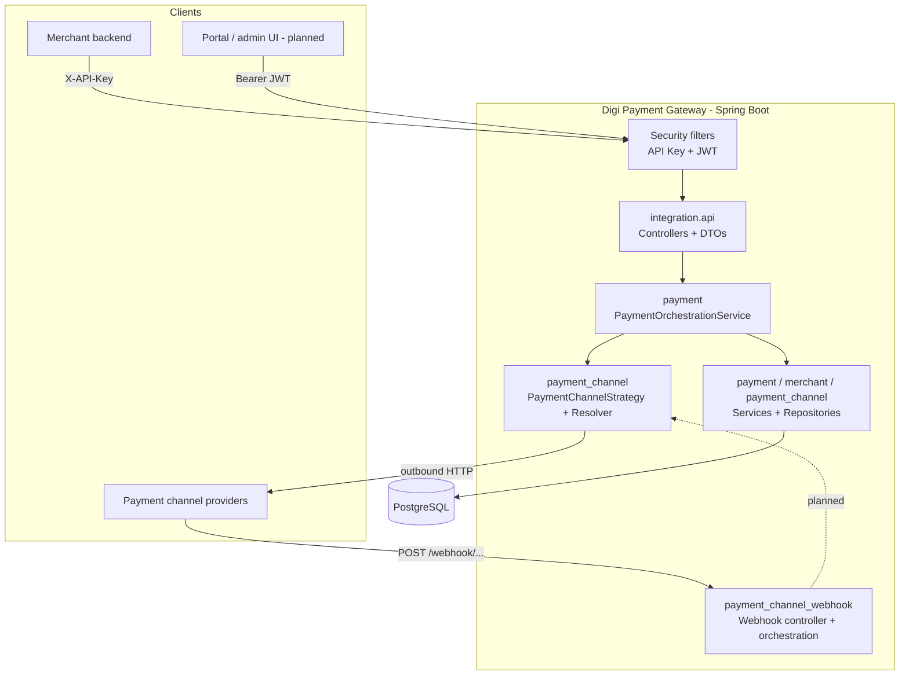
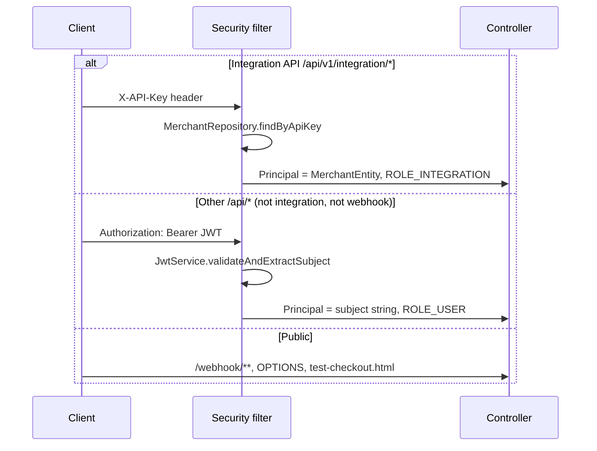
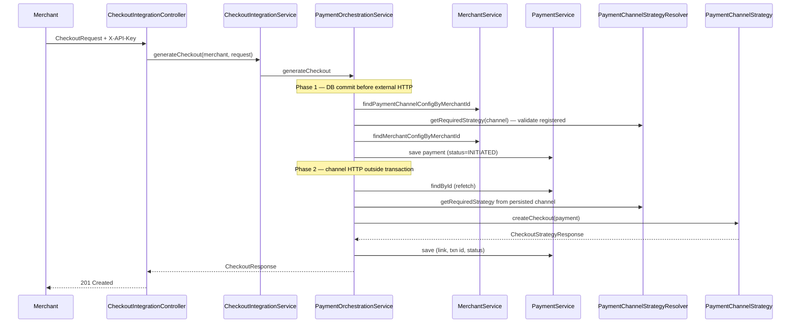

# Digi Payment Gateway — Architecture

**Audience:** Backend engineers, integrators, and reviewers onboarding to the codebase.

**Source of truth:** Java packages under `src/main/java/com/digirestro/digi_payment_gateway/`.

**Related docs:** [DATABASE.md](./DATABASE.md) (schema detail), [CLIENT_INTEGRATION.md](./CLIENT_INTEGRATION.md) (onboarding & flows), [Postman](../postman/README.md) (API examples).

---

## 1. Purpose and scope

Digi Payment Gateway is a **multi-tenant payment orchestration service**. Merchants integrate via a server-to-server API (`X-API-Key`). The gateway:

1. Resolves each merchant’s active payment channel and configuration from PostgreSQL.
2. Persists payment records with a fixed **two-phase** link-generation flow.
3. Delegates channel-specific HTTP/SDK work to **strategy** implementations (`PaymentChannelStrategy`).
4. Exposes public webhook endpoints for payment providers (orchestration partially implemented).
5. Will notify merchants via outbound webhooks (entities exist; delivery flow is not wired end-to-end).

The application is a **Spring Boot 4** monolith (Java 21): web MVC, JPA, Security, Actuator, Validation.

---

## 2. Technology stack

| Layer | Choice |
| ----- | ------ |
| Runtime | Java 21 |
| Framework | Spring Boot 4.0.3 (`spring-boot-starter-webmvc`, `data-jpa`, `security`, `validation`, `actuator`) |
| Database | PostgreSQL |
| ORM | Spring Data JPA / Hibernate (`ddl-auto=update` in dev — see [DATABASE.md](./DATABASE.md)) |
| HTTP client | `RestTemplate` (`config.RestTemplateConfig`) |
| Build | Maven |
| Utilities | Lombok |

---

## 3. High-level architecture


```mermaid
flowchart TB
  subgraph clients [Clients]
    M[Merchant backend]
    PC[Payment channel providers]
    UI[Portal / admin UI - planned]
  end

  subgraph gateway [Digi Payment Gateway - Spring Boot]
    SEC[Security filters\nAPI Key + JWT]
    INT[integration.api\nControllers + DTOs]
    ORCH[payment\nPaymentOrchestrationService]
    STR[payment_channel\nPaymentChannelStrategy + Resolver]
    DOM[payment / merchant / payment_channel\nServices + Repositories]
    WH[payment_channel_webhook\nWebhook controller + orchestration]
  end

  DB[(PostgreSQL)]

  M -->|X-API-Key| SEC
  UI -->|Bearer JWT| SEC
  PC -->|POST /webhook/...| WH

  SEC --> INT
  INT --> ORCH
  ORCH --> DOM
  ORCH --> STR
  WH -.->|planned| STR
  DOM --> DB
  STR -->|outbound HTTP| PC
```

### 3.1 Layering model

The codebase uses **package-by-feature** modules with a thin integration boundary:

| Layer | Packages | Responsibility |
| ----- | -------- | -------------- |
| **API (integration)** | `integration.api` | REST controllers, request/response DTOs, merchant-scoped integration services |
| **API (webhooks)** | `payment_channel_webhook` | Public channel webhook ingress |
| **Orchestration** | `payment` | Cross-cutting payment flows with explicit contracts (`CheckoutOrchestrationContract`) |
| **Domain services** | `payment`, `merchant`, `payment_channel` | Persistence and merchant/channel lookups |
| **Strategy** | `payment_channel` | Channel-specific link creation (and future webhook parsing) |
| **Infrastructure** | `config`, `security`, `common.persistence`, `exception`, `util` | Cross-cutting concerns |
| **Persistence models** | `*.entity`, `*.repository` | JPA entities and Spring Data repositories |

**Rule of thumb:** Controllers stay thin; orchestration owns multi-step flows; strategies must **not** persist payments.

---

## 4. Package map

```
com.digirestro.digi_payment_gateway
├── DigiPaymentGatewayApplication.java   # @EnableJpaAuditing, @EnableScheduling
├── auth/                                # IntegrationAuthService (principal → MerchantEntity)
├── common/persistence/                  # AuditableEntity (createdDateTime, updatedDateTime)
├── config/                              # SecurityConfig, RestTemplateConfig
├── exception/                           # GlobalExceptionHandler
├── integration/api/                     # Merchant integration REST API
│   ├── controller/
│   ├── dto/
│   └── service/
├── merchant/                            # Merchant, config, channel config
├── merchant_webhook/                    # Outbound merchant notification entity (delivery TBD)
├── payment/                             # Payment entity, orchestration, contract
├── payment_channel/                     # Channel catalog + strategy (entity, service, interfaces, impl, resolver, dto)
├── payment_channel_webhook/             # Inbound channel webhook entity + controller
├── security/                            # ApiKeyAuthenticationFilter, JwtAuthenticationFilter, JwtService
├── util/                                # InputSanitizer
└── logging/                             # Placeholder (todo.txt)
```

---

## 5. Core domain model

Entities extend `AuditableEntity` unless noted. Table names match `@Table` on each entity.

```mermaid
erDiagram
  merchant ||--o| merchant_config : has
  merchant ||--o{ merchant_payment_channel_config : configures
  payment_channel ||--o{ merchant_payment_channel_config : for_channel
  merchant ||--o{ payment : owns
  merchant_payment_channel_config ||--o{ payment : uses
  payment_channel ||--o{ payment : via
  payment ||--o{ payment_channel_webhook : logs_inbound
  payment ||--o{ merchant_webhook : logs_outbound

  merchant {
    bigint id PK
    string name
    string api_key UK
    string email UK
    boolean is_active
  }

  merchant_config {
    bigint id PK
    bigint merchant_id FK UK
    text webhook_url
    varchar currency
  }

  merchant_payment_channel_config {
    bigint id PK
    bigint merchant_id FK
    bigint payment_channel_id FK
    boolean is_active
    text config_json
  }

  payment_channel {
    bigint id PK
    enum name UK
    boolean is_active
  }

  payment {
    bigint id PK
    uuid payment_reference_id UK
    bigint merchant_id FK
    bigint merchant_payment_channel_config_id FK
    bigint payment_channel_id FK
    string merchant_reference_id
    string payment_channel_txn_id
    numeric amount
    varchar currency
    enum status
    string payment_channel_pay_link
    text merchant_metadata_json
  }
```

| Concept | Entity | Notes |
| ------- | ------ | ----- |
| Tenant | `MerchantEntity` | Identified by `apiKey` for integration auth |
| Merchant defaults | `MerchantConfigEntity` | `currency`, `webhookUrl` (1:1 with merchant) |
| Channel credentials | `MerchantPaymentChannelConfigEntity` | Per-merchant channel JSON config; one **active** row resolved per merchant today |
| Channel catalog | `PaymentChannelEntity` | `PaymentChannelNameEnum` stored as string |
| Payment attempt | `PaymentEntity` | Internal `id` + public `paymentReferenceId` (UUID) |
| Inbound webhook audit | `PaymentChannelWebhookEntity` | Raw payload logging (orchestration not fully wired) |
| Outbound merchant webhook audit | `MerchantWebhookEntity` | Delivery/retry fields (orchestration not fully wired) |

Full column-level documentation: [DATABASE.md](./DATABASE.md) (some legacy table names in that doc may differ from current JPA `@Table` names — **trust the entity classes** when they conflict).

### 5.1 Enumerations

**`PaymentChannelNameEnum`** (catalog / strategy routing):

`STRIPE`, `RAZORPAY`, `PHONEPE`, `PAYTM`, `GOOGLE_PAY`, `XPLORPAY`, `PAYMOB`, `TEST`

**`PaymentStatusEnum`** (payment lifecycle):

`INITIATED` → `CHECKOUT_GENERATED` → `SUCCESS` | `FAILED` | `REFUNDED` | `VOIDED`

---

## 6. Security architecture

Two authentication paths are composed in `SecurityConfig` (filters run **before** `UsernamePasswordAuthenticationFilter`):


```mermaid
sequenceDiagram
  participant C as Client
  participant F as Security filter
  participant API as Controller

  alt Integration API /api/v1/integration/*
    C->>F: X-API-Key header
    F->>F: MerchantRepository.findByApiKey
    F->>API: Principal = MerchantEntity, ROLE_INTEGRATION
  else Other /api/* (not integration, not webhook)
    C->>F: Authorization: Bearer JWT
    F->>F: JwtService.validateAndExtractSubject
    F->>API: Principal = subject string, ROLE_USER
  else Public
    C->>API: /webhook/**, OPTIONS, test-checkout.html
  end
```

| Route pattern | Auth | Principal |
| ------------- | ---- | ----------- |
| `/api/v1/integration/**` | `X-API-Key` (`ApiKeyAuthenticationFilter`) | `MerchantEntity` |
| `/api/**` (except integration & webhooks) | Bearer JWT (`JwtAuthenticationFilter`) | JWT `sub` (string) |
| `/webhook/**` | None (permitAll) | — |
| `OPTIONS /**` | None | — |

Configuration:

- Integration path prefix: `security.integration.path-prefix` (default `/api/v1/integration/`)
- JWT: HMAC-SHA256 implemented in `JwtService` (not a third-party JWT library)
- CSRF disabled (stateless API)
- CORS: permissive patterns for dev (`allowedOriginPatterns=*`)

Integration controllers use `IntegrationAuthService.extractMerchant(Authentication)` to cast the principal to `MerchantEntity`.

---

## 7. Payment link flow (implemented)

End-to-end path for `POST /api/v1/integration/checkout/generate`:


```mermaid
sequenceDiagram
  participant M as Merchant
  participant C as CheckoutIntegrationController
  participant I as CheckoutIntegrationService
  participant O as PaymentOrchestrationService
  participant MS as MerchantService
  participant PS as PaymentService
  participant R as PaymentChannelStrategyResolver
  participant S as PaymentChannelStrategy

  M->>C: CheckoutRequest + X-API-Key
  C->>I: generateCheckout(merchant, request)
  I->>O: generateCheckout

  Note over O: Phase 1 — DB commit before external HTTP
  O->>MS: findPaymentChannelConfigByMerchantId
  O->>R: getRequiredStrategy(channel) — validate registered
  O->>MS: findMerchantConfigByMerchantId
  O->>PS: save payment (status=INITIATED)

  Note over O: Phase 2 — channel HTTP outside transaction
  O->>PS: findById (refetch)
  O->>R: getRequiredStrategy from persisted channel
  O->>S: createCheckout(payment)
  S-->>O: CheckoutStrategyResponse
  O->>PS: save (link, txn id, status)

  O-->>C: CheckoutResponse
  C-->>M: 201 Created
```

### 7.1 Two-phase orchestration contract

`PaymentOrchestrationService` implements a **fixed contract** marked with `@CheckoutOrchestrationContract` and enforced by `PaymentOrchestrationServiceContractTest`:

| Rule | Rationale |
| ---- | --------- |
| **Phase 1:** Persist `INITIATED`, then commit | Payment row exists if channel API fails or times out |
| **Phase 2:** Refetch payment, resolve strategy from DB, call channel, update link fields | Strategy choice follows persisted channel, not request input |
| **No `@Transactional` on `generateCheckout`** | External HTTP must not run inside a DB transaction |
| **Do not merge phases into one transaction** | Avoid long locks and partial rollbacks hiding channel calls |
| **Strategies must not save payments or set status** | Orchestration owns all persistence |

Phase 2 is implemented in private `completeCheckoutGeneration`.

### 7.2 Integration API surface

| Method | Path | Service chain |
| ------ | ---- | ------------- |
| `POST` | `/api/v1/integration/checkout/generate` | `CheckoutIntegrationService` → `PaymentOrchestrationService` |
| `GET` | `/api/v1/integration/transactions` | `TransactionIntegrationService` → `PaymentService` |
| `GET` | `/api/v1/integration/transactions/{id}` | `TransactionIntegrationService` (merchant-scoped) |

Request body (`CheckoutRequest`): `merchantReferenceId`, `amount`, optional `merchantMetadataJson`, `redirectSuccessUrl`, `redirectFailureUrl`.

Response (`CheckoutResponse`): internal `paymentId`, `checkoutUrl`, `paymentChannelTxnId`, `status`.

Currency is taken from `merchant_config.currency`, not from the request body.

---

## 8. Payment channel strategy pattern

### 8.1 Components

| Component | Role |
| --------- | ---- |
| `PaymentChannelStrategy` | Interface: `getChannelName()`, `createCheckout(PaymentEntity)` |
| `PaymentChannelStrategyResolver` | Builds immutable `Map<PaymentChannelNameEnum, PaymentChannelStrategy>` from all Spring beans; fails on duplicate channel |
| `*PaymentChannelStrategy` in `impl/` | Channel-specific link generation |
| `CheckoutStrategyResponse` | `checkoutUrl`, `paymentChannelTxnId`, `status` returned to orchestration |

### 8.2 Registered implementations (current)

| Channel | Class | Spring bean | Status |
| ------- | ----- | ----------- | ------ |
| `TEST` | `TestPaymentChannelStrategy` | `@Component` | **Complete** — builds local `test-checkout.html` URL |
| `PHONEPE` | `PhonePePaymentChannelStrategy` | **Not registered** (no `@Component`) | Stub — `createCheckout` returns `null` |

All other enum values require a new `@Component` strategy class and a `payment_channel` row in the database.

### 8.3 Resolver behavior

- `getRequiredStrategy(channel)` → strategy or `404` (`ResponseStatusException`) if none registered
- Constructor throws `IllegalStateException` if two strategies claim the same `PaymentChannelNameEnum`

---

## 9. Webhook architecture (partial)

### 9.1 Inbound (payment channel → gateway)

| Item | Status |
| ---- | ------ |
| `POST /webhook/v1/payment-channel/{channelKey}` | Endpoint exists; returns `200 OK` without processing |
| `PaymentChannelWebhookOrchestrationService.processWebhook` | Commented out |
| `PaymentChannelStrategy.validateAndParseWebhook` | Commented out on interface |
| `PaymentChannelWebhookEntity` | Defined for audit logging |

`channelKey` is parsed case-insensitively to `PaymentChannelNameEnum` (e.g. `test`, `phonepe`).

### 9.2 Outbound (gateway → merchant)

| Item | Status |
| ---- | ------ |
| `MerchantWebhookEntity` | Entity + repository exist |
| Delivery / retry worker | Not implemented in current codebase |
| `merchant_config.webhookUrl` | Stored; not invoked from orchestration yet |

Planned flow (from commented code): strategy parses payload → orchestration updates `PaymentEntity` → merchant webhook job enqueued/logged.

---

## 10. Cross-cutting concerns

### 10.1 Auditing

`@EnableJpaAuditing` on the main application class. `AuditableEntity` provides:

- `createdDateTime` (insert only)
- `updatedDateTime` (on change)

Explicit column names (not snake_case) — see [DATABASE.md](./DATABASE.md) §3.1.

### 10.2 Exception handling

`GlobalExceptionHandler` (`@RestControllerAdvice`):

| Exception | HTTP status |
| --------- | ----------- |
| `IllegalArgumentException` | 400 |
| `EntityNotFoundException` | 404 |
| Other `Exception` | 500 |

Body shape: `timestamp`, `status`, `error`, `message`, `path`.

### 10.3 Utilities

- `InputSanitizer` — email, mobile, name, ISO 4217 currency normalization (used where portal/onboarding APIs are added)
- `RestTemplate` bean — available for channel HTTP calls in strategies

### 10.4 Actuator

Dev profile exposes all actuator endpoints (`management.endpoints.web.exposure.include=*`).

---

## 11. Merchant resolution rules

`MerchantService` (used by orchestration):

1. **`findPaymentChannelConfigByMerchantId`** — single active config: `findByMerchant_IdAndIsActiveTrue`. Throws `EntityNotFoundException` if none.
2. **`findMerchantConfigByMerchantId`** — required for currency. Throws if missing.

Implication: each merchant should have exactly one **active** `merchant_payment_channel_config` row for link generation to succeed.

---

## 12. Extension guide: add a payment channel

1. **Enum** — Add value to `PaymentChannelNameEnum` if not present.
2. **Database** — Insert row in `payment_channel` with `name` = enum string, `is_active = true`. Update PostgreSQL CHECK constraint if needed (`scripts/sql/postgresql/update-payment-channel-name-check.sql`).
3. **Strategy** — Create `XxxPaymentChannelStrategy` implementing `PaymentChannelStrategy`:
   - Annotate with `@Component`
   - Implement `createCheckout` using `payment`, `merchantPaymentChannelConfig.configJson`, and `RestTemplate` as needed
   - Return `CheckoutStrategyResponse` only — **no** `paymentRepository.save`
4. **Merchant config** — Add `merchant_payment_channel_config` for the merchant with channel-specific JSON.
5. **Webhook** (when ready) — Implement `validateAndParseWebhook` on the strategy; uncomment orchestration in `PaymentChannelWebhookOrchestrationService` and controller.
6. **Tests** — Add strategy unit tests; do not break `PaymentOrchestrationServiceContractTest` invariants.

---

## 13. Testing strategy

| Test | Purpose |
| ---- | ------- |
| `PaymentOrchestrationServiceContractTest` | Guards two-phase contract: no `@Transactional` on `generateCheckout`, private phase-2 method, `@CheckoutOrchestrationContract` presence |
| `DigiPaymentGatewayApplicationTests` | Context load smoke test |

Contract tests use reflection — changing orchestration signatures requires updating tests.

---

## 14. Configuration profiles

| File | Purpose |
| ---- | ------- |
| `application.properties` | App name, active profile, JWT TTL, OTP settings |
| `application-dev.properties` | Local PostgreSQL, `ddl-auto=update`, dev JWT secret, test payment link base URL |
| `application-prod.properties` | Production overrides |

Key properties:

- `security.integration.path-prefix`
- `security.jwt.secret`, `security.jwt.expiration-seconds`
- `payment-channel.test.checkout-base-url` (dev test channel)

---

## 15. Current limitations and work in progress

| Area | State |
| ---- | ----- |
| Payment link generation | **Production-ready pattern** for TEST channel; other channels need strategy + DB setup |
| `PhonePePaymentChannelStrategy` | Stub, not a Spring bean |
| `MerchantController` | Scaffold only (no endpoints) |
| Portal / user management | Commented references to `UserEntity`; JWT filter ready for `/api/**` portal routes |
| Inbound webhooks | Controller only; orchestration commented |
| Outbound merchant webhooks | Entity only |
| API request logging | `logging` package placeholder |
| `CheckoutRequest.redirectSuccessUrl` / `redirectFailureUrl` | Accepted on DTO; not used in orchestration yet |

---

## 16. Document history

| Version | Date | Changes |
| ------- | ---- | ------- |
| 1.0 | 2026-05-27 | Initial architecture doc from current `digi_payment_gateway` packages |
