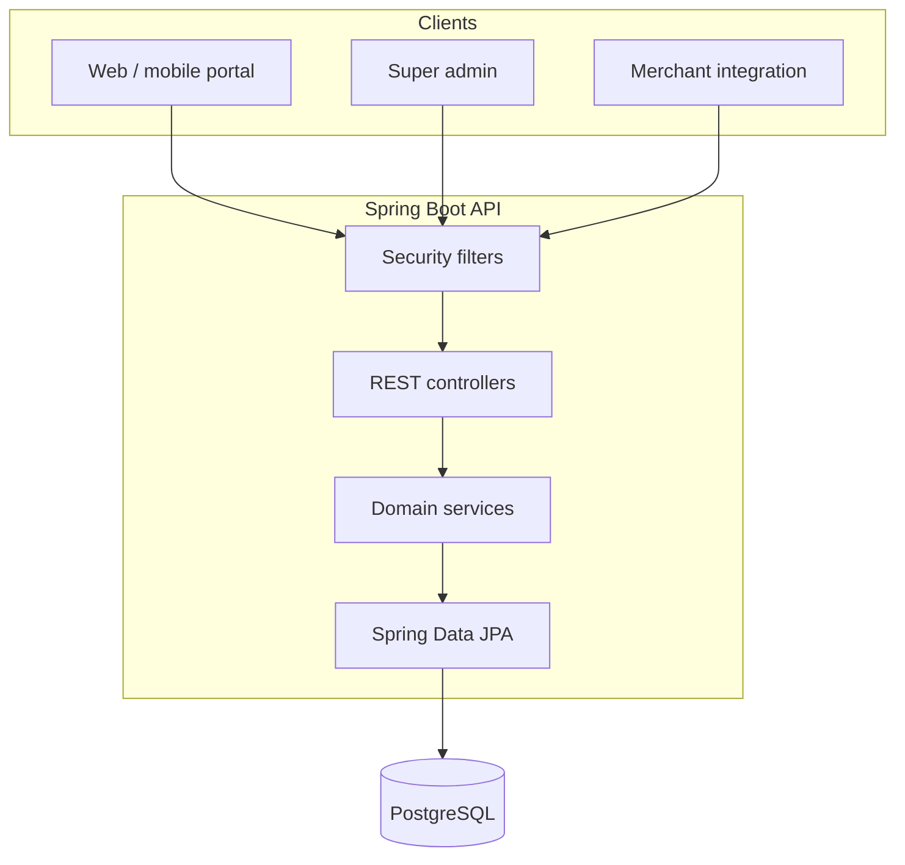
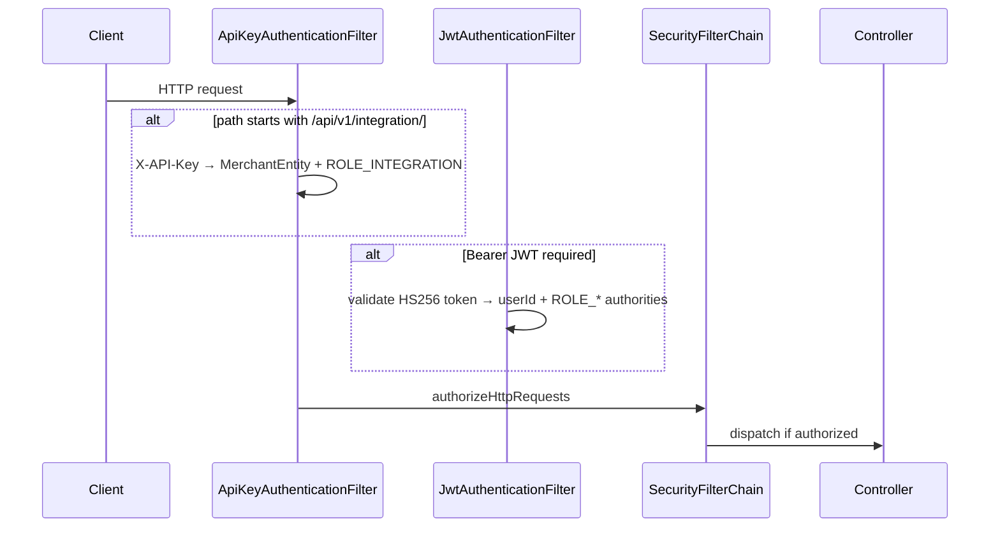

# OnDemand Service — Architecture

This document describes the **ondemand-service** Spring Boot application in this repository (`com.runalb.ondemand_service`). It is the backend API for user identity, merchant configuration, service catalog, and provider profiles. Payment processing, integration endpoints, and inbound webhooks are partially scaffolded but not yet implemented.

For table-level schema detail, see [DATABASE.md](./DATABASE.md).

---

## Overview

The service exposes a versioned REST API under `/api/v1`. It uses **PostgreSQL** for persistence, **Spring Security** with a dual authentication model (JWT for portal users, API key for merchant integration), and a layered **controller → service → repository** structure per domain package.


```mermaid
flowchart TB
    subgraph clients [Clients]
        Web[Web / mobile portal]
        Admin[Super admin]
        Merchant[Merchant integration]
    end

    subgraph api [Spring Boot API]
        Filters[Security filters]
        Controllers[REST controllers]
        Services[Domain services]
        JPA[Spring Data JPA]
    end

    DB[(PostgreSQL)]

    Web --> Filters
    Admin --> Filters
    Merchant --> Filters
    Filters --> Controllers
    Controllers --> Services
    Services --> JPA
    JPA --> DB
```

---

## Technology stack

| Area | Choice |
|------|--------|
| Runtime | Java **21** |
| Framework | Spring Boot **4.0.3** |
| Artifact | `com.runalb:ondemand-service-api:0.0.1-SNAPSHOT` |
| Web | `spring-boot-starter-webmvc`, validation, JSON |
| Persistence | `spring-boot-starter-data-jpa`, PostgreSQL driver |
| Security | `spring-boot-starter-security`, BCrypt passwords |
| Observability | `spring-boot-starter-actuator` |
| Boilerplate | Lombok |
| JWT | Custom HS256 implementation in `JwtService` (no third-party JWT library) |
| HTTP client | `RestTemplate` bean (`RestTemplateConfig`) — defined but unused by services today |

### Application bootstrap

`OnDemandServiceApplication` enables:

- `@SpringBootApplication` — component scan and auto-configuration
- `@EnableJpaAuditing` — `createdDateTime` / `updatedDateTime` on entities extending `AuditableEntity`
- `@EnableScheduling` — OTP session cleanup in `AuthService`

### Configuration profiles

| Property | Default / dev | Production |
|----------|---------------|------------|
| `spring.application.name` | `ondemand-service` | same |
| Active profile | `dev` | set via deployment |
| Server port | `8080` | `8080` |
| JWT access TTL | `3600` s | `3600` s |
| JWT refresh TTL | `1209600` s (14 days) | same |
| OTP resend cooldown | `45` s | same |
| OTP cleanup interval | `60000` ms | same |
| Hibernate `ddl-auto` | `update` (dev) | `validate` (prod) |
| JWT secret | dev placeholder in `application-dev.properties` | `JWT_SECRET` env var |
| Database | local `db_ondemand_service` | `DB_URL`, `DB_USERNAME`, `DB_PASSWORD` |

---

## Package structure

Source root: `src/main/java/com/runalb/ondemand_service/`

| Package | Responsibility |
|---------|----------------|
| `auth` | Login, OTP flows, password reset, refresh/logout; `AuthRefreshTokenEntity` |
| `business` | `BusinessEntity` CRUD scaffolding (`BusinessController` mostly returns `501`) |
| `catalog` | Admin-managed service catalog (categories and services) |
| `common.persistence` | `AuditableEntity` base class |
| `config` | `SecurityConfig`, `RestTemplateConfig` |
| `exception` | `GlobalExceptionHandler` (`@RestControllerAdvice`) |
| `merchant` | Merchant portal CRUD, merchant config, payment-channel config storage |
| `provider` | Provider profile CRUD (1:1 with user) |
| `role` | `RoleEntity`, `RoleNameEnum` |
| `security` | `JwtService`, `JwtAuthenticationFilter`, `ApiKeyAuthenticationFilter`, `JwtPayload` |
| `user` | User registration and self-service profile |
| `util` | `InputSanitizer` — email, mobile, name, ISO 4217 currency normalization |

**Not yet implemented:** `payment` package (referenced in comments on `MerchantPaymentChannelConfigEntity`); integration controllers under `/api/v1/integration/**`; webhook handlers under `/webhook/**`.

---

## Domain model

All persistent entities extend `AuditableEntity` (`createdDateTime`, `updatedDateTime`).

### Entity relationships

```
UserEntity ──M:N──► RoleEntity          (join: user_role)
UserEntity ──M:N──► MerchantEntity      (join: user_merchant)
UserEntity ──M:N──► BusinessEntity      (join: user_business)
UserEntity ◄──1:1── ProviderEntity      (FK: user_id)

MerchantEntity ◄──1:1── MerchantConfigEntity              (FK: merchant_id)
MerchantEntity ◄──1:N── MerchantPaymentChannelConfigEntity (FK: merchant_id)

CatalogCategoryEntity ◄──1:N── CatalogServiceEntity     (FK: catalog_category_id)

UserEntity ◄──N:1── AuthRefreshTokenEntity                (FK: user_id)
```

### Roles (`RoleNameEnum`)

| Value | Typical use |
|-------|-------------|
| `CUSTOMER` | Marketplace buyer |
| `PROVIDER` | Service provider (required for `/api/v1/providers/**`) |
| `ADMIN` | Tenant / operations admin |
| `SUPER_ADMIN` | Catalog mutations (`POST`/`PATCH`/`DELETE` on `/api/v1/catalog/**`) |

Roles must exist in the database before user registration. Seed with `scripts/seed-roles.sql`.

### Key entities

| Entity | Table | Notes |
|--------|-------|-------|
| `UserEntity` | `users` | Email and mobile unique; BCrypt `passwordHash`; `isActive`, `isVerified` |
| `RoleEntity` | `roles` | `roleName` maps to `RoleNameEnum` |
| `AuthRefreshTokenEntity` | `auth_refresh_token` | Opaque refresh token stored as SHA-256 hash; `revokedAt` for rotation |
| `MerchantEntity` | `merchant` | Auto-generated UUID `apiKey` on create; used for integration auth |
| `MerchantConfigEntity` | `merchant_config` | `webhookUrl`, ISO 4217 `currency` |
| `MerchantPaymentChannelConfigEntity` | `merchant_payment_channel_config` | Opaque `configJson`; payment channel FK commented out |
| `ProviderEntity` | `providers` | Bio, ratings, profile completion; 1:1 with user |
| `BusinessEntity` | `business` | Name, email, address; M:N with users |
| `CatalogCategoryEntity` | `catalog_category` | Ordered, activatable categories |
| `CatalogServiceEntity` | `catalog_service` | Services under a category |

---

## API surface

All controllers use `@RestController`. JSON request bodies are validated with Jakarta Bean Validation (`@Valid`).

### Authentication — `/api/v1/auth` (public `POST`)

| Endpoint | Purpose |
|----------|---------|
| `POST /login` | Email + password → access JWT + refresh token |
| `POST /login/email/request-otp` | Request email OTP |
| `POST /login/email/verify-otp` | Verify email OTP → tokens |
| `POST /forgot-password/email/request-otp` | Forgot-password OTP |
| `POST /forgot-password/email/reset-password` | Reset password with OTP |
| `POST /login/mobile/request-otp` | Request mobile OTP |
| `POST /login/mobile/verify-otp` | Verify mobile OTP → tokens |
| `POST /refresh-token` | Rotate refresh token; issue new access JWT |
| `POST /logout` | Revoke refresh token |

### Users — `/api/v1/users`

| Endpoint | Auth |
|----------|------|
| `POST /` | Public (registration) |
| `GET /{userId}` | JWT; owner only |
| `PATCH /{userId}` | JWT; owner only |
| `DELETE /{userId}` | JWT; owner only (soft deactivate) |
| `POST /{userId}/reactivate` | JWT; owner only |

### Merchants — `/api/v1/portal/merchants`

> Controller is annotated *"Not used in this project"* but fully implemented for merchant CRUD, config, and payment-channel config.

| Endpoint | Purpose |
|----------|---------|
| `POST /` | Create merchant |
| `GET /`, `GET /{merchantId}` | List / get |
| `PATCH /{merchantId}`, `DELETE /{merchantId}` | Update / deactivate |
| `GET|POST|PATCH /{merchantId}/config` | Merchant config |
| `POST|GET|GET|PATCH|DELETE` under `/{merchantId}/payment-channel-configs` | Payment channel config CRUD |

Ownership is enforced via `AuthService.assertAuthenticatedUserOwnsMerchant`.

### Providers — `/api/v1/providers`

Requires `ROLE_PROVIDER` at the security layer plus service-level ownership checks.

| Endpoint | Purpose |
|----------|---------|
| `POST /` | Create provider profile |
| `PUT /{providerId}` | Update profile |
| `GET /{providerId}` | Get profile |

### Catalog — `/api/v1/catalog`

| Endpoint | Auth |
|----------|------|
| `GET /categories`, `GET /categories/{categoryId}` | Authenticated |
| `GET /categories/{categoryId}/services`, `GET /services`, `GET /services/{serviceId}` | Authenticated |
| `POST|PATCH|DELETE` on categories and services | `SUPER_ADMIN` only |

### Business — `/api/v1/business`

| Endpoint | Status |
|----------|--------|
| `POST /` | Implemented |
| `GET /`, `GET /{businessId}`, `PATCH /{businessId}`, `DELETE /{businessId}` | `501 NOT_IMPLEMENTED` |

### Reserved routes (security configured, no controllers)

| Prefix | Auth mechanism | Status |
|--------|----------------|--------|
| `/api/v1/integration/**` | `X-API-Key` → `ROLE_INTEGRATION` | No handlers yet; use `IntegrationAuthService.extractMerchant()` when built |
| `/webhook/**` | `permitAll` | No handlers yet |

### Actuator

In the `dev` profile, all actuator web endpoints are exposed (`management.endpoints.web.exposure.include=*`), typically under `/actuator/*`.

---

## Security architecture

### Dual authentication


```mermaid
sequenceDiagram
    participant Client
    participant ApiKey as ApiKeyAuthenticationFilter
    participant Jwt as JwtAuthenticationFilter
    participant Chain as SecurityFilterChain
    participant Ctrl as Controller

    Client->>ApiKey: HTTP request
    alt path starts with /api/v1/integration/
        ApiKey->>ApiKey: X-API-Key → MerchantEntity + ROLE_INTEGRATION
    end
  alt Bearer JWT required
        Jwt->>Jwt: validate HS256 token → userId + ROLE_* authorities
    end
    ApiKey->>Chain: authorizeHttpRequests
    Chain->>Ctrl: dispatch if authorized
```

#### 1. JWT (portal / admin APIs) — `JwtAuthenticationFilter`

- Header: `Authorization: Bearer <token>`
- Principal in `SecurityContext`: `Long` userId
- Authorities: `ROLE_<RoleNameEnum>` from JWT `roles` claim
- Skipped for: `OPTIONS`, non-`/api/**`, `/api/v1/integration/**`, `/webhook/**`, public registration, all public `POST /api/v1/auth/**` paths

#### 2. API key (integration APIs) — `ApiKeyAuthenticationFilter`

- Applies to paths under `security.integration.path-prefix` (default `/api/v1/integration/`)
- Header: `X-API-Key`
- Resolves active `MerchantEntity` via `MerchantRepository.findByApiKey`
- Principal: `MerchantEntity`; authority: `ROLE_INTEGRATION`

### JWT format (`JwtService`)

Custom HS256 JWT with claims:

| Claim | Content |
|-------|---------|
| `sub` | User id (`Long`) |
| `roles` | Array of `RoleNameEnum` names |
| `iat` | Issued-at (epoch seconds) |
| `exp` | Expiry (epoch seconds) |

Secret: `security.jwt.secret`. Access TTL: `security.jwt.expiration-seconds`.

### Refresh tokens

- Opaque URL-safe random token (48 bytes, Base64)
- Persisted as SHA-256 hash in `auth_refresh_token`
- Rotated on refresh (previous token revoked via `revokedAt`)
- Logout revokes by refresh token hash in request body

### OTP (in-memory)

`AuthService` maintains three `ConcurrentHashMap` session stores: email login, forgot-password email, and mobile login.

| Property | Value |
|----------|-------|
| OTP length | 6 digits |
| Expiry | 300 seconds |
| Resend cooldown | `security.otp.resend-cooldown-seconds` (default 45) |
| Delivery | **Placeholder** — OTP logged via `log.info`; email/SMS providers not wired |
| Cleanup | `@Scheduled` `removeExpiredOtpSessions()` every `security.otp.cleanup-interval-ms` |

OTP sessions are **not cluster-safe** and are lost on process restart.

### Passwords

BCrypt via `PasswordEncoder` bean in `SecurityConfig`.

### Authorization rules (`SecurityConfig`)

Rules are evaluated in declaration order:

| Pattern | Rule |
|---------|------|
| `OPTIONS /**` | `permitAll` |
| `/webhook/**` | `permitAll` |
| `POST /api/v1/users` | `permitAll` |
| `POST /api/v1/auth/**` | `permitAll` |
| `GET /api/v1/catalog/**` | `authenticated` |
| Non-GET `/api/v1/catalog/**` | `hasRole("SUPER_ADMIN")` |
| `/api/v1/integration/**` | `authenticated` (API key filter sets context) |
| `/api/v1/providers/**` | `hasRole("PROVIDER")` |
| `/api/**` | `authenticated` |
| Other | `permitAll` |

CSRF is disabled. CORS allows all origins (`*`), common HTTP methods, all headers; `allowCredentials=false`.

### Service-layer authorization (`AuthService`)

| Method | Purpose |
|--------|---------|
| `assertAuthenticatedUserOwnsUserId` | User can only access own profile |
| `assertAuthenticatedUserOwnsMerchant` | User must be linked to merchant |
| `assertAuthenticatedUserHasProviderRole` | Provider operations |
| `loadAuthenticatedActiveUser` | Resolve JWT principal to active `UserEntity` with roles |

Filter-level auth failures return minimal JSON: `{"error":"..."}` and are **not** handled by `GlobalExceptionHandler`.

---

## Request lifecycle

1. **CORS** preflight or request enters the servlet container.
2. **`ApiKeyAuthenticationFilter`** runs first for integration paths; sets merchant principal or returns `401`.
3. **`JwtAuthenticationFilter`** parses Bearer token for applicable `/api/**` routes; sets user principal and roles or continues unauthenticated for public routes.
4. **`SecurityFilterChain`** applies `authorizeHttpRequests` rules.
5. **Controller** receives validated DTO; may call `AuthService` ownership helpers.
6. **Service** applies business logic, `InputSanitizer` normalization, and `@Transactional` persistence via repositories.
7. **Response** returned as `ResponseEntity` with response DTOs.
8. **Uncaught exceptions** routed to `GlobalExceptionHandler`.

### Example: registration and login

1. `POST /api/v1/users` — `UserService.createUser` hashes password, assigns roles from request (must exist in DB).
2. `POST /api/v1/auth/login` — `AuthService.issueTokens` returns access JWT + opaque refresh token row.

### Example: authenticated merchant operation

1. Client sends `Authorization: Bearer <jwt>`.
2. `JwtAuthenticationFilter` sets `userId` principal.
3. `MerchantController` calls `authService.assertAuthenticatedUserOwnsMerchant(merchantId)`.
4. `MerchantService` reads or writes merchant, config, or payment-channel config.

---

## Cross-cutting concerns

### Error handling (`GlobalExceptionHandler`)

JSON error body shape:

```json
{
  "timestamp": "<ISO-8601 instant>",
  "status": 400,
  "error": "Bad Request",
  "message": "<detail>",
  "path": "/api/v1/..."
}
```

| Exception | HTTP status |
|-----------|-------------|
| `IllegalArgumentException` | 400 |
| `EntityNotFoundException` | 404 |
| `ResponseStatusException` | Status from exception |
| `Exception` (catch-all) | 500 |

### Input normalization (`InputSanitizer`)

Used across auth, user, merchant, provider, and business services:

- `normalizeEmail`, `normalizeMobile`, `normalizeName`
- `trimToNull`
- `normalizeISO4217Currency` (merchant config)

### Transactions

Service methods that mutate data are annotated `@Transactional`.

---

## External integrations

| Integration | Status |
|-------------|--------|
| **PostgreSQL** | Active — JPA/Hibernate |
| **Email OTP** | Placeholder (logged only) |
| **SMS OTP** | Placeholder (logged only) |
| **Payment providers** | Not implemented; `configJson` on `MerchantPaymentChannelConfigEntity` is opaque storage |
| **Merchant webhooks** | `webhookUrl` stored on `MerchantConfigEntity`; no outbound sender |
| **Inbound webhooks** | `/webhook/**` permitted; no controller |
| **Integration API** | `/api/v1/integration/**` secured; no controller |
| **RestTemplate** | Bean present; no outbound HTTP in current services |

A static test page exists at `src/main/resources/static/test-payment-link.html` for future payment-link testing.

---

## Implementation maturity

| Area | State |
|------|-------|
| Auth (login, OTP, refresh, logout) | Implemented |
| User self-service | Implemented |
| Catalog read (authenticated) / write (super admin) | Implemented |
| Provider profiles | Implemented |
| Merchant portal API | Implemented but marked unused in controller comment |
| Business API | Create only; list/update/delete return `501` |
| Payment processing | Not started |
| Integration API (`X-API-Key`) | Security only |
| Webhooks | Security only |
| Role seeding | Manual via `scripts/seed-roles.sql` |

---

## Key class index

| Concern | Classes |
|---------|---------|
| Entry point | `OnDemandServiceApplication` |
| Security config | `SecurityConfig`, `JwtAuthenticationFilter`, `ApiKeyAuthenticationFilter`, `JwtService`, `JwtPayload` |
| Auth | `AuthService`, `IntegrationAuthService`, `AuthController` |
| Errors | `GlobalExceptionHandler` |
| Persistence base | `AuditableEntity` |
| Roles | `RoleEntity`, `RoleNameEnum` |
| Utilities | `InputSanitizer` |

---

## Related documentation

| Document | Description |
|----------|-------------|
| [DATABASE.md](./DATABASE.md) | Table and column reference |
| [README.md](./README.md) | Documentation index |
| `postman/OnDemand-Service-API.postman_collection.json` | API collection for manual testing |
| `scripts/seed-roles.sql` | Idempotent role seed data |
