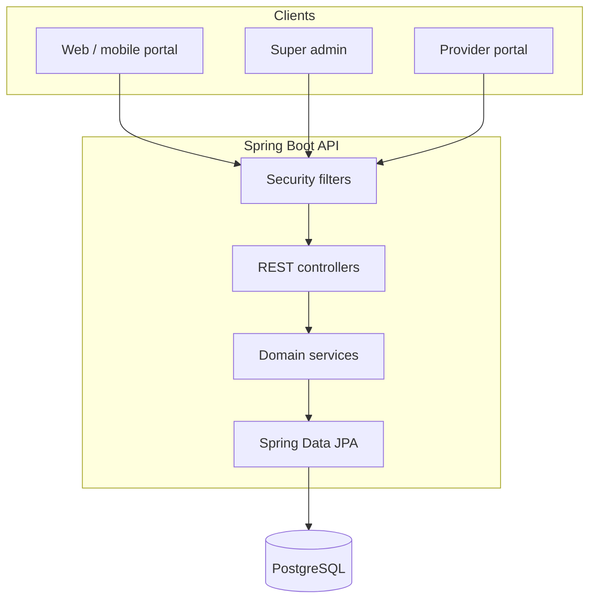
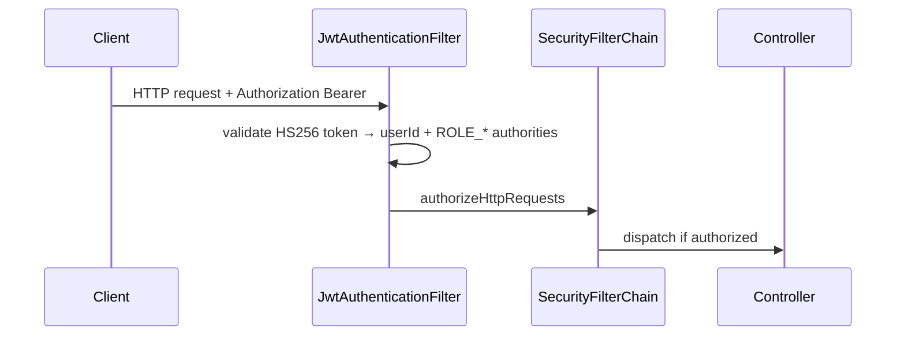

# OnDemand Service — Architecture

This document describes the **ondemand-service** Spring Boot application in this repository (`com.runalb.ondemand_service`). It is the backend API for user identity, business (provider) tenants, service catalog, and business-to-catalog offerings. Payment processing and inbound webhooks are partially scaffolded but not yet implemented.

For table-level schema detail, see [DATABASE.md](./DATABASE.md).

---

## Overview

The service exposes a versioned REST API under `/api/v1`. It uses **PostgreSQL** for persistence, **Spring Security** with JWT bearer authentication, and a layered **controller → service → repository** structure per domain package.


```mermaid
flowchart TB
    subgraph clients [Clients]
        Web[Web / mobile portal]
        Admin[Super admin]
        Provider[Provider portal]
    end

    subgraph api [Spring Boot API]
        Filters[Security filters]
        Controllers[REST controllers]
        Services[Domain services]
        JPA[Spring Data JPA]
    end

    DB[(PostgreSQL)]

    Web --> Filters
    Admin --> Filters
    Provider --> Filters
    Filters --> Controllers
    Controllers --> Services
    Services --> JPA
    JPA --> DB
```


---

## Technology stack


| Area          | Choice                                                                            |
| ------------- | --------------------------------------------------------------------------------- |
| Runtime       | Java **21**                                                                       |
| Framework     | Spring Boot **4.0.3**                                                             |
| Artifact      | `com.runalb:ondemand-service-api:0.0.1-SNAPSHOT`                                  |
| Web           | `spring-boot-starter-webmvc`, validation, JSON                                    |
| Persistence   | `spring-boot-starter-data-jpa`, PostgreSQL driver                                 |
| Security      | `spring-boot-starter-security`, BCrypt passwords                                  |
| Observability | `spring-boot-starter-actuator`                                                    |
| Boilerplate   | Lombok                                                                            |
| JWT           | Custom HS256 implementation in `JwtService` (no third-party JWT library)          |
| HTTP client   | `RestTemplate` bean (`RestTemplateConfig`) — defined but unused by services today |


### Application bootstrap

`OnDemandServiceApplication` enables:

- `@SpringBootApplication` — component scan and auto-configuration
- `@EnableJpaAuditing` — `createdDateTime` / `updatedDateTime` on entities extending `AuditableEntity`
- `@EnableScheduling` — OTP session cleanup in `AuthService`

### Configuration profiles


| Property                  | Default / dev                                   | Production                             |
| ------------------------- | ----------------------------------------------- | -------------------------------------- |
| `spring.application.name` | `ondemand-service`                              | same                                   |
| Active profile            | `dev`                                           | set via deployment                     |
| Server port               | `8080`                                          | `8080`                                 |
| JWT access TTL            | `3600` s                                        | `3600` s                               |
| JWT refresh TTL           | `1209600` s (14 days)                           | same                                   |
| OTP resend cooldown       | `45` s                                          | same                                   |
| OTP cleanup interval      | `60000` ms                                      | same                                   |
| Hibernate `ddl-auto`      | `update` (dev)                                  | `validate` (prod)                      |
| JWT secret                | dev placeholder in `application-dev.properties` | `JWT_SECRET` env var                   |
| Database                  | local `db_ondemand_service`                     | `DB_URL`, `DB_USERNAME`, `DB_PASSWORD` |


---

## Package structure

Source root: `src/main/java/com/runalb/ondemand_service/`


| Package              | Responsibility                                                                  |
| -------------------- | ------------------------------------------------------------------------------- |
| `auth`               | Login, OTP flows, password reset, refresh/logout; `AuthRefreshTokenEntity`      |
| `business`           | Business CRUD, config, payment-channel config storage                           |
| `catalog`            | Admin-managed service catalog (categories and services)                         |
| `common.persistence` | `AuditableEntity` base class                                                    |
| `config`             | `SecurityConfig`, `RestTemplateConfig`                                          |
| `exception`          | `GlobalExceptionHandler` (`@RestControllerAdvice`)                              |
| `offering`           | Links catalog services to businesses (`business_offering`)                      |
| `relationship`       | `EntityLinkService` — user↔business join management and access checks           |
| `role`               | `RoleEntity`, `RoleNameEnum`                                                    |
| `security`           | `JwtAuthenticationFilter`, `JwtService`, `AuthorizationService`, `CurrentUserService` |
| `user`               | User registration and self-service profile                                      |
| `util`               | `InputSanitizer` — email, mobile, name, ISO 4217 currency normalization         |


**Not yet implemented:** `payment` package (referenced in comments on `BusinessPaymentChannelConfigEntity`); webhook handlers under `/webhook/**`.

---

## Domain model

All persistent entities extend `AuditableEntity` (`createdDateTime`, `updatedDateTime`).

### Entity relationships

```
UserEntity ──M:N──► RoleEntity          (join: user_role)
UserEntity ──M:N──► BusinessEntity      (join: user_business)

BusinessEntity ◄──1:1── BusinessConfigEntity              (FK: business_id)
BusinessEntity ◄──1:N── BusinessPaymentChannelConfigEntity (FK: business_id)
BusinessEntity ◄──1:N── BusinessOfferingEntity            (FK: business_id)

CatalogCategoryEntity ◄──1:N── CatalogServiceEntity     (FK: catalog_category_id)
CatalogServiceEntity ◄──1:N── BusinessOfferingEntity     (FK: catalog_service_id)

UserEntity ◄──N:1── AuthRefreshTokenEntity                (FK: user_id)
```

### Roles (`RoleNameEnum`)


| Value         | Typical use                                                         |
| ------------- | ------------------------------------------------------------------- |
| `CUSTOMER`    | Marketplace buyer                                                   |
| `PROVIDER`    | Business operator (required for `/api/v1/businesses/**`)            |
| `ADMIN`       | Tenant / operations admin                                           |
| `SUPER_ADMIN` | Catalog mutations (`POST`/`PATCH`/`DELETE` on `/api/v1/catalog/**`) |


Roles must exist in the database before user registration. Seed with `scripts/seed-roles.sql`.

### Key entities


| Entity                               | Table                             | Notes                                                                      |
| ------------------------------------ | --------------------------------- | -------------------------------------------------------------------------- |
| `UserEntity`                         | `users`                           | Email and mobile unique; BCrypt `passwordHash`; `isDeleted`, `isVerified`  |
| `RoleEntity`                         | `roles`                           | `roleName` maps to `RoleNameEnum`                                          |
| `AuthRefreshTokenEntity`             | `auth_refresh_token`              | Opaque refresh token stored as SHA-256 hash; `revokedAt` for rotation      |
| `BusinessEntity`                     | `business`                        | Profile fields, M:N with users; soft-delete via `isDeleted`              |
| `BusinessConfigEntity`               | `business_config`                 | `webhookUrl`, ISO 4217 `currency`                                          |
| `BusinessPaymentChannelConfigEntity` | `business_payment_channel_config` | Opaque `configJson`; payment channel FK commented out                      |
| `BusinessOfferingEntity`             | `business_offering`               | Links a business to a catalog service; `isActive`, soft-delete             |
| `CatalogCategoryEntity`              | `catalog_category`                | Ordered categories; soft-delete via `isDeleted`                            |
| `CatalogServiceEntity`               | `catalog_service`                 | Services under a category; soft-delete via `isDeleted`                     |


---

## API surface

All controllers use `@RestController`. JSON request bodies are validated with Jakarta Bean Validation (`@Valid`).

### Authentication — `/api/v1/auth` (public `POST`)


| Endpoint                                     | Purpose                                       |
| -------------------------------------------- | --------------------------------------------- |
| `POST /login`                                | Email + password → access JWT + refresh token |
| `POST /login/email/request-otp`              | Request email OTP                             |
| `POST /login/email/verify-otp`               | Verify email OTP → tokens                     |
| `POST /forgot-password/email/request-otp`    | Forgot-password OTP                           |
| `POST /forgot-password/email/reset-password` | Reset password with OTP                       |
| `POST /login/mobile/request-otp`             | Request mobile OTP                            |
| `POST /login/mobile/verify-otp`              | Verify mobile OTP → tokens                    |
| `POST /refresh-token`                        | Rotate refresh token; issue new access JWT    |
| `POST /logout`                               | Revoke refresh token                          |


### Users — `/api/v1/users`


| Endpoint                    | Auth                              |
| --------------------------- | --------------------------------- |
| `POST /`                    | Public (registration)             |
| `GET /{userId}`             | JWT; owner only                   |
| `PATCH /{userId}`           | JWT; owner only                   |
| `DELETE /{userId}`          | JWT; owner only (soft deactivate) |
| `POST /{userId}/reactivate` | JWT; owner only                   |


### Businesses — `/api/v1/businesses`

Requires `ROLE_PROVIDER` at the security filter layer. Business-scoped routes additionally call `AuthorizationService.assertAuthenticatedUserOwnsBusiness`.

> `BusinessController` carries a *"Not used in this project"* comment but is fully implemented.


| Endpoint                                                  | Purpose                                                               |
| --------------------------------------------------------- | --------------------------------------------------------------------- |
| `POST /`                                                  | Create business (links creator via `user_business`)                   |
| `GET /`                                                   | List businesses for the authenticated user                            |
| `GET /{businessId}`                                       | Get business                                                          |
| `PATCH /{businessId}`                                     | Update business                                                       |
| `DELETE /{businessId}`                                    | Soft-delete business                                                  |
| `GET /{businessId}/config`                                | Get business config                                                   |
| `POST /{businessId}/config`                               | Create business config                                                |
| `PATCH /{businessId}/config`                              | Update business config                                                |
| `DELETE /{businessId}/config`                             | Soft-delete business config                                           |
| `POST /{businessId}/payment-channel-configs`              | Create payment-channel config                                         |
| `GET /{businessId}/payment-channel-configs`               | List payment-channel configs                                          |
| `GET /{businessId}/payment-channel-configs/{configId}`    | Get one config                                                        |
| `PATCH /{businessId}/payment-channel-configs/{configId}`  | Update config                                                         |
| `DELETE /{businessId}/payment-channel-configs/{configId}` | Soft-delete config                                                    |


### Business offerings — `/api/v1/businesses/{businessId}/offerings`

Links catalog services to a business. Same `ROLE_PROVIDER` + business-ownership checks as above.


| Endpoint               | Purpose                                                       |
| ---------------------- | ------------------------------------------------------------- |
| `POST /`               | Link one or more catalog services (body: `catalogServiceIds`) |
| `GET /`                | List active offerings for the business                        |
| `PATCH /{offeringId}`  | Toggle `isActive` on an offering                              |
| `DELETE /{offeringId}` | Unlink (soft-delete) an offering                              |


### Catalog — `/api/v1/catalog`


| Endpoint                                                                              | Auth          |
| ------------------------------------------------------------------------------------- | ------------- |
| `GET /categories`, `GET /categories/{categoryId}`                                     | Authenticated |
| `GET /categories/{categoryId}/services`, `GET /services`, `GET /services/{serviceId}` | Authenticated |
| `POST`, `PATCH`, `DELETE` on categories and services                                  | `SUPER_ADMIN` |


### Catalog service offerings — `/api/v1/catalog/services/{serviceId}/offerings`


| Endpoint                     | Auth          | Status                              |
| ---------------------------- | ------------- | ----------------------------------- |
| `GET /{serviceId}/offerings` | Authenticated | **Not implemented** — returns `501` |


### Reserved routes (security configured, no controllers)


| Prefix        | Auth mechanism | Status                |
| ------------- | -------------- | --------------------- |
| `/webhook/**` | `permitAll`    | No handlers yet       |


### Actuator

In the `dev` profile, all actuator web endpoints are exposed (`management.endpoints.web.exposure.include=*`), typically under `/actuator/*`.

---

## Security architecture

### JWT authentication


```mermaid
sequenceDiagram
    participant Client
    participant Jwt as JwtAuthenticationFilter
    participant Chain as SecurityFilterChain
    participant Ctrl as Controller

    Client->>Jwt: HTTP request + Authorization Bearer
    Jwt->>Jwt: validate HS256 token → userId + ROLE_* authorities
    Jwt->>Chain: authorizeHttpRequests
    Chain->>Ctrl: dispatch if authorized
```

#### `JwtAuthenticationFilter`

- Header: `Authorization: Bearer <token>`
- Principal in `SecurityContext`: `Long` userId
- Authorities: `ROLE_<RoleNameEnum>` from JWT `roles` claim
- Skipped for: `OPTIONS`, non-`/api/**`, `/webhook/**`, public registration, all public `POST /api/v1/auth/**` paths

### JWT format (`JwtService`)

Custom HS256 JWT with claims:


| Claim   | Content                       |
| ------- | ----------------------------- |
| `sub`   | User id (`Long`)              |
| `roles` | Array of `RoleNameEnum` names |
| `iat`   | Issued-at (epoch seconds)     |
| `exp`   | Expiry (epoch seconds)        |


Secret: `security.jwt.secret`. Access TTL: `security.jwt.expiration-seconds`.

### Refresh tokens

- Opaque URL-safe random token (48 bytes, Base64)
- Persisted as SHA-256 hash in `auth_refresh_token`
- Rotated on refresh (previous token revoked via `revokedAt`)
- Logout revokes by refresh token hash in request body

### OTP (in-memory)

`AuthService` maintains three `ConcurrentHashMap` session stores: email login, forgot-password email, and mobile login.


| Property        | Value                                                                              |
| --------------- | ---------------------------------------------------------------------------------- |
| OTP length      | 6 digits                                                                           |
| Expiry          | 300 seconds                                                                        |
| Resend cooldown | `security.otp.resend-cooldown-seconds` (default 45)                                |
| Delivery        | **Placeholder** — OTP logged via `log.info`; email/SMS providers not wired         |
| Cleanup         | `@Scheduled` `removeExpiredOtpSessions()` every `security.otp.cleanup-interval-ms` |


OTP sessions are **not cluster-safe** and are lost on process restart.

### Passwords

BCrypt via `PasswordEncoder` bean in `SecurityConfig`.

### Authorization rules (`SecurityConfig`)

Rules are evaluated in declaration order:


| Pattern                                    | Rule                                          |
| ------------------------------------------ | --------------------------------------------- |
| `OPTIONS /`**                              | `permitAll`                                   |
| `/webhook/`**                              | `permitAll`                                   |
| `POST /api/v1/users`                       | `permitAll`                                   |
| `POST /api/v1/auth/**`                     | `permitAll`                                   |
| `GET /api/v1/catalog/services/*/offerings` | `authenticated`                               |
| `GET /api/v1/catalog/**`                   | `authenticated`                               |
| Non-GET `/api/v1/catalog/**`               | `hasRole("SUPER_ADMIN")`                      |
| `/api/v1/businesses/**`                    | `hasRole("PROVIDER")`                         |
| `/api/**`                                  | `authenticated`                               |
| Other                                      | `permitAll`                                   |


CSRF is disabled. CORS allows all origins (`*`), common HTTP methods, all headers; `allowCredentials=false`.

### Service-layer authorization

Authorization is split across dedicated security services (no longer on `AuthService`):


| Class                  | Responsibility                                                                              |
| ---------------------- | ------------------------------------------------------------------------------------------- |
| `CurrentUserService`   | Resolves JWT principal (`Long` userId) to `UserEntity` via `UserService`                    |
| `AuthorizationService` | `assertAuthenticatedUserOwnsUserId`, `assertAuthenticatedUserOwnsBusiness`                  |
| `EntityLinkService`    | `linkUserToBusiness`, `userHasBusinessAccess` (used by authorization and `BusinessService`) |


`BusinessService` uses `CurrentUserService` for create/list scoped to the authenticated user.

Filter-level auth failures return minimal JSON: `{"error":"..."}` and are **not** handled by `GlobalExceptionHandler`.

---

## Request lifecycle

1. **CORS** preflight or request enters the servlet container.
2. `**JwtAuthenticationFilter**` parses Bearer token for applicable `/api/**` routes; sets user principal and roles or continues unauthenticated for public routes.
3. `**SecurityFilterChain**` applies `authorizeHttpRequests` rules.
4. **Controller** receives validated DTO; may call `AuthorizationService` ownership helpers.
5. **Service** applies business logic, `InputSanitizer` normalization, and `@Transactional` persistence via repositories.
6. **Response** returned as `ResponseEntity` with response DTOs.
7. **Uncaught exceptions** routed to `GlobalExceptionHandler`.

### Example: registration and login

1. `POST /api/v1/users` — `UserService.createUser` hashes password, assigns roles from request (must exist in DB).
2. `POST /api/v1/auth/login` — `AuthService.issueTokens` returns access JWT + opaque refresh token row.

### Example: authenticated business operation

1. Client sends `Authorization: Bearer <jwt>`.
2. `JwtAuthenticationFilter` sets `userId` principal.
3. `BusinessController` calls `authorizationService.assertAuthenticatedUserOwnsBusiness(businessId)`.
4. `BusinessService` reads or writes business, config, or payment-channel config.

---

## Cross-cutting concerns

### Error handling (`GlobalExceptionHandler`)

JSON error body shape:

```json
{
  "timestamp": "<ISO-8601 instant>",
  "status": 400,
  "error": "Bad Request",
  "message": "<detail>",
  "path": "/api/v1/..."
}
```


| Exception                  | HTTP status           |
| -------------------------- | --------------------- |
| `IllegalArgumentException` | 400                   |
| `EntityNotFoundException`  | 404                   |
| `ResponseStatusException`  | Status from exception |
| `Exception` (catch-all)    | 500                   |


### Input normalization (`InputSanitizer`)

Used across auth, user, business, and catalog services:

- `normalizeEmail`, `normalizeMobile`, `normalizeName`
- `trimToNull`
- `normalizeISO4217Currency` (business config)

### Transactions

Service methods that mutate data are annotated `@Transactional`.

---

## External integrations


| Integration           | Status                                                                                  |
| --------------------- | --------------------------------------------------------------------------------------- |
| **PostgreSQL**        | Active — JPA/Hibernate                                                                  |
| **Email OTP**         | Placeholder (logged only)                                                               |
| **SMS OTP**           | Placeholder (logged only)                                                               |
| **Payment providers** | Not implemented; `configJson` on `BusinessPaymentChannelConfigEntity` is opaque storage |
| **Business webhooks** | `webhookUrl` stored on `BusinessConfigEntity`; no outbound sender                       |
| **Inbound webhooks**  | `/webhook/**` permitted; no controller                                                  |
| **RestTemplate**      | Bean present; no outbound HTTP in current services                                      |


A static test page exists at `src/main/resources/static/test-payment-link.html` for future payment-link testing.

---

## Implementation maturity


| Area                                               | State                                                      |
| -------------------------------------------------- | ---------------------------------------------------------- |
| Auth (login, OTP, refresh, logout)                 | Implemented                                                |
| User self-service                                  | Implemented                                                |
| Catalog read (authenticated) / write (super admin) | Implemented (soft-delete via `isDeleted`)                  |
| Business API (`/api/v1/businesses`)                | Implemented; requires `PROVIDER`; controller marked unused |
| Business offerings (link catalog services)         | Implemented                                                |
| Catalog service offerings listing                  | Stub (`501 Not Implemented`)                               |
| Payment processing                                 | Not started                                                |
| Webhooks                                           | Security only                                              |
| Role seeding                                       | Manual via `scripts/seed-roles.sql`                        |


---

## Key class index


| Concern          | Classes                                                                                               |
| ---------------- | ----------------------------------------------------------------------------------------------------- |
| Entry point      | `OnDemandServiceApplication`                                                                          |
| Security config  | `SecurityConfig`, `JwtAuthenticationFilter`, `JwtService`, `JwtPayload`                             |
| Authorization    | `AuthorizationService`, `CurrentUserService`, `EntityLinkService`                                     |
| Auth             | `AuthService`, `AuthController`                                                                       |
| Business         | `BusinessController`, `BusinessService`                                                               |
| Offerings        | `BusinessOfferingController`, `BusinessOfferingService`, `CatalogServiceOfferingController`           |
| Errors           | `GlobalExceptionHandler`                                                                              |
| Persistence base | `AuditableEntity`                                                                                     |
| Roles            | `RoleEntity`, `RoleNameEnum`                                                                          |
| Utilities        | `InputSanitizer`                                                                                      |


---

## Related documentation


| Document                                               | Description                       |
| ------------------------------------------------------ | --------------------------------- |
| [DATABASE.md](./DATABASE.md)                           | Table and column reference        |
| [README.md](./README.md)                               | Documentation index               |
| `postman/OnDemand-Service-API.postman_collection.json` | API collection for manual testing |
| `scripts/seed-roles.sql`                               | Idempotent role seed data         |


