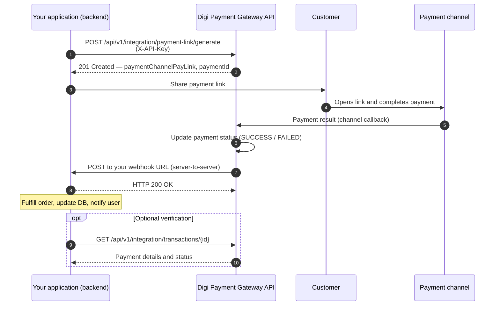

# Digi Payment Gateway — Client Integration Guide v1

Welcome to the Digi Payment Gateway. This guide explains how to connect your business to our unified payment service—whether you are a product owner planning an integration or a developer implementing it.


---

## 1. Overview

### What is the Digi Payment Gateway?

The Digi Payment Gateway is a **single, unified payment service** for your application. Instead of integrating separately with multiple payment providers, you connect once to our API. We handle routing to the configured payment channel (for example, card wallets or regional providers) and keep a consistent record of every payment.

### What can you do with it?


| Capability                 | Benefit for your business                                                                                                                                             |
| -------------------------- | --------------------------------------------------------------------------------------------------------------------------------------------------------------------- |
| **Generate payment links** | Send customers a secure checkout URL to complete payment for an order, invoice, or booking.                                                                           |
| **Receive webhooks**       | Get automatic, server-to-server notifications when a payment **succeeds** or **fails**, so you can fulfill orders, update inventory, or notify users—without polling. |
| **Query transactions**     | Look up payment status and details anytime using your API key.                                                                                                        |


### How it fits your product

1. Your backend calls our API to create a payment link for a specific order or reference.
2. You share the returned link with your customer (email, SMS, in-app browser, QR code, etc.).
3. The customer pays through the payment channel.
4. Our gateway notifies **your server** at the webhook URL you provided during onboarding.
5. Your server runs business logic (mark order paid, send receipt, release stock, etc.).

You stay in control of the customer experience; we handle payment orchestration and status tracking.

---

## 2. Onboarding Process

Before you can call the API in production, we onboard your business on the gateway. Onboarding is coordinated with the Digi Payment Gateway team (there is no self-service signup API in the current release).

### What you provide


| Item                 | Description                                                                                | Example                                           |
| -------------------- | ------------------------------------------------------------------------------------------ | ------------------------------------------------- |
| **Business name**    | Legal or trading name shown on your merchant record                                        | `Acme Restaurants Pvt Ltd`                        |
| **Business email**   | Primary contact for the merchant account                                                   | `payments@acme.example`                           |
| **Webhook URL**      | HTTPS endpoint on **your** server that accepts `POST` requests when payment status changes | `https://api.acme.example/webhooks/digi-payments` |
| **Default currency** | ISO 4217 code used when creating payments (e.g. `INR`, `USD`)                              | `INR`                                             |
| **Payment channel**  | Which provider(s) you will use (configured per environment)                                | Production: Razorpay / Stripe; Sandbox: `TEST`    |


**Webhook URL requirements**

- Must be **publicly reachable** from the gateway (no localhost in production).
- Must use **HTTPS**.
- Should respond quickly with **HTTP 200 OK** (see [Handling webhooks](#step-2-handling-webhooks)).
- Should be **idempotent**: the same payment outcome may be delivered more than once; your handler must safely ignore duplicates.

### What you receive

After onboarding, we provision your merchant account and share:


| Credential / detail        | How you use it                                              |
| -------------------------- | ----------------------------------------------------------- |
| **API key**                | Send on every integration request in the `X-API-Key` header |
| **Base URL**               | Host for all API calls (sandbox vs production)              |
| **Merchant ID**            | Internal identifier (visible in transaction responses)      |
| **Active payment channel** | Determines how checkout links are created                   |


**Keep your API key secret.** Treat it like a password. Do not embed it in mobile apps or public frontends—only call the integration API from your **backend**.

### Environments


| Environment    | Typical base URL                                        | Purpose                              |
| -------------- | ------------------------------------------------------- | ------------------------------------ |
| **Sandbox**    | `http://dev.digipaymentgateway` or URL provided by Digi | Integration testing with the channel |
| **Production** | URL provided by Digi at go-live                         | Live customer payments               |


There is separate “sandbox API key”  — environment separation is by API key and Environment url.

---

## 3. How It Works (Visual Flow)

The diagram below shows the end-to-end path from your application through the gateway to your webhook.




**Status progression (typical happy path)**

1. `INITIATED` — payment record created internally
2. `PAYMENT_LINK_GENERATED` — checkout link ready (returned to you)
3. `SUCCESS` or `FAILED` — final outcome (sent to your webhook)

---

## 4. Integration Guide (For Developers)

### Base URL and headers

All examples use `{baseUrl}` (no context path). Common headers:


| Header         | Value                 | When                                  |
| -------------- | --------------------- | ------------------------------------- |
| `X-API-Key`    | Your merchant API key | All `/api/v1/integration/`** requests |
| `Content-Type` | `application/json`    | Requests with a body                  |
| `Accept`       | `application/json`    | Recommended                           |


---

### Authentication

Integration endpoints live under `/api/v1/integration/` and require the merchant API key.

**Header name:** `X-API-Key`  
**Value:** The API key issued at onboarding (stored as `merchant.api_key`).

**Example**

```http
POST /api/v1/integration/payment-link/generate HTTP/1.1
Host: api.your-gateway.example
X-API-Key: b4bdb71a-51c5-4565-985d-e0c13f72b970
Content-Type: application/json
Accept: application/json
```

**Success:** The gateway resolves your merchant and grants the `ROLE_INTEGRATION` authority for that request.

**Failure (401 Unauthorized)**

```json
{
  "error": "Missing API key"
}
```

or

```json
{
  "error": "Invalid API key"
}
```

An invalid or inactive merchant account always receives `401`. Never log or expose the full API key in client-side code or error reports.

---

### Step 1: Generating a payment link

Create a payment and receive a channel-specific URL for the customer to complete checkout.


|             |                                             |
| ----------- | ------------------------------------------- |
| **Method**  | `POST`                                      |
| **Path**    | `/api/v1/integration/payment-link/generate` |
| **Auth**    | `X-API-Key`                                 |
| **Success** | `201 Created`                               |


#### Request body


| Field                        | Type   | Required | Description                                                                                   |
| ---------------------------- | ------ | -------- | --------------------------------------------------------------------------------------------- |
| `merchantReferencePaymentId` | string | Yes      | Your unique reference for this payment (e.g. order ID). Used for reconciliation and webhooks. |
| `amount`                     | number | Yes      | Payment amount; minimum `0.01`.                                                               |
| `merchantMetadataJson`       | string | No       | Opaque JSON string for your own use (stored and returned on transaction queries).             |
| `redirectSuccessUrl`         | string | No       | Reserved for future redirect-after-pay flows.                                                 |
| `redirectFailureUrl`         | string | No       | Reserved for future redirect-after-pay flows.                                                 |


**Currency** is not sent in the request body. It is taken from your merchant configuration (`merchant_config.currency`) at onboarding.

#### Example request

```bash
curl -X POST "{baseUrl}/api/v1/integration/payment-link/generate" \
  -H "X-API-Key: YOUR_API_KEY" \
  -H "Content-Type: application/json" \
  -d '{
    "merchantReferencePaymentId": "order-1001",
    "amount": 99.50,
    "merchantMetadataJson": "{\"table\":\"T5\"}"
  }'
```

#### Example response (`201 Created`)

```json
{
  "paymentId": 1,
  "paymentChannelPayLink": "http://localhost:8080/test-payment-link.html?paymentId=1&merchantId=1&amount=99.50&currency=INR",
  "status": "PAYMENT_LINK_GENERATED"
}
```


| Field                   | Description                                                                                          |
| ----------------------- | ---------------------------------------------------------------------------------------------------- |
| `paymentId`             | Gateway payment ID—store this and/or `merchantReferencePaymentId` for support and webhooks.          |
| `paymentChannelPayLink` | URL to present to the customer. In production this is the live checkout URL from the active channel. |
| `status`                | `PAYMENT_LINK_GENERATED` when the link is ready.                                                     |
|                         |                                                                                                      |


**Next step for your app:** Redirect or deep-link the user to `paymentChannelPayLink`, or render it as a “Pay now” button.

#### Validation errors (`400 Bad Request`)

If required fields are missing or `amount` is below `0.01`, validation returns `400` with field-level error details.

#### Configuration errors (`404 Not Found`)

Examples (structured error body from the global handler):

```json
{
  "timestamp": "2026-05-20T10:15:30.123Z",
  "status": 404,
  "error": "Not Found",
  "message": "Merchant config not found for merchantId: 1",
  "path": "/api/v1/integration/payment-link/generate"
}
```

Ensure onboarding completed: merchant config, active payment channel, and `is_active = true`.

---

### Step 2: Handling webhooks

When a payment reaches a **terminal outcome** (`SUCCESS` or `FAILED`), the gateway sends an **outbound webhook** to the URL you provided at onboarding (`merchant_config.webhook_url`).

This is a **server-to-server** `POST` from the gateway to **your** infrastructure—not a browser callback.

#### Your endpoint contract


|                       |                                               |
| --------------------- | --------------------------------------------- |
| **Method**            | `POST`                                        |
| **URL**               | Your registered webhook URL                   |
| **Content-Type**      | `application/json`                            |
| **Expected response** | **HTTP 200 OK** with an empty or minimal body |


Respond with `200` as soon as you have **accepted** the event (e.g. queued for processing). Long-running work should happen asynchronously. Non-2xx responses may trigger retries 

#### Webhook payload

The JSON body matches the gateway’s `MerchantWebhookResponse` shape:


| Field                        | Type   | Description                                                       |
| ---------------------------- | ------ | ----------------------------------------------------------------- |
| `paymentId`                  | long   | Gateway payment ID                                                |
| `merchantReferencePaymentId` | string | Your reference from link generation                               |
| `status`                     | string | `SUCCESS` or `FAILED` (see [Payment statuses](#payment-statuses)) |
| `merchantMetadata`           |        | Provider when available                                           |


#### Example — payment succeeded

```json
{
  "paymentId": 1,
  "merchantReferencePaymentId": "order-1001",
  "status": "SUCCESS",
  "merchantMetadataJson": "{\"table\":\"T5\"}"
}
```

**Suggested handler logic**

1. Verify the event (see [Best practices](#5-best-practices--next-steps)).
2. Load your order by `merchantReferencePaymentId` (or map via `paymentId`).
3. If already marked paid/failed, return `200` .
4. On `SUCCESS`: fulfill the order, capture revenue, notify the customer.
5. On `FAILED`: cancel hold, prompt retry, or alert operations.
6. Return `200 OK`.

#### Example — payment failed

```json
{
  "paymentId": 1,
  "merchantReferencePaymentId": "order-1001",
  "status": "FAILED",
  "merchantMetadataJson": "{\"table\":\"T5\"}"
}
```

#### Example handler (pseudo-code)

```javascript
app.post('/webhooks/digi-payments', express.json(), async (req, res) => {
  const { paymentId, merchantReferencePaymentId, status, paymentChannelTxnId } = req.body;

  // TODO: verify signature when the gateway provides one

  if (status === 'SUCCESS') {
    await orderService.markPaid(merchantReferencePaymentId, { paymentId, paymentChannelTxnId });
  } else if (status === 'FAILED') {
    await orderService.markPaymentFailed(merchantReferencePaymentId, { paymentId });
  }

  res.sendStatus(200);
});
```


---

### Querying transactions (optional )

Use these endpoints to reconcile webhooks, support tooling, or recovery if a webhook was missed.

#### List all payments for your merchant

```http
GET /api/v1/integration/transactions
X-API-Key: YOUR_API_KEY
```

**Response:** `200 OK` — array of payment objects.

#### Get one payment by ID

```http
GET /api/v1/integration/transactions/{id}
X-API-Key: YOUR_API_KEY
```

**Response:** `200 OK` — single object, or `404` if the ID does not exist or belongs to another merchant.

#### Example transaction object

```json
{
  "id": 1,
  "amount": 99.50,
  "currency": "INR",
  "status": "SUCCESS",
  "merchantId": 1,
  "merchantReferencePaymentId": "order-1001",
  "merchantMetadataJson": "{\"table\":\"T5\"}",
  "paymentChannelId": 1,
  "paymentChannelName": "TEST",
  "paymentChannelTxnId": "TEST-TXN-8f3c2a1b-4d5e-6f7a-8b9c-0d1e2f3a4b5c",
  "paymentChannelPayLink": "http://localhost:8080/test-payment-link.html?paymentId=1&merchantId=1&amount=99.50&currency=INR",
  "createdDateTime": "2026-05-20T10:00:00",
  "updatedDateTime": "2026-05-20T10:05:00"
}
```

---

### Payment statuses


| Status                   | Meaning                                         |
| ------------------------ | ----------------------------------------------- |
| `INITIATED`              | Payment record created; link not yet finalized. |
| `PAYMENT_LINK_GENERATED` | Checkout link issued to client.                 |
| `SUCCESS`                | Payment completed successfully.                 |
| `FAILED`                 | Payment failed or was declined.                 |
| `REFUNDED`               | Refund processed (when supported).              |
| `VOIDED`                 | Payment voided (when supported).                |


Webhooks for client integration focus on `**SUCCESS**` and `**FAILED**`.

---

### Error responses (summary)


| Situation                   | HTTP | Body shape                                              |
| --------------------------- | ---- | ------------------------------------------------------- |
| Missing/invalid API key     | 401  | `{"error":"<message>"}`                                 |
| Validation error            | 400  | Spring validation JSON                                  |
| Not found (payment, config) | 404  | `{ "timestamp", "status", "error", "message", "path" }` |
| Server error                | 500  | Same structured object as 404                           |


---

## 5. Best Practices / Next Steps

### Security

- **Never expose the API key** in browsers, mobile apps, or public repositories. Use environment variables or a secrets manager on your server.
- **Use HTTPS** for your webhook URL in production.
- **Do not trust client-side payment UI alone**—always confirm `SUCCESS` via webhook or server-side status query before shipping goods or granting access.

### Reliability

- **Idempotency:** Store `paymentId` or `merchantReferencePaymentId` and skip duplicate processing if the order is already in the target state.
- **Fast 200 responses:** Acknowledge webhooks quickly; process fulfillment in a background job.


### Going live checklist

- Production base URL and API key received from Digi  
- Production webhook URL registered (HTTPS, monitored, returns 200)  
- Payment channel credentials configured for production  
- Default currency confirmed (`merchant_config.currency`)  
- End-to-end test: generate link → pay → webhook received → order fulfilled  
- Error handling and alerts for `FAILED` payments  
- Runbook for support (lookup by `merchantReferencePaymentId` and `paymentId`)  
- API key rotation process agreed with Digi


---

*Document version: aligned with gateway integration API v1 (`/api/v1/integration`).*