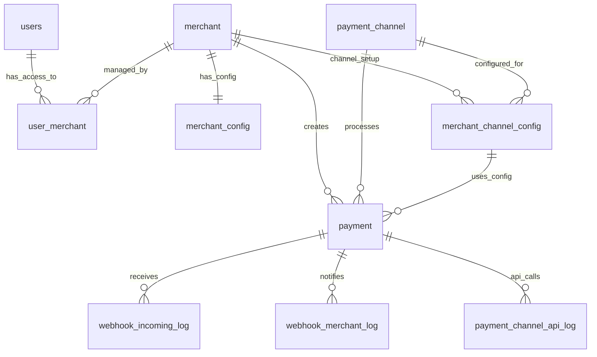
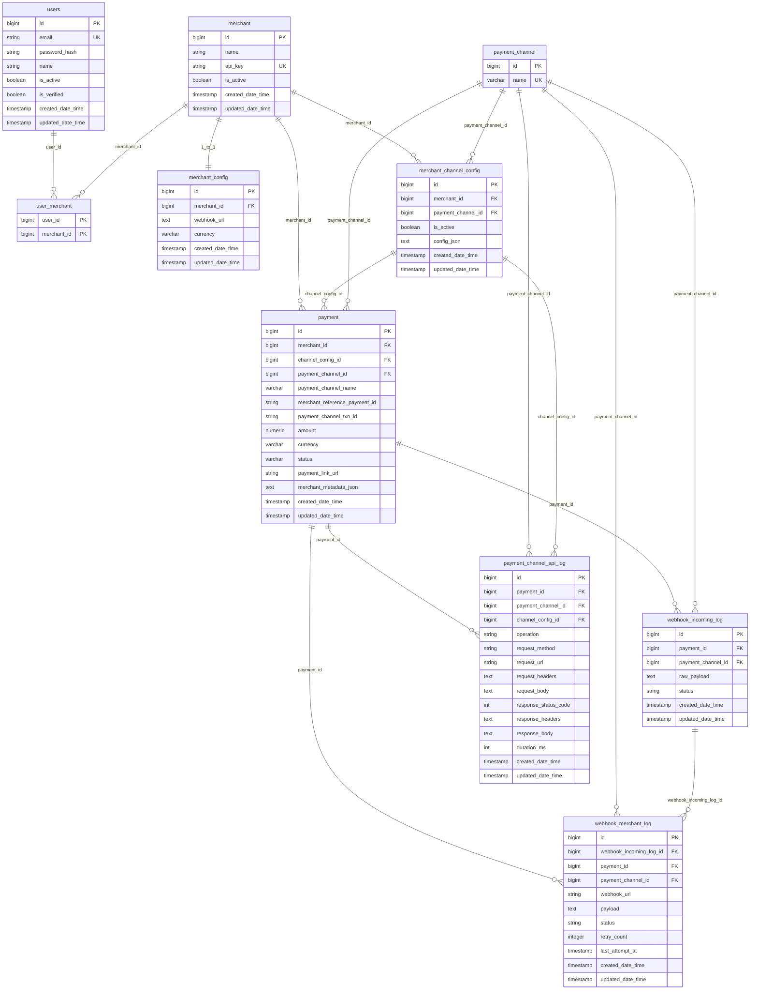

# Digi Payment Gateway — Database Documentation

**Audience:** Database administrators, SRE, and backend engineers reviewing schema, backups, and migrations.

**Source of truth (application mapping):** JPA entities under `src/main/java/com/digirestro/digi_payment_gateway/entity/`.

**Target DBMS:** PostgreSQL (see `application-dev.properties` for connection settings).

---

## 1. Deployment and schema management

| Topic | Notes |
| ----- | ----- |
| **ORM** | Spring Data JPA / Hibernate |
| **Development** | `spring.jpa.hibernate.ddl-auto=update` may apply DDL at startup — convenient for dev, **not** a controlled migration for production. |
| **Physical column naming** | Default Spring Boot / Hibernate physical naming typically maps Java camelCase to **snake_case** (e.g. `apiKey` → `api_key`). Columns with an explicit `@Column(name = "…")` are subject to the same strategy unless you override `spring.jpa.hibernate.naming.*`. **Always validate** against `information_schema.columns` or Hibernate-exported DDL for your environment. |
| **Auditing** | Tables extending `AuditableEntity` include timestamp columns (see §3.1). Requires JPA Auditing enabled in the application. |

---

## 2. Entity–relationship diagram

### 2.1 Simple ER diagram

### 2.2 Detailed ER diagram

High-level relationships (cardinality as enforced or implied by the JPA model):

### 2.3 Relationship summary

| From | To | Cardinality | Implementation notes |
| ---- | -- | ----------- | -------------------- |
| `users` | `merchant` | **M:N** | Join table `user_merchant` (`user_id`, `merchant_id`). Composite PK recommended for DBA control (JPA may not declare PK on join table — verify DDL). |
| `merchant` | `merchant_config` | **1:0..1** | `merchant_config.merchant_id` **UNIQUE** + NOT NULL → at most one config row per merchant. |
| `merchant` | `merchant_channel_config` | **1:N** | Multiple channel configs per merchant (e.g. per `payment_channel`). |
| `payment_channel` | `merchant_channel_config` | **1:N** | Same channel can be configured for many merchants. |
| `merchant` | `payment` | **1:N** | |
| `merchant_channel_config` | `payment` | **1:N** | |
| `payment_channel` | `payment` | **1:N** | Denormalized channel on `payment` for query convenience (must stay consistent with `channel_config`). |
| `payment` | `webhook_incoming_log` | **1:N** | `payment_id` nullable on entity → optional FK in DB. |
| `payment` | `webhook_merchant_log` | **1:N** | `payment_id` NOT NULL. |
| `webhook_incoming_log` | `webhook_merchant_log` | **1:N** | `webhook_incoming_log_id` nullable. |
| `payment` | `payment_channel_api_log` | **1:N** | `payment_id` nullable. |

---

## 3. Table specifications

Naming below uses **snake_case** for physical columns as commonly produced by Spring Boot defaults. Adjust if your naming strategy differs.

### 3.1 Auditing columns (inherited)

Present on all entities that extend `AuditableEntity` (see per-table lists).

| Column | Type | Nullable | Description |
| ------ | ---- | -------- | ----------- |
| `created_date_time` | `timestamp` | NOT NULL | Set on insert (JPA `@CreatedDate`). |
| `updated_date_time` | `timestamp` | NOT NULL | Updated on each change (`@LastModifiedDate`). |

*If your DDL shows `createdDateTime` / `updatedDateTime` (mixed case), the app uses explicit `@Column` names — match the live database.*

---

### 3.2 `users`

Back-office / UI users; many-to-many with merchants.

| Column | Type | Constraints | Description |
| ------ | ---- | ----------- | ----------- |
| `id` | `bigint` | PK, identity | Surrogate key. |
| `email` | `varchar` | NOT NULL, UNIQUE | Login identifier. |
| `password_hash` | `varchar` | NOT NULL | Password storage (e.g. BCrypt). |
| `name` | `varchar` | NOT NULL | Display name. |
| `is_active` | `boolean` | NOT NULL | Account enabled. |
| `is_verified` | `boolean` | NOT NULL | Verification flag. |
| + audit | timestamps | NOT NULL | §3.1 |

**Indexes (recommended):** PK on `id`, UNIQUE on `email`.

---

### 3.3 `user_merchant`

Join table for `users` ↔ `merchant`.

| Column | Type | Constraints | Description |
| ------ | ---- | ----------- | ----------- |
| `user_id` | `bigint` | FK → `users.id` | |
| `merchant_id` | `bigint` | FK → `merchant.id` | |

**Indexes (recommended):** Composite PK `(user_id, merchant_id)`; index on `merchant_id` for reverse lookups.

---

### 3.4 `merchant`

Core merchant record; API key for server-to-server integration.

| Column | Type | Constraints | Description |
| ------ | ---- | ----------- | ----------- |
| `id` | `bigint` | PK, identity | |
| `name` | `varchar` | NOT NULL | |
| `api_key` | `varchar` | NOT NULL, UNIQUE | Merchant API key (e.g. UUID string). |
| `is_active` | `boolean` | NOT NULL | |
| + audit | timestamps | NOT NULL | §3.1 |

**Indexes:** PK, UNIQUE(`api_key`).

---

### 3.5 `merchant_config`

**One row per merchant** (integration defaults and callbacks).

| Column | Type | Constraints | Description |
| ------ | ---- | ----------- | ----------- |
| `id` | `bigint` | PK, identity | |
| `merchant_id` | `bigint` | NOT NULL, FK → `merchant.id`, **UNIQUE** | Enforces 1:1. |
| `webhook_url` | `text` | NULL | Consumer webhook URL for outbound notifications. |
| `currency` | `varchar(3)` | NOT NULL | ISO 4217 alphabetic code (e.g. `USD`). Used when creating payments / links. |
| + audit | timestamps | NOT NULL | §3.1 |

**Indexes:** UNIQUE(`merchant_id`); FK to `merchant`.

---

### 3.6 `payment_channel`

Catalog of integrated payment providers.

| Column | Type | Constraints | Description |
| ------ | ---- | ----------- | ----------- |
| `id` | `bigint` | PK, identity | |
| `name` | `varchar` | NOT NULL, UNIQUE | Enum string — see §4. |

*No auditing columns on this entity in the current model.*

---

### 3.7 `merchant_channel_config`

Per-merchant, per-channel credentials and settings (often JSON).

| Column | Type | Constraints | Description |
| ------ | ---- | ----------- | ----------- |
| `id` | `bigint` | PK, identity | |
| `merchant_id` | `bigint` | NOT NULL, FK → `merchant.id` | |
| `payment_channel_id` | `bigint` | NOT NULL, FK → `payment_channel.id` | |
| `is_active` | `boolean` | NOT NULL | Only active configs should be used by orchestration. |
| `config_json` | `text` | NULL | Channel-specific secrets/config (protect at rest). |
| + audit | timestamps | NOT NULL | §3.1 |

**Indexes (recommended):** `(merchant_id, is_active)` for “resolve active config” queries; FKs.

---

### 3.8 `payment`

Payment attempt / transaction record.

| Column | Type | Constraints | Description |
| ------ | ---- | ----------- | ----------- |
| `id` | `bigint` | PK, identity | Internal payment id (exposed to consumers as appropriate). |
| `merchant_id` | `bigint` | NOT NULL, FK → `merchant.id` | |
| `channel_config_id` | `bigint` | NOT NULL, FK → `merchant_channel_config.id` | |
| `payment_channel_id` | `bigint` | NOT NULL, FK → `payment_channel.id` | |
| `payment_channel_name` | `varchar` | NOT NULL | Denormalized channel enum string at creation (matches `payment_channel.name`; see §4.1). |
| `merchant_reference_payment_id` | `varchar` | NOT NULL | Idempotent / correlation id from consumer. |
| `payment_channel_txn_id` | `varchar` | NULL | Provider transaction id after link creation / updates. |
| `amount` | `numeric(19,4)` | NOT NULL | |
| `currency` | `varchar(3)` | NOT NULL | Copied from `merchant_config.currency` at creation (not from raw API body in current design). |
| `status` | `varchar` | NOT NULL | Enum string — see §4. Default `PENDING`. |
| `payment_link_url` | `varchar` | NULL | Generated checkout URL. |
| `merchant_metadata_json` | `text` | NULL | Opaque merchant metadata. |
| + audit | timestamps | NOT NULL | §3.1 |

**Indexes (recommended):** FK indexes; optional UNIQUE(`merchant_id`, `merchant_reference_payment_id`) if business rules require global idempotency per merchant.

---

### 3.9 `webhook_incoming_log`

Inbound webhook payload audit from payment channels.

| Column | Type | Constraints | Description |
| ------ | ---- | ----------- | ----------- |
| `id` | `bigint` | PK, identity | |
| `payment_id` | `bigint` | FK → `payment.id`, NULL | Optional link to payment. |
| `payment_channel_id` | `bigint` | FK → `payment_channel.id`, NULL | |
| `raw_payload` | `text` | NOT NULL | Raw body. |
| `status` | `varchar` | NOT NULL | Application-defined processing status. |
| + audit | timestamps | NOT NULL | §3.1 |

---

### 3.10 `webhook_merchant_log`

Outbound calls to the consumer webhook URL (and retries).

| Column | Type | Constraints | Description |
| ------ | ---- | ----------- | ----------- |
| `id` | `bigint` | PK, identity | |
| `webhook_incoming_log_id` | `bigint` | FK → `webhook_incoming_log.id`, NULL | |
| `payment_id` | `bigint` | NOT NULL, FK → `payment.id` | |
| `payment_channel_id` | `bigint` | NOT NULL, FK → `payment_channel.id` | |
| `webhook_url` | `varchar` | NOT NULL | URL used for this attempt (copy at send time). |
| `payload` | `text` | NOT NULL | JSON (or similar) sent to consumer. |
| `status` | `varchar` | NOT NULL | e.g. PENDING / SUCCESS / FAILED. |
| `retry_count` | `integer` | NOT NULL | Default 0. |
| `last_attempt_at` | `timestamp` | NULL | |
| + audit | timestamps | NOT NULL | §3.1 |

---

### 3.11 `payment_channel_api_log`

Outbound HTTP audit to payment channel APIs.

| Column | Type | Constraints | Description |
| ------ | ---- | ----------- | ----------- |
| `id` | `bigint` | PK, identity | |
| `payment_id` | `bigint` | FK → `payment.id`, NULL | |
| `payment_channel_id` | `bigint` | FK → `payment_channel.id`, NULL | |
| `channel_config_id` | `bigint` | FK → `merchant_channel_config.id`, NULL | |
| `operation` | `varchar` | NOT NULL | e.g. `CREATE_PAYMENT_LINK`. |
| `request_method` | `varchar` | NOT NULL | GET, POST, … |
| `request_url` | `varchar` | NOT NULL | |
| `request_headers` | `text` | NULL | Mask secrets in application layer. |
| `request_body` | `text` | NULL | |
| `response_status_code` | `integer` | NULL | |
| `response_headers` | `text` | NULL | |
| `response_body` | `text` | NULL | |
| `duration_ms` | `integer` | NULL | |
| + audit | timestamps | NOT NULL | §3.1 |

**Retention:** Log tables can grow quickly — define **retention/archival** policy (partitioning by month, TTL job, etc.).

---

## 4. Enumerated values (application layer)

Stored as **strings** in VARCHAR columns (`EnumType.STRING`).

### 4.1 `payment_channel.name` — `PaymentChannelNameEnum`

`XPLORPAY`, `PAYMOB`, `STRIPE`, `RAZORPAY`, `DUMMY`

### 4.2 `payment.status` — `PaymentStatusEnum`

`PENDING`, `SUCCESS`, `FAILED`, `CANCELLED`, `EXPIRED`

---

## 5. Operational checklist for DBAs

1. **FK consistency:** Nullable FKs on log tables allow partial records; monitor orphan rates if you add NOT NULL constraints later.
2. **1:1 enforcement:** Rely on **UNIQUE** constraint on `merchant_config.merchant_id` (duplicate rows must fail).
3. **Currency:** `merchant_config.currency` and `payment.currency` should stay aligned with product rules (ISO 4217).

---

## 6. Document history

| Version | Date | Author / note | Changes |
| ------- | ---- | ------------- | ------- |
| 1.0 | 2025-03-23 | Engineering | Initial DBA-oriented schema doc from JPA entities. |
