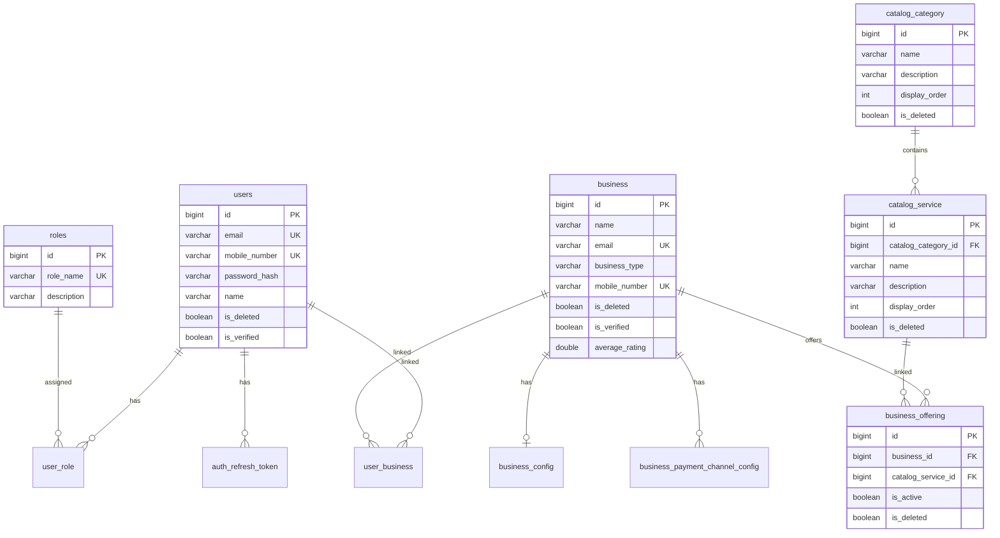

# OnDemand Service — Database

This document describes the **PostgreSQL** schema used by the ondemand-service application (`com.runalb.ondemand_service`). Tables are created and updated by Hibernate from JPA entities (`spring.jpa.hibernate.ddl-auto=update` in dev, `validate` in prod).

For application structure and API behavior, see [ARCHITECTURE.md](./ARCHITECTURE.md).

---

## Overview

| Item | Value |
|------|-------|
| Database | PostgreSQL |
| Dev database name | `db_ondemand_service` (see `application-dev.properties`) |
| ORM | Spring Data JPA / Hibernate |
| Schema management | Hibernate `ddl-auto` (no Flyway/Liquibase) |
| Auditing | `createdDateTime`, `updatedDateTime` on all entities via `AuditableEntity` |

### Naming conventions

- **Table names** are set explicitly on `@Table(name = "...")`.
- **Column names** use explicit `@Column(name = "...")` where defined on the entity; otherwise Spring Boot’s physical naming strategy maps Java camelCase fields to **snake_case** columns (e.g. `passwordHash` → `password_hash`).
- **Audit columns** are explicitly named `createdDateTime` and `updatedDateTime` (camelCase) on every entity extending `AuditableEntity`.

### Entity-relationship diagram


```mermaid
erDiagram
    users ||--o{ user_role : has
    roles ||--o{ user_role : assigned
    users ||--o{ user_business : linked
    business ||--o{ user_business : linked
    users ||--o{ auth_refresh_token : has
    business ||--o| business_config : has
    business ||--o{ business_payment_channel_config : has
    business ||--o{ business_offering : offers
    catalog_category ||--o{ catalog_service : contains
    catalog_service ||--o{ business_offering : linked

    users {
        bigint id PK
        varchar email UK
        varchar mobile_number UK
        varchar password_hash
        varchar name
        boolean is_deleted
        boolean is_verified
    }

    roles {
        bigint id PK
        varchar role_name UK
        varchar description
    }

    business {
        bigint id PK
        varchar name
        varchar email UK
        varchar business_type
        varchar mobile_number UK
        boolean is_deleted
        boolean is_verified
        double average_rating
    }

    business_offering {
        bigint id PK
        bigint business_id FK
        bigint catalog_service_id FK
        boolean is_active
        boolean is_deleted
    }

    catalog_category {
        bigint id PK
        varchar name
        varchar description
        int display_order
        boolean is_deleted
    }

    catalog_service {
        bigint id PK
        bigint catalog_category_id FK
        varchar name
        varchar description
        int display_order
        boolean is_deleted
    }
```

---

## Shared audit columns

Every entity extends `AuditableEntity` and includes:

| Column | Type | Constraints | Notes |
|--------|------|-------------|-------|
| `createdDateTime` | `timestamp` | `NOT NULL` | Set on insert; not updatable |
| `updatedDateTime` | `timestamp` | `NOT NULL` | Updated on each modification |

Populated by Spring Data JPA auditing (`@EnableJpaAuditing` on `OnDemandServiceApplication`).

---

## Tables

### `users`

Portal accounts. Passwords are stored as BCrypt hashes.

| Column | Type | Constraints | Entity field |
|--------|------|-------------|--------------|
| `id` | `bigint` | `PK`, identity | `id` |
| `email` | `varchar` | `NOT NULL`, `UNIQUE` | `email` |
| `mobile_number` | `varchar(20)` | `UNIQUE` | `mobileNumber` |
| `password_hash` | `varchar` | `NOT NULL` | `passwordHash` |
| `name` | `varchar` | `NOT NULL` | `name` |
| `is_deleted` | `boolean` | `NOT NULL`, default `false` | `isDeleted` |
| `is_verified` | `boolean` | `NOT NULL`, default `false` | `isVerified` |
| `createdDateTime` | `timestamp` | `NOT NULL` | audit |
| `updatedDateTime` | `timestamp` | `NOT NULL` | audit |

**Entity:** `UserEntity`

**Relationships:**

- M:N → `roles` via `user_role`
- M:N → `business` via `user_business`
- 1:1 ← `providers` (`providers.user_id`)
- 1:N ← `auth_refresh_token` (`auth_refresh_token.user_id`)

**Common queries:** `findByEmail`, `findByMobileNumber`, `existsByMobileNumber`, `existsByIdAndBusinesses_Id`

---

### `roles`

Lookup table for assignable roles. Rows must exist before user registration.

| Column | Type | Constraints | Entity field |
|--------|------|-------------|--------------|
| `id` | `bigint` | `PK`, identity | `id` |
| `role_name` | `varchar(64)` | `NOT NULL`, `UNIQUE` | `roleName` (`RoleNameEnum`, stored as string) |
| `description` | `varchar(255)` | | `description` |
| `createdDateTime` | `timestamp` | `NOT NULL` | audit |
| `updatedDateTime` | `timestamp` | `NOT NULL` | audit |

**Entity:** `RoleEntity`

**Enum values (`RoleNameEnum`):**

| Value | Description (seed) |
|-------|-------------------|
| `CUSTOMER` | End customer / marketplace buyer |
| `PROVIDER` | Service provider |
| `ADMIN` | Tenant or operations admin |
| `SUPER_ADMIN` | Full administrative access |

**Seed script:** `scripts/seed-roles.sql` (idempotent `ON CONFLICT (role_name) DO NOTHING`)

---

### `user_role`

Join table: users ↔ roles.

| Column | Type | Constraints |
|--------|------|-------------|
| `user_id` | `bigint` | `FK` → `users.id` |
| `role_id` | `bigint` | `FK` → `roles.id` |

Composite primary key on `(user_id, role_id)` (Hibernate default for `@JoinTable`).

---

### `user_business`

Join table: users ↔ business records.

| Column | Type | Constraints |
|--------|------|-------------|
| `user_id` | `bigint` | `FK` → `users.id` |
| `business_id` | `bigint` | `FK` → `business.id` |

---

### `auth_refresh_token`

Opaque refresh tokens for session renewal. Only a **SHA-256 hash** of the token is stored.

| Column | Type | Constraints | Entity field |
|--------|------|-------------|--------------|
| `id` | `bigint` | `PK`, identity | `id` |
| `user_id` | `bigint` | `NOT NULL`, `FK` → `users.id` | `user` |
| `token_hash` | `varchar(64)` | `NOT NULL`, `UNIQUE` | `tokenHash` |
| `expires_at` | `timestamp` | `NOT NULL` | `expiresAt` |
| `revoked_at` | `timestamp` | nullable | `revokedAt` (set on logout / rotation) |
| `createdDateTime` | `timestamp` | `NOT NULL` | audit |
| `updatedDateTime` | `timestamp` | `NOT NULL` | audit |

**Entity:** `AuthRefreshTokenEntity`

**Common queries:** `findByTokenHashAndRevokedAtIsNull`

---

### `business`

Business tenant records for provider-operated tenants.

| Column | Type | Constraints | Entity field |
|--------|------|-------------|--------------|
| `id` | `bigint` | `PK`, identity | `id` |
| `name` | `varchar` | `NOT NULL` | `name` |
| `email` | `varchar` | `NOT NULL`, `UNIQUE` | `email` |
| `business_type` | `varchar` | `NOT NULL` | `businessType` |
| `description` | `text` | | `description` |
| `address` | `text` | | `address` |
| `mobile_number` | `varchar(20)` | `UNIQUE` | `mobileNumber` |
| `is_verified` | `boolean` | `NOT NULL`, default `false` | `isVerified` |
| `average_rating` | `double precision` | `NOT NULL`, default `0.0` | `averageRating` |
| `is_deleted` | `boolean` | `NOT NULL`, default `false` | `isDeleted` |
| `createdDateTime` | `timestamp` | `NOT NULL` | audit |
| `updatedDateTime` | `timestamp` | `NOT NULL` | audit |

**Entity:** `BusinessEntity`

**Relationships:**

- 1:1 → `business_config`
- 1:N → `business_payment_channel_config`
- 1:N → `business_offering`
- M:N ← `users` via `user_business`

**Common queries:** `findByIdAndIsDeletedFalse`, `findByEmail`, `findByMobileNumber`, `findByUsers_IdAndIsDeletedFalseOrderByIdAsc`, `existsByIdAndUsers_IdAndIsDeletedFalse`

---

### `business_config`

Per-business settings (webhook URL, default currency).

| Column | Type | Constraints | Entity field |
|--------|------|-------------|--------------|
| `id` | `bigint` | `PK`, identity | `id` |
| `business_id` | `bigint` | `NOT NULL`, `UNIQUE`, `FK` → `business.id` | `business` |
| `webhook_url` | `text` | | `webhookUrl` |
| `currency` | `varchar(3)` | `NOT NULL` | `currency` (ISO 4217, e.g. `USD`) |
| `is_deleted` | `boolean` | `NOT NULL`, default `false` | `isDeleted` |
| `createdDateTime` | `timestamp` | `NOT NULL` | audit |
| `updatedDateTime` | `timestamp` | `NOT NULL` | audit |

**Entity:** `BusinessConfigEntity`

One config row per business (`business_id` unique).

**Common queries:** `findByBusiness_Id`

---

### `business_payment_channel_config`

Per-business payment channel credentials/settings stored as opaque JSON. No `payment_channel` master table is wired in the current codebase (FK commented out in entity).

| Column | Type | Constraints | Entity field |
|--------|------|-------------|--------------|
| `id` | `bigint` | `PK`, identity | `id` |
| `business_id` | `bigint` | `NOT NULL`, `FK` → `business.id` | `business` |
| `is_deleted` | `boolean` | `NOT NULL`, default `false` | `isDeleted` |
| `config_json` | `text` | | `configJson` |
| `createdDateTime` | `timestamp` | `NOT NULL` | audit |
| `updatedDateTime` | `timestamp` | `NOT NULL` | audit |

**Entity:** `BusinessPaymentChannelConfigEntity`

**Common queries:** `findByBusiness_IdOrderByIdAsc`, `findByIdAndBusiness_Id`

> **Note:** `scripts/update-payment-channel-name-check.sql` references a legacy `payment_channel` table that is not present in current JPA entities.

---

### `business_offering`

Links a business to a catalog service (what the business offers). Unlinking sets `is_deleted`; re-linking reuses the same row when previously soft-deleted.

| Column | Type | Constraints | Entity field |
|--------|------|-------------|--------------|
| `id` | `bigint` | `PK`, identity | `id` |
| `business_id` | `bigint` | `NOT NULL`, `FK` → `business.id` | `business` |
| `catalog_service_id` | `bigint` | `NOT NULL`, `FK` → `catalog_service.id` | `catalogService` |
| `is_active` | `boolean` | `NOT NULL`, default `true` | `isActive` |
| `is_deleted` | `boolean` | `NOT NULL`, default `false` | `isDeleted` |
| `createdDateTime` | `timestamp` | `NOT NULL` | audit |
| `updatedDateTime` | `timestamp` | `NOT NULL` | audit |

**Entity:** `BusinessOfferingEntity`

**Common queries:** `findByBusiness_IdAndIsDeletedFalseOrderByIdAsc`, `findByIdAndBusiness_IdAndIsDeletedFalse`, `findByBusiness_IdAndCatalogService_Id`, `existsByBusiness_IdAndCatalogService_IdAndIsDeletedFalse`, `findByCatalogService_IdAndIsDeletedFalseAndIsActiveTrueOrderByIdAsc`

> Uniqueness of an active link per `(business_id, catalog_service_id)` is enforced in `BusinessOfferingService`, not via a database unique constraint.

---

### `catalog_category`

Top-level catalog grouping for on-demand services.

| Column | Type | Constraints | Entity field |
|--------|------|-------------|--------------|
| `id` | `bigint` | `PK`, identity | `id` |
| `name` | `varchar(255)` | `NOT NULL` | `name` |
| `description` | `varchar(2000)` | | `description` |
| `display_order` | `integer` | `NOT NULL`, default `0` | `displayOrder` |
| `is_deleted` | `boolean` | `NOT NULL`, default `false` | `isDeleted` |
| `createdDateTime` | `timestamp` | `NOT NULL` | audit |
| `updatedDateTime` | `timestamp` | `NOT NULL` | audit |

**Entity:** `CatalogCategoryEntity`

**Common queries:** `findByIdAndIsDeletedFalse`, `findByIsDeletedFalse`, `existsByNameIgnoreCase`, `existsByNameIgnoreCaseAndIdNot`

---

### `catalog_service`

Individual catalog entries under a category.

| Column | Type | Constraints | Entity field |
|--------|------|-------------|--------------|
| `id` | `bigint` | `PK`, identity | `id` |
| `catalog_category_id` | `bigint` | `NOT NULL`, `FK` → `catalog_category.id` | `catalogCategory` |
| `name` | `varchar(512)` | `NOT NULL` | `name` |
| `description` | `varchar(4000)` | | `description` |
| `display_order` | `integer` | `NOT NULL`, default `0` | `displayOrder` |
| `is_deleted` | `boolean` | `NOT NULL`, default `false` | `isDeleted` |
| `createdDateTime` | `timestamp` | `NOT NULL` | audit |
| `updatedDateTime` | `timestamp` | `NOT NULL` | audit |

**Entity:** `CatalogServiceEntity`

**Relationships:**

- N:1 → `catalog_category`
- 1:N ← `business_offering`

**Common queries:** `findWithCatalogCategoryByIdAndIsDeletedFalse`, `findByCatalogCategory_IdAndIsDeletedFalseOrderByDisplayOrderAscIdAsc`, `existsByCatalogCategory_IdAndNameIgnoreCase`

---

## Data not persisted

The following application data is **in-memory only** and has no database tables:

| Data | Location | Notes |
|------|----------|-------|
| Email login OTP sessions | `AuthService` | Lost on restart; not cluster-safe |
| Forgot-password OTP sessions | `AuthService` | Same |
| Mobile login OTP sessions | `AuthService` | Same |

---

## Setup and operations

### Local development

1. Create PostgreSQL database `db_ondemand_service`.
2. Start the application with the `dev` profile (default). Hibernate creates/updates tables (`ddl-auto=update`).
3. Seed roles:

```bash
psql -h localhost -U postgres -d db_ondemand_service -f scripts/seed-roles.sql
```

### Production

- Set `DB_URL`, `DB_USERNAME`, `DB_PASSWORD`, and `JWT_SECRET`.
- Use `ddl-auto=validate` — schema must already match entities.
- Run `scripts/seed-roles.sql` once per environment before accepting user registrations.

### Inspecting schema

```sql
-- List tables
SELECT tablename FROM pg_tables WHERE schemaname = 'public' ORDER BY tablename;

-- Example: users table
\d users
```

With `spring.jpa.show-sql=true` (dev), Hibernate logs DDL and DML to the application log.

---

## Entity index

| Table | JPA entity | Package |
|-------|------------|---------|
| `users` | `UserEntity` | `user.entity` |
| `roles` | `RoleEntity` | `role.entity` |
| `user_role` | *(join table)* | — |
| `user_business` | *(join table)* | — |
| `auth_refresh_token` | `AuthRefreshTokenEntity` | `auth.entity` |
| `business` | `BusinessEntity` | `business.entity` |
| `business_config` | `BusinessConfigEntity` | `business.entity` |
| `business_payment_channel_config` | `BusinessPaymentChannelConfigEntity` | `business.entity` |
| `business_offering` | `BusinessOfferingEntity` | `offering.entity` |
| `catalog_category` | `CatalogCategoryEntity` | `catalog.entity` |
| `catalog_service` | `CatalogServiceEntity` | `catalog.entity` |

---

## Related documentation

| Document | Description |
|----------|-------------|
| [ARCHITECTURE.md](./ARCHITECTURE.md) | Application layers, security, API |
| [README.md](./README.md) | Documentation index |
| `scripts/seed-roles.sql` | Required role seed data |
| `scripts/update-payment-channel-name-check.sql` | Legacy `payment_channel` constraint fix (optional) |
