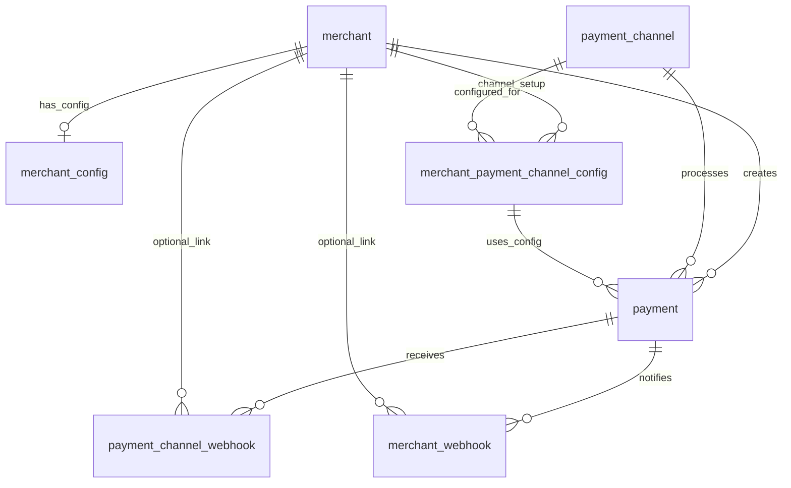

# Digi Payment Gateway — Database Documentation

**Audience:** Database administrators, SRE, and backend engineers reviewing schema, backups, and migrations.

**Source of truth (application mapping):** JPA entities under `src/main/java/com/digirestro/digi_payment_gateway/**/entity/`.

**Related:** [ARCHITECTURE.md](./ARCHITECTURE.md) (flows and module layout).

**Target DBMS:** PostgreSQL (see `application-dev.properties` for connection settings).

---

## 1. Deployment and schema management

| Topic | Notes |
| ----- | ----- |
| **ORM** | Spring Data JPA / Hibernate |
| **Development** | `spring.jpa.hibernate.ddl-auto=update` may apply DDL at startup — convenient for dev, **not** a controlled migration for production. |
| **Physical column naming** | Spring Boot’s default Hibernate physical naming usually maps Java camelCase to **snake_case** (e.g. `apiKey` → `api_key`, `paymentReferenceId` → `payment_reference_id`) unless you override `spring.jpa.hibernate.naming.*`. **Exception:** `AuditableEntity` sets explicit names **`createdDateTime`** and **`updatedDateTime`** (see §3.1) — those columns are not snake_case. **Always validate** against `information_schema.columns` or Hibernate-exported DDL. |
| **Auditing** | `@EnableJpaAuditing` on `DigiPaymentGatewayApplication`; all entities extending `AuditableEntity` get the columns in §3.1. |
| **Tables in codebase** | Seven mapped tables (§3.2–§3.8). No `users`, `user_merchant`, or `payment_channel_api_log` entities in the current application. |

### 1.1 Entity → table map

| JPA entity | Package | Table |
| ---------- | ------- | ----- |
| `MerchantEntity` | `merchant.entity` | `merchant` |
| `MerchantConfigEntity` | `merchant.entity` | `merchant_config` |
| `MerchantPaymentChannelConfigEntity` | `merchant.entity` | `merchant_payment_channel_config` |
| `PaymentChannelEntity` | `payment_channel.entity` | `payment_channel` |
| `PaymentEntity` | `payment.entity` | `payment` |
| `PaymentChannelWebhookEntity` | `payment_channel_webhook.entity` | `payment_channel_webhook` |
| `MerchantWebhookEntity` | `merchant_webhook.entity` | `merchant_webhook` |

---

## 2. Entity–relationship diagram

### 2.1 Simple ER diagram

```mermaid
erDiagram
  merchant ||--o| merchant_config : has_config
  merchant ||--o{ merchant_payment_channel_config : channel_setup
  payment_channel ||--o{ merchant_payment_channel_config : configured_for

  merchant ||--o{ payment : creates
  payment_channel ||--o{ payment : processes
  merchant_payment_channel_config ||--o{ payment : uses_config

  payment ||--o{ payment_channel_webhook : receives
  payment ||--o{ merchant_webhook : notifies
  merchant ||--o{ merchant_webhook : optional_link
  merchant ||--o{ payment_channel_webhook : optional_link
```

### 2.2 Detailed ER diagram

```mermaid
erDiagram
  merchant ||--o| merchant_config : "merchant_id"
  merchant ||--o{ merchant_payment_channel_config : "merchant_id"
  payment_channel ||--o{ merchant_payment_channel_config : "payment_channel_id"
  merchant ||--o{ payment : "merchant_id"
  merchant_payment_channel_config ||--o{ payment : "merchant_payment_channel_config_id"
  payment_channel ||--o{ payment : "payment_channel_id"
  payment ||--o{ payment_channel_webhook : "payment_id"
  payment_channel ||--o{ payment_channel_webhook : "payment_channel_id"
  merchant ||--o{ payment_channel_webhook : "merchant_id"
  payment ||--o{ merchant_webhook : "payment_id"
  payment_channel ||--o{ merchant_webhook : "payment_channel_id"
  merchant ||--o{ merchant_webhook : "merchant_id"

  merchant {
    bigint id PK
    string name
    string api_key UK
    string email UK
    boolean is_active
    timestamp createdDateTime
    timestamp updatedDateTime
  }

  merchant_config {
    bigint id PK
    bigint merchant_id FK UK
    text webhook_url
    varchar currency
    timestamp createdDateTime
    timestamp updatedDateTime
  }

  payment_channel {
    bigint id PK
    varchar name UK
    boolean is_active
    timestamp createdDateTime
    timestamp updatedDateTime
  }

  merchant_payment_channel_config {
    bigint id PK
    bigint merchant_id FK
    bigint payment_channel_id FK
    boolean is_active
    text config_json
    timestamp createdDateTime
    timestamp updatedDateTime
  }

  payment {
    bigint id PK
    uuid payment_reference_id UK
    bigint merchant_id FK
    bigint merchant_payment_channel_config_id FK
    bigint payment_channel_id FK
    string merchant_reference_id
    string payment_channel_txn_id
    numeric amount
    varchar currency
    varchar status
    string payment_channel_pay_link
    text merchant_metadata_json
    timestamp createdDateTime
    timestamp updatedDateTime
  }

  payment_channel_webhook {
    bigint id PK
    bigint payment_id FK
    bigint payment_channel_id FK
    bigint merchant_id FK
    text raw_payload
    string status
    timestamp createdDateTime
    timestamp updatedDateTime
  }

  merchant_webhook {
    bigint id PK
    bigint payment_id FK
    bigint payment_channel_id FK
    bigint merchant_id FK
    string webhook_url
    text payload
    string status
    integer retry_count
    timestamp last_attempt_at
    timestamp createdDateTime
    timestamp updatedDateTime
  }
```

### 2.3 Relationship summary

| From | To | Cardinality | Implementation notes |
| ---- | -- | ----------- | -------------------- |
| `merchant` | `merchant_config` | **1:0..1** | `merchant_config.merchant_id` **UNIQUE** + NOT NULL → at most one config row per merchant. |
| `merchant` | `merchant_payment_channel_config` | **1:N** | Multiple channel configs per merchant; orchestration currently loads **one** active row via `findByMerchant_IdAndIsActiveTrue`. |
| `payment_channel` | `merchant_payment_channel_config` | **1:N** | Same channel can be configured for many merchants. |
| `merchant` | `payment` | **1:N** | |
| `merchant_payment_channel_config` | `payment` | **1:N** | FK column `merchant_payment_channel_config_id`. |
| `payment_channel` | `payment` | **1:N** | Channel key is `payment_channel.name` (`PaymentChannelNameEnum` string); not duplicated on `payment`. |
| `payment` | `payment_channel_webhook` | **1:N** | `payment_id` nullable on entity → optional FK in DB. |
| `payment` | `merchant_webhook` | **1:N** | `payment_id` NOT NULL. |
| `merchant` | `merchant_webhook` | **1:N** | `merchant_id` nullable on entity. |
| `merchant` | `payment_channel_webhook` | **1:N** | `merchant_id` nullable on entity. |

---

## 3. Table specifications

Naming below: non-audit fields use **snake_case** as typically produced by Spring Boot’s default physical naming. **Audit** columns are the exception (see §3.1).

### 3.1 Auditing columns (inherited)

Present on every entity that extends `AuditableEntity`:

`MerchantEntity`, `MerchantConfigEntity`, `MerchantPaymentChannelConfigEntity`, `PaymentChannelEntity`, `PaymentEntity`, `PaymentChannelWebhookEntity`, `MerchantWebhookEntity`.

Mapped in `common.persistence.AuditableEntity` with explicit `@Column` names:

| Column | Type | Nullable | Description |
| ------ | ---- | -------- | ----------- |
| `createdDateTime` | `timestamp` | NOT NULL | Set on insert (`@CreatedDate`). |
| `updatedDateTime` | `timestamp` | NOT NULL | Updated on each change (`@LastModifiedDate`). |

On PostgreSQL, Hibernate typically emits quoted identifiers for these names so casing matches the mapping. Per-table “+ audit” rows in §3.2–§3.8 refer to these two columns.

---

### 3.2 `merchant`

Core merchant record; API key for server-to-server integration (`MerchantEntity`).

| Column | Type | Constraints | Description |
| ------ | ---- | ----------- | ----------- |
| `id` | `bigint` | PK, identity | Surrogate key. |
| `name` | `varchar` | NOT NULL | Display / business name. |
| `api_key` | `varchar` | NOT NULL, UNIQUE | Merchant API key (e.g. UUID string). Used by `ApiKeyAuthenticationFilter`. |
| `email` | `varchar` | NOT NULL, UNIQUE | Merchant contact / identifier. |
| `is_active` | `boolean` | NOT NULL | Default `true`. Inactive merchants fail API key auth. |
| + audit | `createdDateTime`, `updatedDateTime` | NOT NULL | §3.1 |

**Indexes (recommended):** PK on `id`; UNIQUE on `api_key`; UNIQUE on `email`.

---

### 3.3 `merchant_config`

**One row per merchant** (integration defaults and outbound webhook URL).

| Column | Type | Constraints | Description |
| ------ | ---- | ----------- | ----------- |
| `id` | `bigint` | PK, identity | |
| `merchant_id` | `bigint` | NOT NULL, FK → `merchant.id`, **UNIQUE** | Enforces 1:1. |
| `webhook_url` | `text` | NULL | Consumer webhook URL for outbound notifications (delivery not fully wired in app). |
| `currency` | `varchar(3)` | NOT NULL | ISO 4217 alphabetic code (e.g. `USD`). Copied onto `payment.currency` at link creation. |
| + audit | `createdDateTime`, `updatedDateTime` | NOT NULL | §3.1 |

**Indexes:** UNIQUE(`merchant_id`); FK to `merchant`.

---

### 3.4 `payment_channel`

Catalog of integrated payment providers (`PaymentChannelEntity`).

| Column | Type | Constraints | Description |
| ------ | ---- | ----------- | ----------- |
| `id` | `bigint` | PK, identity | |
| `name` | `varchar` | NOT NULL, UNIQUE | Enum string — see §4.1 (`PaymentChannelNameEnum`). |
| `is_active` | `boolean` | NOT NULL | Whether this channel is available for configuration / routing. |
| + audit | `createdDateTime`, `updatedDateTime` | NOT NULL | §3.1 |

---

### 3.5 `merchant_payment_channel_config`

Per-merchant, per-channel credentials and settings (`MerchantPaymentChannelConfigEntity`).

| Column | Type | Constraints | Description |
| ------ | ---- | ----------- | ----------- |
| `id` | `bigint` | PK, identity | |
| `merchant_id` | `bigint` | NOT NULL, FK → `merchant.id` | |
| `payment_channel_id` | `bigint` | NOT NULL, FK → `payment_channel.id` | |
| `is_active` | `boolean` | NOT NULL | Orchestration uses `findByMerchant_IdAndIsActiveTrue` — expect **at most one** active row per merchant in practice. |
| `config_json` | `text` | NULL | Channel-specific secrets/config (protect at rest). |
| + audit | `createdDateTime`, `updatedDateTime` | NOT NULL | §3.1 |

**Indexes (recommended):** `(merchant_id, is_active)` for active-config lookup; FKs on `merchant_id`, `payment_channel_id`.

---

### 3.6 `payment`

Payment attempt / transaction record (`PaymentEntity`).

| Column | Type | Constraints | Description |
| ------ | ---- | ----------- | ----------- |
| `id` | `bigint` | PK, identity | Internal id; exposed in integration APIs. |
| `payment_reference_id` | `uuid` | NOT NULL, UNIQUE | Gateway-generated correlation id (set at creation). |
| `merchant_id` | `bigint` | NOT NULL, FK → `merchant.id` | |
| `merchant_payment_channel_config_id` | `bigint` | NOT NULL, FK → `merchant_payment_channel_config.id` | Config used for this payment. |
| `payment_channel_id` | `bigint` | NOT NULL, FK → `payment_channel.id` | Denormalized channel reference; name resolved via `payment_channel.name`. |
| `merchant_reference_id` | `varchar` | NOT NULL | Idempotent / correlation id from merchant integration API. |
| `payment_channel_txn_id` | `varchar` | NULL | Provider transaction id after link creation / webhook updates. |
| `amount` | `numeric(19,4)` | NOT NULL | From integration request. |
| `currency` | `varchar(3)` | NOT NULL | Copied from `merchant_config.currency` at creation (not from request body). |
| `status` | `varchar` | NOT NULL | Enum string — see §4.2. Default `INITIATED`. |
| `payment_channel_pay_link` | `varchar` | NULL | Checkout URL returned by channel strategy. |
| `merchant_metadata_json` | `text` | NULL | Opaque merchant metadata from integration request. |
| + audit | `createdDateTime`, `updatedDateTime` | NOT NULL | §3.1 |

**Indexes (recommended):** FK indexes; UNIQUE on `payment_reference_id`; optional UNIQUE(`merchant_id`, `merchant_reference_id`) if product requires idempotency per merchant.

**Lifecycle (application):** `INITIATED` (phase 1 commit) → `CHECKOUT_GENERATED` (after successful strategy call) → terminal states via webhooks (planned).

---

### 3.7 `payment_channel_webhook`

Inbound webhook payload audit from payment channels (`PaymentChannelWebhookEntity`). Persistence/orchestration from controllers is **not fully implemented** yet.

| Column | Type | Constraints | Description |
| ------ | ---- | ----------- | ----------- |
| `id` | `bigint` | PK, identity | |
| `payment_id` | `bigint` | FK → `payment.id`, NULL | Optional link to payment. |
| `payment_channel_id` | `bigint` | FK → `payment_channel.id`, NULL | |
| `merchant_id` | `bigint` | FK → `merchant.id`, NULL | Optional denormalized merchant reference. |
| `raw_payload` | `text` | NOT NULL | Raw inbound body. |
| `status` | `varchar` | NOT NULL | Application-defined processing status. |
| + audit | `createdDateTime`, `updatedDateTime` | NOT NULL | §3.1 |

---

### 3.8 `merchant_webhook`

Outbound calls to the merchant webhook URL (`MerchantWebhookEntity`). Delivery/retry worker **not implemented** in current application.

| Column | Type | Constraints | Description |
| ------ | ---- | ----------- | ----------- |
| `id` | `bigint` | PK, identity | |
| `payment_id` | `bigint` | NOT NULL, FK → `payment.id` | |
| `payment_channel_id` | `bigint` | NOT NULL, FK → `payment_channel.id` | |
| `merchant_id` | `bigint` | FK → `merchant.id`, NULL | Optional merchant reference. |
| `webhook_url` | `varchar` | NOT NULL | URL used for this attempt (snapshot at send time). |
| `payload` | `text` | NOT NULL | JSON (or similar) sent to merchant. |
| `status` | `varchar` | NOT NULL | e.g. `PENDING` / `SUCCESS` / `FAILED` (application-defined). |
| `retry_count` | `integer` | NOT NULL | Default `0`. |
| `last_attempt_at` | `timestamp` | NULL | Last delivery attempt. |
| + audit | `createdDateTime`, `updatedDateTime` | NOT NULL | §3.1 |

**Retention:** Webhook log tables can grow quickly — define **retention/archival** policy (partitioning by month, TTL job, etc.).

---

## 4. Enumerated values (application layer)

Stored as **strings** in VARCHAR columns (`@Enumerated(EnumType.STRING)`).

### 4.1 `payment_channel.name` — `PaymentChannelNameEnum`

Current enum values in code:

`STRIPE`, `RAZORPAY`, `PHONEPE`, `PAYTM`, `GOOGLE_PAY`, `XPLORPAY`, `PAYMOB`, `TEST`

Each value used in production data should have:

1. A row in `payment_channel` with `name` = enum name and `is_active = true` where appropriate.
2. A Spring `@Component` implementing `PaymentChannelStrategy` (only `TEST` is fully implemented today).

**Legacy CHECK constraint:** Older databases may have `payment_channel_name_check` allowing a smaller value set (e.g. `DUMMY`). If inserts fail with:

`violates check constraint "payment_channel_name_check"`

run:

`scripts/sql/postgresql/update-payment-channel-name-check.sql`

That script **drops** the constraint permanently (it does not add a replacement CHECK). Migrate any `DUMMY` rows to `TEST` before relying on new channel names.

### 4.2 `payment.status` — `PaymentStatusEnum`

`INITIATED`, `CHECKOUT_GENERATED`, `SUCCESS`, `FAILED`, `REFUNDED`, `VOIDED`

Default on new payments: `INITIATED`.

---

## 5. Operational checklist for DBAs

1. **Active channel config:** `MerchantPaymentChannelConfigRepository.findByMerchant_IdAndIsActiveTrue` returns a single `Optional` — ensure merchants have exactly one active config row for link generation, or orchestration will fail with `EntityNotFoundException`.
2. **1:1 merchant config:** Rely on **UNIQUE** on `merchant_config.merchant_id`.
3. **Currency:** `merchant_config.currency` and `payment.currency` should stay aligned with product rules (ISO 4217).
4. **Payment reference:** `payment.payment_reference_id` is UUID and UNIQUE — use for external correlation where appropriate.
5. **FK nullability:** Nullable FKs on `payment_channel_webhook` allow partial audit rows; monitor orphans if tightening constraints.
6. **Secrets:** `merchant_payment_channel_config.config_json` may contain API keys — encrypt at rest and mask in logs.
7. **Schema drift:** Validate column names against live DDL after Hibernate upgrades; audit columns keep camelCase names by design.

---

## 6. Document history

| Version | Date | Author / note | Changes |
| ------- | ---- | ------------- | ------- |
| 1.0 | 2025-03-23 | Engineering | Initial DBA-oriented schema doc from JPA entities. |
| 1.1 | 2025-03-23 | Engineering | `payment_channel`: audit columns; `is_active`. |
| 1.2 | 2026-03-25 | Engineering | Audit column naming; remove obsolete `payment.payment_channel_name`. |
| 2.0 | 2026-05-27 | Engineering | Align with current codebase: table renames (`merchant_payment_channel_config`, `payment_channel_webhook`, `merchant_webhook`); remove `users` / `user_merchant` / `payment_channel_api_log`; add `merchant.email`, `payment.payment_reference_id`, `payment.payment_channel_pay_link`; update enums and CHECK constraint script behavior; entity path map. |
